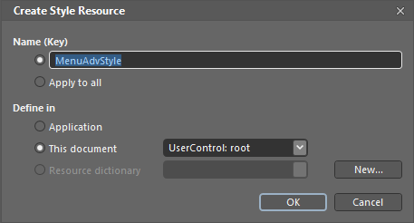
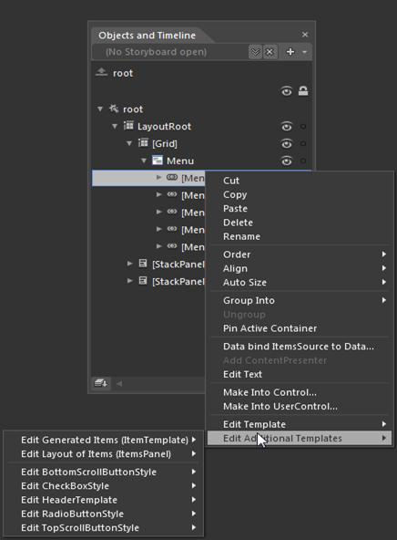
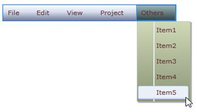

::: {style="DISPLAY: none"}
{#d2h_url_template}{#d2h_package_url style="WIDTH: 0px; DISPLAY: none; HEIGHT: 0px"}
:::

::: {.d2h_secondary_topic style="PADDING-BOTTOM: 10pt; MARGIN: 0pt; PADDING-LEFT: 0pt; PADDING-RIGHT: 0pt; PADDING-TOP: 0pt"}
#### Blendability Support

You can customize MenuAdv and MenuItemAdv in Expression Blend. After adding MenuAdv and MenuItemAdv to the design view, you can see MenuAdv and MenuItemAdv in the Objects and Timeline window.

 

{border="0"}

Figure 941: MenuAdv and MenuItemAdv Displayed in Objects and Timeline Tap

 

{border="0"}

Figure 942: Expression Blend Design View

 

Right-click MenuAdv and in EditTemplate option select Edit a Copy and assign the key name to the resource edited. The same process can be repeated to edit the MenuItemAdv style.

{border="0"}

Figure 943: Edit the MenuAdv Template

 

{border="0"}

Figure 944: Assign Key Name to Resource

 

User can also customize the appearance of the TopScrollButtonStyle, BottomScrollButtonStyle, CheckBoxStyle & RadioButtonStyle using the Edit Additional Templates option by doing right click on the MenuItemAdv and selecting the respective styles from the option.

 

{border="0"}

Figure 945: Edit Additional Templates

 

The following screen shot shows the MenuAdv and MenuItemAdv templates edited and customized by using Expression Blend:

{border="0"}

Figure 946: MenuAdv with Custom Look

 

[]{#related-topics}
:::
