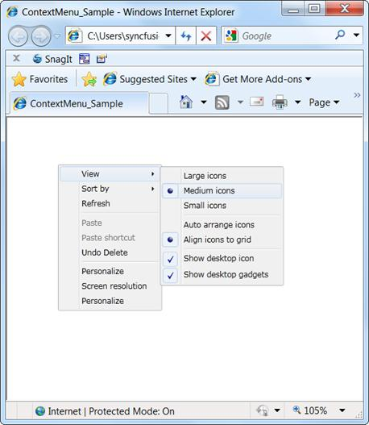
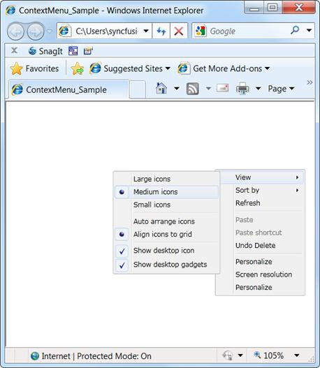

::: {style="DISPLAY: none"}
{#d2h_url_template}{#d2h_package_url style="WIDTH: 0px; DISPLAY: none; HEIGHT: 0px"}
:::

::: {.d2h_secondary_topic style="PADDING-BOTTOM: 10pt; MARGIN: 0pt; PADDING-LEFT: 0pt; PADDING-RIGHT: 0pt; PADDING-TOP: 0pt"}
#### Boundary Detection

[                ]{style="FONT-FAMILY: 'Calibri','sans-serif'; FONT-SIZE: 11pt"}ContextMenuAdv detects the boundaries and opens its submenu in the opposite direction when the submenu crosses the boundary.

In the following figure, the submenu has not crossed the boundary. So it is displayed on the right side of the Parent Menu.

{border="0"}

Figure 891: ContextMenuAdv

In the following figure, the submenu has crossed the boundaries of the browser. So it is displayed on the left side of the Parent Menu.

{border="0"}

Figure 892: SubMenu in the Left side

[]{#related-topics}
:::
