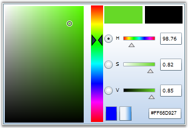
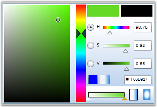
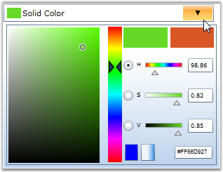
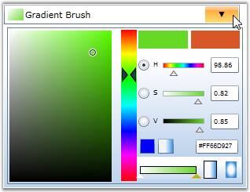
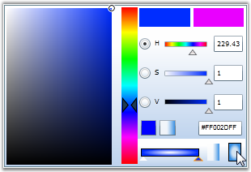
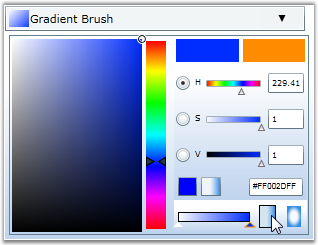
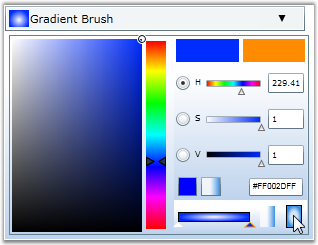

::: {style="DISPLAY: none"}
{#d2h_url_template}{#d2h_package_url style="WIDTH: 0px; DISPLAY: none; HEIGHT: 0px"}
:::

:::: {.d2h_secondary_topic style="PADDING-BOTTOM: 10pt; MARGIN: 0pt; PADDING-LEFT: 0pt; PADDING-RIGHT: 0pt; PADDING-TOP: 0pt"}
#### []{#p164}[]{#_Brush_Mode}Brush Mode

BrushSelector and BrushEdit controls can return two types of brush modes:

 

[·      ]{style="FONT-FAMILY: Symbol"}Solid Color Brush

[·      ]{style="FONT-FAMILY: Symbol"}Gradient Brush

 

::: {style="BORDER-BOTTOM: windowtext 1pt solid; BORDER-LEFT: medium none; PADDING-BOTTOM: 1pt; MARGIN-TOP: 9pt; PADDING-LEFT: 0pt; PADDING-RIGHT: 0pt; MARGIN-BOTTOM: 9pt; BORDER-TOP: windowtext 1pt solid; BORDER-RIGHT: medium none; PADDING-TOP: 1pt"}
{border="0"}Note: The BrushMode property is used to switch between these modes.
:::

 

14.  **A. Setting the Brush Mode for BrushEdit Control**

 

**1.   Setting Brush Mode to Solid**

 

The following code example illustrates how to set the Brush mode of the BrushEdit control to \"Solid\".

 

+--------------------------------------------------------------------------------------------------------------------------------------------------------------------------------------------------------------------------------------------------------------------------------------------------------------------------------------------------------------------------------------------------------------------------------------------------------------------------------+
| **[\[XAML\]]{style="FONT-FAMILY: 'Courier New'; COLOR: black"}**                                                                                                                                                                                                                                                                                                                                                                                                               |
|                                                                                                                                                                                                                                                                                                                                                                                                                                                                                |
| []{style="FONT-FAMILY: 'Courier New'; COLOR: black"}                                                                                                                                                                                                                                                                                                                                                                                                                           |
|                                                                                                                                                                                                                                                                                                                                                                                                                                                                                |
| [\<!\-- Adding BrushEdit \--\>]{style="FONT-FAMILY: 'Courier New'; COLOR: green"}                                                                                                                                                                                                                                                                                                                                                                                              |
|                                                                                                                                                                                                                                                                                                                                                                                                                                                                                |
| [\<]{style="FONT-FAMILY: 'Courier New'; COLOR: blue"}[syncfusion]{style="FONT-FAMILY: 'Courier New'; COLOR: #a31515"}[:]{style="FONT-FAMILY: 'Courier New'; COLOR: blue"}[BrushEdit]{style="FONT-FAMILY: 'Courier New'; COLOR: #a31515"}[ [ Margin]{style="COLOR: red"}[=\"20\"]{style="COLOR: blue"}[ BrushMode]{style="COLOR: red"}[=\"Solid\"]{style="COLOR: blue"}[ Name]{style="COLOR: red"}[=\"brushedit\"/\>]{style="COLOR: blue"}]{style="FONT-FAMILY: 'Courier New'"} |
+--------------------------------------------------------------------------------------------------------------------------------------------------------------------------------------------------------------------------------------------------------------------------------------------------------------------------------------------------------------------------------------------------------------------------------------------------------------------------------+

 

+-------------------------------------------------------------------------------------------------------------------------------------------------------------------------------+
| **[\[C#\]]{style="FONT-FAMILY: 'Courier New'; COLOR: black"}**                                                                                                                |
|                                                                                                                                                                               |
| []{style="FONT-FAMILY: 'Courier New'; COLOR: black"}                                                                                                                          |
|                                                                                                                                                                               |
| [// Creating an instance of the BrushEdit control.]{style="FONT-FAMILY: 'Courier New'; COLOR: green"}                                                                         |
|                                                                                                                                                                               |
| [BrushEdit]{style="FONT-FAMILY: 'Courier New'; COLOR: teal"}[ brushedit = [new]{style="COLOR: blue"} [BrushEdit]{style="COLOR: teal"}();]{style="FONT-FAMILY: 'Courier New'"} |
|                                                                                                                                                                               |
| []{style="FONT-FAMILY: 'Courier New'"}                                                                                                                                        |
|                                                                                                                                                                               |
| [// Setting brush mode as Solid.]{style="FONT-FAMILY: 'Courier New'; COLOR: green"}                                                                                           |
|                                                                                                                                                                               |
| [brushedit.BrushMode = [BrushModes]{style="COLOR: teal"}.Solid;]{style="FONT-FAMILY: 'Courier New'"}                                                                          |
+-------------------------------------------------------------------------------------------------------------------------------------------------------------------------------+

 

{border="0"}

 

Figure 356: BrushEdit with Brush Mode set to Solid

The Brush mode of the BrushEdit control to is set to Solid.

 

**2.   Setting Brush Mode to Gradient**

 

The following code example illustrates how to set the Brush mode of the BrushEdit control to Gradient.

 

+----------------------------------------------------------------------------------------------------------------------------------------------------------------------------------------------------------------------------------------------------------------------------------------------------------------------------------------------------------------------------------------------------------------------------------------------------------------------------------+
| **[\[XAML\]]{style="FONT-FAMILY: 'Courier New'; COLOR: black"}**                                                                                                                                                                                                                                                                                                                                                                                                                 |
|                                                                                                                                                                                                                                                                                                                                                                                                                                                                                  |
| []{style="FONT-FAMILY: 'Courier New'; COLOR: black"}                                                                                                                                                                                                                                                                                                                                                                                                                             |
|                                                                                                                                                                                                                                                                                                                                                                                                                                                                                  |
| [\<!\-- Adding BrushEdit \--\>]{style="FONT-FAMILY: 'Courier New'; COLOR: green"}                                                                                                                                                                                                                                                                                                                                                                                                |
|                                                                                                                                                                                                                                                                                                                                                                                                                                                                                  |
| [\<]{style="FONT-FAMILY: 'Courier New'; COLOR: blue"}[syncfusion]{style="FONT-FAMILY: 'Courier New'; COLOR: #a31515"}[:]{style="FONT-FAMILY: 'Courier New'; COLOR: blue"}[BrushEdit]{style="FONT-FAMILY: 'Courier New'; COLOR: #a31515"}[ [Margin]{style="COLOR: red"}[=\"20\"]{style="COLOR: blue"}[ BrushMode]{style="COLOR: red"}[=\"Gradient\"]{style="COLOR: blue"}[ Name]{style="COLOR: red"}[=\"brushedit\"/\>]{style="COLOR: blue"}]{style="FONT-FAMILY: 'Courier New'"} |
+----------------------------------------------------------------------------------------------------------------------------------------------------------------------------------------------------------------------------------------------------------------------------------------------------------------------------------------------------------------------------------------------------------------------------------------------------------------------------------+

 

+-------------------------------------------------------------------------------------------------------------------------------------------------------------------------------+
| **[\[C#\]]{style="FONT-FAMILY: 'Courier New'; COLOR: black"}**                                                                                                                |
|                                                                                                                                                                               |
| []{style="FONT-FAMILY: 'Courier New'; COLOR: black"}                                                                                                                          |
|                                                                                                                                                                               |
| [// Creating an instance of the BrushEdit control.]{style="FONT-FAMILY: 'Courier New'; COLOR: green"}                                                                         |
|                                                                                                                                                                               |
| [BrushEdit]{style="FONT-FAMILY: 'Courier New'; COLOR: teal"}[ brushedit = [new]{style="COLOR: blue"} [BrushEdit]{style="COLOR: teal"}();]{style="FONT-FAMILY: 'Courier New'"} |
|                                                                                                                                                                               |
| []{style="FONT-FAMILY: 'Courier New'"}                                                                                                                                        |
|                                                                                                                                                                               |
| [// Setting brush mode as Gradient.]{style="FONT-FAMILY: 'Courier New'; COLOR: green"}                                                                                        |
|                                                                                                                                                                               |
| [brushedit.BrushMode = [BrushModes]{style="COLOR: teal"}.Gradient;]{style="FONT-FAMILY: 'Courier New'"}                                                                       |
+-------------------------------------------------------------------------------------------------------------------------------------------------------------------------------+

 

{border="0"}

 

Figure 357: BrushEdit with Brush Mode set to Gradient

 

The Brush mode of the BrushEdit control to is set to Gradient.

 

15.  **B. Setting the Brush Mode for BrushSelector Control**

 

**1.   Setting Brush Mode to Solid**

 

The following code example illustrates how to set the Brush Mode of the BrushSelector control to \"Solid\".

 

+-------------------------------------------------------------------------------------------------------------------------------------------------------------------------------------------------------------------------------------------------------------------------------------------------------------------------------------------------------------------------------------------------------------------------------------------------------------------------------------------------------------------------------------------------------------------------------------------------------------------------+
| **[\[XAML\]]{style="FONT-FAMILY: 'Courier New'; COLOR: black"}**                                                                                                                                                                                                                                                                                                                                                                                                                                                                                                                                                        |
|                                                                                                                                                                                                                                                                                                                                                                                                                                                                                                                                                                                                                         |
| []{style="FONT-FAMILY: 'Courier New'; COLOR: black"}                                                                                                                                                                                                                                                                                                                                                                                                                                                                                                                                                                    |
|                                                                                                                                                                                                                                                                                                                                                                                                                                                                                                                                                                                                                         |
| [\<!\-- Adding BrushEdit \--\>]{style="FONT-FAMILY: 'Courier New'; COLOR: green"}                                                                                                                                                                                                                                                                                                                                                                                                                                                                                                                                       |
|                                                                                                                                                                                                                                                                                                                                                                                                                                                                                                                                                                                                                         |
| [\<]{style="FONT-FAMILY: 'Courier New'; COLOR: blue"}[syncfusion]{style="FONT-FAMILY: 'Courier New'; COLOR: #a31515"}[:]{style="FONT-FAMILY: 'Courier New'; COLOR: blue"}[BrushSelector]{style="FONT-FAMILY: 'Courier New'; COLOR: #a31515"}[ Margin]{style="FONT-FAMILY: 'Courier New'; COLOR: red"}[=\"20\"]{style="FONT-FAMILY: 'Courier New'; COLOR: blue"}[ BrushMode]{style="FONT-FAMILY: 'Courier New'; COLOR: red"}[=\"Solid\"]{style="FONT-FAMILY: 'Courier New'; COLOR: blue"}[ Name]{style="FONT-FAMILY: 'Courier New'; COLOR: red"}[=\"brushselector\"/\>]{style="FONT-FAMILY: 'Courier New'; COLOR: blue"} |
+-------------------------------------------------------------------------------------------------------------------------------------------------------------------------------------------------------------------------------------------------------------------------------------------------------------------------------------------------------------------------------------------------------------------------------------------------------------------------------------------------------------------------------------------------------------------------------------------------------------------------+

 

+-------------------------------------------------------------------------------------------------------------------------------------------------------------------------------------------+
| **[\[C#\]]{style="FONT-FAMILY: 'Courier New'; COLOR: black"}**                                                                                                                            |
|                                                                                                                                                                                           |
| []{style="FONT-FAMILY: 'Courier New'; COLOR: black"}                                                                                                                                      |
|                                                                                                                                                                                           |
| [// Creating an instance of the BrushSelector control.]{style="FONT-FAMILY: 'Courier New'; COLOR: green"}                                                                                 |
|                                                                                                                                                                                           |
| [BrushSelector]{style="FONT-FAMILY: 'Courier New'; COLOR: teal"}[ brushselector = [new]{style="COLOR: blue"} [BrushSelector]{style="COLOR: teal"}();]{style="FONT-FAMILY: 'Courier New'"} |
|                                                                                                                                                                                           |
| []{style="FONT-FAMILY: 'Courier New'"}                                                                                                                                                    |
|                                                                                                                                                                                           |
| [// Setting brush mode as Solid.]{style="FONT-FAMILY: 'Courier New'; COLOR: green"}                                                                                                       |
|                                                                                                                                                                                           |
| [brushselector.BrushMode = [BrushModes]{style="COLOR: teal"}.Solid;]{style="FONT-FAMILY: 'Courier New'"}                                                                                  |
+-------------------------------------------------------------------------------------------------------------------------------------------------------------------------------------------+

 

 

{border="0"}

Figure 358: BrushSelector with Brush Mode set to Solid

 

The Brush mode of the BrushSelector control to is set to Solid.

 

**2.   Setting Brush Mode to Gradient**

 

The following code example illustrates how to set the Brush Mode of the BrushSelector control to \"Gradient\".

 

+----------------------------------------------------------------------------------------------------------------------------------------------------------------------------------------------------------------------------------------------------------------------------------------------------------------------------------------------------------------------------------------------------------------------------------------------------------------------------------------------------------------------------------------------------------------------------------------------------------------------------+
| **[\[XAML\]]{style="FONT-FAMILY: 'Courier New'; COLOR: black"}**                                                                                                                                                                                                                                                                                                                                                                                                                                                                                                                                                           |
|                                                                                                                                                                                                                                                                                                                                                                                                                                                                                                                                                                                                                            |
| []{style="FONT-FAMILY: 'Courier New'; COLOR: black"}                                                                                                                                                                                                                                                                                                                                                                                                                                                                                                                                                                       |
|                                                                                                                                                                                                                                                                                                                                                                                                                                                                                                                                                                                                                            |
| [\<!\-- Adding BrushEdit \--\>]{style="FONT-FAMILY: 'Courier New'; COLOR: green"}                                                                                                                                                                                                                                                                                                                                                                                                                                                                                                                                          |
|                                                                                                                                                                                                                                                                                                                                                                                                                                                                                                                                                                                                                            |
| [\<]{style="FONT-FAMILY: 'Courier New'; COLOR: blue"}[syncfusion]{style="FONT-FAMILY: 'Courier New'; COLOR: #a31515"}[:]{style="FONT-FAMILY: 'Courier New'; COLOR: blue"}[BrushSelector]{style="FONT-FAMILY: 'Courier New'; COLOR: #a31515"}[ Margin]{style="FONT-FAMILY: 'Courier New'; COLOR: red"}[=\"20\"]{style="FONT-FAMILY: 'Courier New'; COLOR: blue"}[ BrushMode]{style="FONT-FAMILY: 'Courier New'; COLOR: red"}[=\"Gradient\"]{style="FONT-FAMILY: 'Courier New'; COLOR: blue"}[ Name]{style="FONT-FAMILY: 'Courier New'; COLOR: red"}[=\"brushselector\"/\>]{style="FONT-FAMILY: 'Courier New'; COLOR: blue"} |
+----------------------------------------------------------------------------------------------------------------------------------------------------------------------------------------------------------------------------------------------------------------------------------------------------------------------------------------------------------------------------------------------------------------------------------------------------------------------------------------------------------------------------------------------------------------------------------------------------------------------------+

 

+-------------------------------------------------------------------------------------------------------------------------------------------------------------------------------------------+
| **[\[C#\]]{style="FONT-FAMILY: 'Courier New'; COLOR: black"}**                                                                                                                            |
|                                                                                                                                                                                           |
| []{style="FONT-FAMILY: 'Courier New'; COLOR: black"}                                                                                                                                      |
|                                                                                                                                                                                           |
| [// Creating an instance of the BrushSelector control.]{style="FONT-FAMILY: 'Courier New'; COLOR: green"}                                                                                 |
|                                                                                                                                                                                           |
| [BrushSelector]{style="FONT-FAMILY: 'Courier New'; COLOR: teal"}[ brushselector = [new]{style="COLOR: blue"} [BrushSelector]{style="COLOR: teal"}();]{style="FONT-FAMILY: 'Courier New'"} |
|                                                                                                                                                                                           |
| []{style="FONT-FAMILY: 'Courier New'"}                                                                                                                                                    |
|                                                                                                                                                                                           |
| [// Setting brush mode as Gradient.]{style="FONT-FAMILY: 'Courier New'; COLOR: green"}                                                                                                    |
|                                                                                                                                                                                           |
| [brushselector.BrushMode = [BrushModes]{style="COLOR: teal"}.Gradient;]{style="FONT-FAMILY: 'Courier New'"}                                                                               |
+-------------------------------------------------------------------------------------------------------------------------------------------------------------------------------------------+

 

{border="0"}

 

 Figure 359: BrushSelector with Brush Mode set to Gradient

 

The Brush mode of the BrushSelector control to is set to Gradient.

**** 

Linear and Radial Gradient Brush Modes

 

BrushSelector and BrushEdit support both Linear and Radial Gradient brush modes. You can switch between Linear and Radial Gradient brush modes only during run time.

 

The following screen shots illustrate the Linear and Radial Gradient brush modes applied to the BrushSelector and BrushEdit controls.

 

16.  A. BrushEdit

 

{border="0"}

 

Figure 360: BrushEdit with Gradient mode set to \"Linear\"

 

{border="0"}

 

Figure 361: BrushEdit with Gradient Mode set to \"Radial\"

 

 

17.  B. BrushSelector

 

{border="0"}

 

Figure 362: BrushSelector with Gradient mode set to \"Linear\"

 

{border="0"}

 

Figure 363: BrushSelector with Gradient Mode set to \"Radial\"

 

[]{#p165} 

 

More:

[ ]{#related-topics}

[{border="0" align="absMiddle"}Switching Brush Modes](ms-xhelp:///?Id=62d96f4d-fe73-4ab2-887d-e4ea9b541765){style="TEXT-DECORATION: none"}
::::
