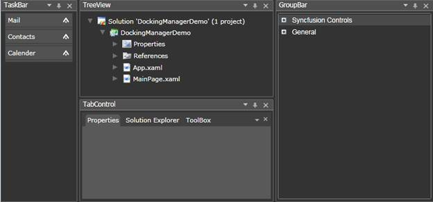
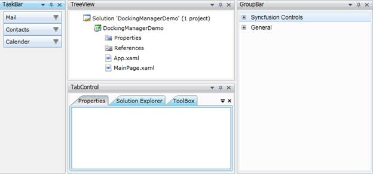
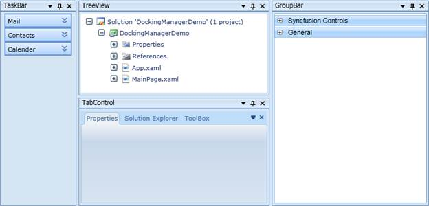
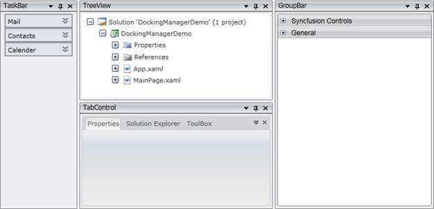
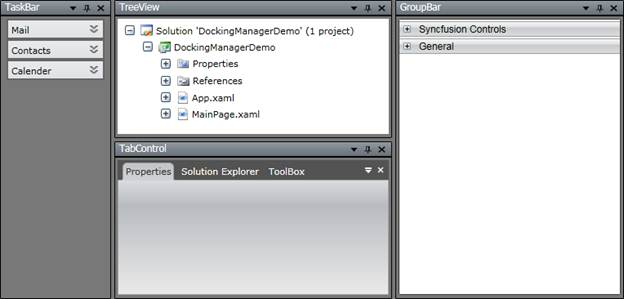
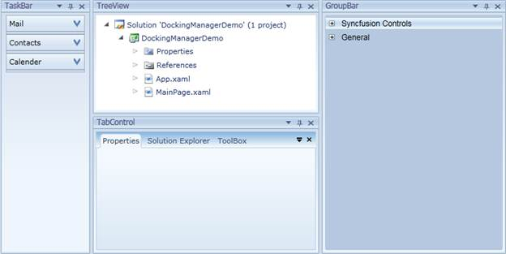
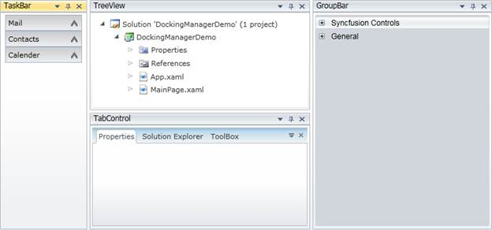
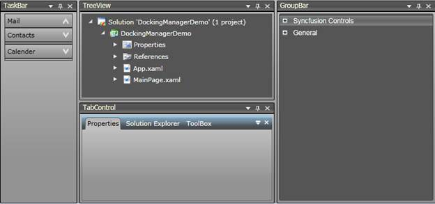

::: {style="DISPLAY: none"}
{#d2h_url_template}{#d2h_package_url style="WIDTH: 0px; DISPLAY: none; HEIGHT: 0px"}
:::

::: {.d2h_secondary_topic style="PADDING-BOTTOM: 10pt; MARGIN: 0pt; PADDING-LEFT: 0pt; PADDING-RIGHT: 0pt; PADDING-TOP: 0pt"}
#### Built-in Skins

[]{style="FONT-SIZE: 14pt"} 

Visual styles are available for the dockable windows This gives the windows a rich and professional look and feel. The visual style for the DockingManager is set using the **VisualStyle** property. The following are some of the visual styles that can be applied to the DockingManager.

+-----------------------------------+------------------------------------------------------------------------------------+
| Property                          | Description                                                                        |
+-----------------------------------+------------------------------------------------------------------------------------+
| VisualStyle                       | Sets the visual style for the DockingManager. The options provided are as follows: |
|                                   |                                                                                    |
|                                   | [·      ]{style="FONT-FAMILY: Symbol"}Office2007Black                              |
|                                   |                                                                                    |
|                                   | [·      ]{style="FONT-FAMILY: Symbol"}Office2007Silver                             |
|                                   |                                                                                    |
|                                   | [·      ]{style="FONT-FAMILY: Symbol"}Office2007Blue                               |
|                                   |                                                                                    |
|                                   | [·      ]{style="FONT-FAMILY: Symbol"}Blend                                        |
|                                   |                                                                                    |
|                                   | [·      ]{style="FONT-FAMILY: Symbol"}Default                                      |
|                                   |                                                                                    |
|                                   | [·      ]{style="FONT-FAMILY: Symbol"}Windows7                                     |
|                                   |                                                                                    |
|                                   | [·      ]{style="FONT-FAMILY: Symbol"}Office2010Blue                               |
|                                   |                                                                                    |
|                                   | [·      ]{style="FONT-FAMILY: Symbol"}Office2010Black                              |
|                                   |                                                                                    |
|                                   | [·      ]{style="FONT-FAMILY: Symbol"}Office2010Silver                             |
|                                   |                                                                                    |
|                                   | [·      ]{style="FONT-FAMILY: Symbol"}VS2010                                       |
|                                   |                                                                                    |
|                                   | [·      ]{style="FONT-FAMILY: Symbol"}Metro                                        |
+-----------------------------------+------------------------------------------------------------------------------------+

 

Given below are the sample screenshots:

[]{style="FONT-SIZE: 14pt"} 

{border="0"}

Figure 108: Default

**[]{style="FONT-SIZE: 14pt"}** 

**[]{style="FONT-SIZE: 14pt"}** 

**[]{style="FONT-SIZE: 14pt"}** 

**[]{style="FONT-SIZE: 14pt"}** 

**[]{style="FONT-SIZE: 14pt"}** 

**[]{style="FONT-SIZE: 14pt"}** 

**[]{style="FONT-SIZE: 14pt"}** 

{border="0"}

Figure 109: Blend

**[]{style="FONT-SIZE: 14pt"}** 

{border="0"}

Figure 110: Windows7

**[]{style="FONT-SIZE: 14pt"}** 

**[]{style="FONT-SIZE: 14pt"}** 

**[]{style="FONT-SIZE: 14pt"}** 

{border="0"}

Figure 111: Office2007Blue

**[]{style="FONT-SIZE: 14pt"}** 

{border="0"}

Figure 112: Office2007Silver

**[]{style="FONT-SIZE: 14pt"}** 

**[]{style="FONT-SIZE: 14pt"}** 

**[]{style="FONT-SIZE: 14pt"}** 

{border="0"}

Figure 113: Office2007Black

**[]{style="FONT-SIZE: 14pt"}** 

{border="0"}

Figure 114: Office2010Blue

**[]{style="FONT-SIZE: 14pt"}** 

**[]{style="FONT-SIZE: 14pt"}** 

**[]{style="FONT-SIZE: 14pt"}** 

{border="0"}

Figure 115: Office2010Silver

**[]{style="FONT-SIZE: 14pt"}** 

{border="0"}

Figure 116: Office2010Black

**[]{style="FONT-SIZE: 14pt"}** 

**[]{style="FONT-SIZE: 14pt"}** 

[]{#related-topics}
:::
