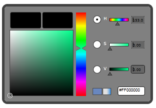

::: {style="DISPLAY: none"}
{#d2h_url_template}{#d2h_package_url style="WIDTH: 0px; DISPLAY: none; HEIGHT: 0px"}
:::

::::: {#nsbanner .d2h_main_nsbanner style="BORDER-BOTTOM: #999999 1px solid; POSITION: relative; PADDING-BOTTOM: 0px; BACKGROUND-COLOR: transparent; PADDING-LEFT: 0px; PADDING-RIGHT: 0px; DISPLAY: none; BORDER-TOP: #999999 1px solid; PADDING-TOP: 0px; LEFT: 0px"}
:::: {#TitleRow .d2h_main_titlerow style="PADDING-BOTTOM: 4px; BACKGROUND-COLOR: transparent; PADDING-LEFT: 22px; WIDTH: 100%; PADDING-RIGHT: 10px; DISPLAY: none; PADDING-TOP: 4px"}
::: {#ienav .d2h_main_ienav style="DISPLAY: none"}
{#D2HPrevious .D2HPreviousEnabled}  {#D2HNext .D2HNextEnabled}
:::
::::
:::::

::: {#nstext .d2h_main_nstext style="PADDING-BOTTOM: 10px; BACKGROUND-COLOR: transparent; PADDING-LEFT: 22px; PADDING-RIGHT: 10px; HEIGHT: 100%; OVERFLOW: auto; PADDING-TOP: 5px" hasuserbackground="true" valign="bottom"}
### []{#_Built-In-Skins}Built-In-Skins

Skins can be applied to the control by setting the **VisualStyle** property defined in the Skin Manager class.

 

Steps to apply the skin

1.   Add corresponding theming assembly in the sample project.

 

Naming Convention of Assembly - Syncfusion.Theming.SkinName

 

Example: Syncfusion.Theming.Blend

 

2.   Set the **VisualStyle** property to the corresponding theme. It can be set either in XAML or in C#.

**[]{style="FONT-FAMILY: 'Myriad Pro','sans-serif'"}** 

Table 71: VisualStyle Property

+-------------+----------------------------------+-------------------+--------------------------------------------------------+---------------------------------------------------------------------------------------------------------------------------------------------------------------------------------------------------------------------------------------+
| Property    | Description                      | Type              | Data Type                                              | Reference links                                                                                                                                                                                                                       |
+-------------+----------------------------------+-------------------+--------------------------------------------------------+---------------------------------------------------------------------------------------------------------------------------------------------------------------------------------------------------------------------------------------+
| VisualStyle | Sets the skins for the controls. | Attached Property | Enum (VisualStyle)                                     | [[Setting Visual Style in XAML]{style="COLOR: windowtext"}](../../../../../../../../Documents%20and%20Settings/riaj/Desktop/styling%20for%20ui%20silverlight/tools%20silverlight/tools%20part%202.docx#SettingVisualStyleinXAML)      |
|             |                                  |                   |                                                        |                                                                                                                                                                                                                                       |
|             |                                  |                   | The options are provided as follows.                   |           [[Setting Visual Style in C#]{style="COLOR: windowtext"}](../../../../../../../../Documents%20and%20Settings/riaj/Desktop/styling%20for%20ui%20silverlight/tools%20silverlight/tools%20part%202.docx#SettingVisualStyleinC) |
|             |                                  |                   |                                                        |                                                                                                                                                                                                                                       |
|             |                                  |                   | [·      ]{style="FONT-FAMILY: Symbol"}Default          | [[]{style="TEXT-DECORATION: none"}]{.underline}                                                                                                                                                                                       |
|             |                                  |                   |                                                        |                                                                                                                                                                                                                                       |
|             |                                  |                   | [·      ]{style="FONT-FAMILY: Symbol"}Blend            | [[]{style="TEXT-DECORATION: none"}]{.underline}                                                                                                                                                                                       |
|             |                                  |                   |                                                        |                                                                                                                                                                                                                                       |
|             |                                  |                   | [·      ]{style="FONT-FAMILY: Symbol"}Office2007Blue   |                                                                                                                                                                                                                                       |
|             |                                  |                   |                                                        |                                                                                                                                                                                                                                       |
|             |                                  |                   | [·      ]{style="FONT-FAMILY: Symbol"}Office2007Black  |                                                                                                                                                                                                                                       |
|             |                                  |                   |                                                        |                                                                                                                                                                                                                                       |
|             |                                  |                   | [·      ]{style="FONT-FAMILY: Symbol"}Office2007Silver |                                                                                                                                                                                                                                       |
|             |                                  |                   |                                                        |                                                                                                                                                                                                                                       |
|             |                                  |                   | [·      ]{style="FONT-FAMILY: Symbol"}Office2010Blue   |                                                                                                                                                                                                                                       |
|             |                                  |                   |                                                        |                                                                                                                                                                                                                                       |
|             |                                  |                   | [·      ]{style="FONT-FAMILY: Symbol"}Office2010Black  |                                                                                                                                                                                                                                       |
|             |                                  |                   |                                                        |                                                                                                                                                                                                                                       |
|             |                                  |                   | [·      ]{style="FONT-FAMILY: Symbol"}Office2010Silver |                                                                                                                                                                                                                                       |
|             |                                  |                   |                                                        |                                                                                                                                                                                                                                       |
|             |                                  |                   | [·      ]{style="FONT-FAMILY: Symbol"}Windows7         |                                                                                                                                                                                                                                       |
|             |                                  |                   |                                                        |                                                                                                                                                                                                                                       |
|             |                                  |                   | [·      ]{style="FONT-FAMILY: Symbol"}VS2010           |                                                                                                                                                                                                                                       |
|             |                                  |                   |                                                        |                                                                                                                                                                                                                                       |
|             |                                  |                   | [·      ]{style="FONT-FAMILY: Symbol"}Metro            |                                                                                                                                                                                                                                       |
|             |                                  |                   |                                                        |                                                                                                                                                                                                                                       |
|             |                                  |                   |                                                        |                                                                                                                                                                                                                                       |
+-------------+----------------------------------+-------------------+--------------------------------------------------------+---------------------------------------------------------------------------------------------------------------------------------------------------------------------------------------------------------------------------------------+

 

[Setting Visual Style in XAML]{#SettingVisualStyleinXAML}

[The following code snippet explains how to set the **VisualStyle** property in XAML.]{#_Ref274540222}

 

1.   Add the following namespace in the sample.

 

+--------------------------------------------------------------------------------------------------------------------------------------------------------------------------------------------------------------------------------------------------------------------------------------------------------------------+
| **[\[XAML\]]{style="FONT-FAMILY: 'Courier New'; COLOR: black"}**                                                                                                                                                                                                                                                   |
|                                                                                                                                                                                                                                                                                                                    |
| [xmlns]{style="FONT-FAMILY: 'Courier New'; COLOR: red"}[:]{style="FONT-FAMILY: 'Courier New'; COLOR: blue"}[theme]{style="FONT-FAMILY: 'Courier New'; COLOR: red"}[=\"clr-namespace:Syncfusion.Windows.Controls.Theming;assembly=Syncfusion.Shared.Silverlight\"]{style="FONT-FAMILY: 'Courier New'; COLOR: blue"} |
|                                                                                                                                                                                                                                                                                                                    |
| []{style="FONT-FAMILY: 'Courier New'; COLOR: blue"}                                                                                                                                                                                                                                                                |
+--------------------------------------------------------------------------------------------------------------------------------------------------------------------------------------------------------------------------------------------------------------------------------------------------------------------+

[]{style="FONT-FAMILY: Consolas; COLOR: blue; FONT-SIZE: 9.5pt"} 

2.   Set the **VisualStyle** property for the control as shown below.

 

+-----------------------------------------------------------------------------------------------------------------------------------------------------------------------------------------------------------------------------------------------------------------------------------------------------------------------------------------------------------------------------------------------------------------------------------------------------------------------------------------------------------------------------------------------------------------------------------------------------------------------------------------------------------------------------------------------------------------------------+
| **[\[XAML\]]{style="FONT-FAMILY: 'Courier New'; COLOR: black"}**                                                                                                                                                                                                                                                                                                                                                                                                                                                                                                                                                                                                                                                            |
|                                                                                                                                                                                                                                                                                                                                                                                                                                                                                                                                                                                                                                                                                                                             |
| [\<]{style="FONT-FAMILY: 'Courier New'; COLOR: blue"}[syncfusion]{style="FONT-FAMILY: 'Courier New'; COLOR: #a31515"}[:]{style="FONT-FAMILY: 'Courier New'; COLOR: blue"}[BrushEdit]{style="FONT-FAMILY: 'Courier New'; COLOR: #a31515"}[ Name]{style="FONT-FAMILY: 'Courier New'; COLOR: red"}[=\"brushedit\"]{style="FONT-FAMILY: 'Courier New'; COLOR: blue"}[ theme]{style="FONT-FAMILY: 'Courier New'; COLOR: red"}[:]{style="FONT-FAMILY: 'Courier New'; COLOR: blue"}[SkinManager.VisualStyle]{style="FONT-FAMILY: 'Courier New'; COLOR: red"}[=\"Blend\"]{style="FONT-FAMILY: 'Courier New'; COLOR: blue"}[ ]{style="FONT-FAMILY: 'Courier New'; COLOR: red"}[/\>]{style="FONT-FAMILY: 'Courier New'; COLOR: blue"} |
|                                                                                                                                                                                                                                                                                                                                                                                                                                                                                                                                                                                                                                                                                                                             |
| []{style="FONT-FAMILY: 'Courier New'; COLOR: blue"}                                                                                                                                                                                                                                                                                                                                                                                                                                                                                                                                                                                                                                                                         |
+-----------------------------------------------------------------------------------------------------------------------------------------------------------------------------------------------------------------------------------------------------------------------------------------------------------------------------------------------------------------------------------------------------------------------------------------------------------------------------------------------------------------------------------------------------------------------------------------------------------------------------------------------------------------------------------------------------------------------------+

 

[Setting Visual Style in C#]{#SettingVisualStyleinC}

The following code snippet explains how to set the VisualStyle property in C#.

 

1.   Name the control using the **Name** attribute.

 

+------------------------------------------------------------------------------------------------------------------------------------------------------------------------------------------------------------------------------------------------------------------------------------------------------------------------------------------------------------------------------------------------------------------------------------------------------------------------------------------------------------------------------------------------------------------------------------------------------------------------------------------------------------------------------------------------------------------+
| **[\[XAML\]]{style="FONT-FAMILY: 'Courier New'; COLOR: black"}**                                                                                                                                                                                                                                                                                                                                                                                                                                                                                                                                                                                                                                                 |
|                                                                                                                                                                                                                                                                                                                                                                                                                                                                                                                                                                                                                                                                                                                  |
| [\<]{style="FONT-FAMILY: 'Courier New'; COLOR: blue"}[syncfusion]{style="FONT-FAMILY: 'Courier New'; COLOR: #a31515"}[:]{style="FONT-FAMILY: 'Courier New'; COLOR: blue"}[BrushEdit]{style="FONT-FAMILY: 'Courier New'; COLOR: #a31515"}[ Height]{style="FONT-FAMILY: 'Courier New'; COLOR: red"}[=\"200\"]{style="FONT-FAMILY: 'Courier New'; COLOR: blue"}[ Name]{style="FONT-FAMILY: 'Courier New'; COLOR: red"}[=\"brushedit\"]{style="FONT-FAMILY: 'Courier New'; COLOR: blue"}[ Width]{style="FONT-FAMILY: 'Courier New'; COLOR: red"}[=\"299\"]{style="FONT-FAMILY: 'Courier New'; COLOR: blue"}[ ]{style="FONT-FAMILY: 'Courier New'; COLOR: red"}[/\>]{style="FONT-FAMILY: 'Courier New'; COLOR: blue"} |
|                                                                                                                                                                                                                                                                                                                                                                                                                                                                                                                                                                                                                                                                                                                  |
| []{style="FONT-FAMILY: 'Courier New'; COLOR: blue"}                                                                                                                                                                                                                                                                                                                                                                                                                                                                                                                                                                                                                                                              |
+------------------------------------------------------------------------------------------------------------------------------------------------------------------------------------------------------------------------------------------------------------------------------------------------------------------------------------------------------------------------------------------------------------------------------------------------------------------------------------------------------------------------------------------------------------------------------------------------------------------------------------------------------------------------------------------------------------------+

[]{style="FONT-FAMILY: Consolas; COLOR: blue; FONT-SIZE: 9.5pt"} 

2.   Add the following line in code behind file.

 

+--------------------------------------------------------------------------------------------------------------------------------------------------------------------------------------------------------+
| **[\[C#\]]{style="FONT-FAMILY: 'Courier New'"}**                                                                                                                                                       |
|                                                                                                                                                                                                        |
| [SkinManager]{style="FONT-FAMILY: 'Courier New'; COLOR: #2b91af"}[.SetVisualStyle([brushedit]{style="COLOR: black"},[VisualStyle]{style="COLOR: #2b91af"}.Blend);]{style="FONT-FAMILY: 'Courier New'"} |
|                                                                                                                                                                                                        |
| []{style="FONT-FAMILY: 'Courier New'"}                                                                                                                                                                 |
+--------------------------------------------------------------------------------------------------------------------------------------------------------------------------------------------------------+

[]{style="COLOR: #4e84c4; FONT-SIZE: 16pt"} 

The output is as shown below.

{border="0"}

Figure 1159: BrushEdit Blend Style

 

[]{#related-topics}
:::
