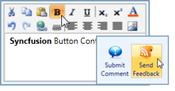

::: {style="DISPLAY: none"}
{#d2h_url_template}{#d2h_package_url style="WIDTH: 0px; DISPLAY: none; HEIGHT: 0px"}
:::

::::: {#nsbanner .d2h_main_nsbanner style="BORDER-BOTTOM: #999999 1px solid; POSITION: relative; PADDING-BOTTOM: 0px; BACKGROUND-COLOR: transparent; PADDING-LEFT: 0px; PADDING-RIGHT: 0px; DISPLAY: none; BORDER-TOP: #999999 1px solid; PADDING-TOP: 0px; LEFT: 0px"}
:::: {#TitleRow .d2h_main_titlerow style="PADDING-BOTTOM: 4px; BACKGROUND-COLOR: transparent; PADDING-LEFT: 22px; WIDTH: 100%; PADDING-RIGHT: 10px; DISPLAY: none; PADDING-TOP: 4px"}
::: {#ienav .d2h_main_ienav style="DISPLAY: none"}
{#D2HPrevious .D2HPreviousEnabled}  {#D2HNext .D2HNextEnabled}
:::
::::
:::::

::: {#nstext .d2h_main_nstext style="PADDING-BOTTOM: 10px; BACKGROUND-COLOR: transparent; PADDING-LEFT: 22px; PADDING-RIGHT: 10px; HEIGHT: 100%; OVERFLOW: auto; PADDING-TOP: 5px" hasuserbackground="true" valign="bottom"}
## ButtonAdv

The *ButtonAdv* control is a basic button control that is used to design complex forms and applications. Also, the control shipped with Commanding Support, provides compatibility in MVVM design pattern[.]{style="FONT-FAMILY: 'Calibri','sans-serif'"}

{border="0"}

Figure 1045: ButtonAdv

More:

[ ]{#related-topics}

[{border="0" align="absMiddle"}Getting Started](ms-xhelp:///?Id=c9a30112-7052-44d0-9f48-343fd608b817){style="TEXT-DECORATION: none"}

[{border="0" align="absMiddle"}Control Structure](ms-xhelp:///?Id=15dd819e-888f-46d4-b483-4de09fd7c464){style="TEXT-DECORATION: none"}

[{border="0" align="absMiddle"}Concepts and Features](ms-xhelp:///?Id=2372d1aa-5f60-4022-8f4c-122c219c7056){style="TEXT-DECORATION: none"}

[{border="0" align="absMiddle"}Events](ms-xhelp:///?Id=8f84d318-c6e7-44c5-85d5-7d9d278f7543){style="TEXT-DECORATION: none"}
:::
