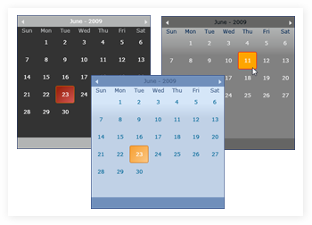

::: {style="DISPLAY: none"}
{#d2h_url_template}{#d2h_package_url style="WIDTH: 0px; DISPLAY: none; HEIGHT: 0px"}
:::

::::: {#nsbanner .d2h_main_nsbanner style="BORDER-BOTTOM: #999999 1px solid; POSITION: relative; PADDING-BOTTOM: 0px; BACKGROUND-COLOR: transparent; PADDING-LEFT: 0px; PADDING-RIGHT: 0px; DISPLAY: none; BORDER-TOP: #999999 1px solid; PADDING-TOP: 0px; LEFT: 0px"}
:::: {#TitleRow .d2h_main_titlerow style="PADDING-BOTTOM: 4px; BACKGROUND-COLOR: transparent; PADDING-LEFT: 22px; WIDTH: 100%; PADDING-RIGHT: 10px; DISPLAY: none; PADDING-TOP: 4px"}
::: {#ienav .d2h_main_ienav style="DISPLAY: none"}
{#D2HPrevious .D2HPreviousEnabled}  {#D2HNext .D2HNextEnabled}
:::
::::
:::::

::: {#nstext .d2h_main_nstext style="PADDING-BOTTOM: 10px; BACKGROUND-COLOR: transparent; PADDING-LEFT: 22px; PADDING-RIGHT: 10px; HEIGHT: 100%; OVERFLOW: auto; PADDING-TOP: 5px" hasuserbackground="true" valign="bottom"}
## []{#p198}[]{#_DateTimeEdit}[]{#p228}CalendarControl

 

The CalendarControl is used to select Dates with different cultures, styles and colors.

 

{border="0"}

 

Figure 454: Calendar Control

 

Feature Summary

 

[·      ]{style="FONT-FAMILY: Symbol"}**AllowMultipleSelection**: select multiple dates in the CalendarControl by using this property

[·      ]{style="FONT-FAMILY: Symbol"}**Animation Time**: control the speed of month navigation in the CalendarControl

[·      ]{style="FONT-FAMILY: Symbol"}**Background Color**: set the background color for the CalendarControl

[·      ]{style="FONT-FAMILY: Symbol"}**Border Color**: set the border color for the control

[·      ]{style="FONT-FAMILY: Symbol"}**Calendar Style**: set the calendar style of the control

[·      ]{style="FONT-FAMILY: Symbol"}**Culture**: set the culture for the control

[·      ]{style="FONT-FAMILY: Symbol"}**Date**: displays the default date at the bottom of the CalendarControl, while loading the control

[·      ]{style="FONT-FAMILY: Symbol"}**Date Foreground Color**: set the foreground color for selected values of this control

[·      ]{style="FONT-FAMILY: Symbol"}**Day Foreground Color**: set the foreground color for the day value of the control

[·      ]{style="FONT-FAMILY: Symbol"}**DisplayCurrentDate**: specify whether to display the current date at the bottom of this control by using this property

[·      ]{style="FONT-FAMILY: Symbol"}**Header Background Color**: set the background color for the header of the CalendarControl

[·      ]{style="FONT-FAMILY: Symbol"}**Header Foreground Color**: set the foreground color for the header of the CalendarControl

[·      ]{style="FONT-FAMILY: Symbol"}**IsDayNameAbbreviated**: specify whether day name should be abbreviated or displayed in full format by using this property

[·      ]{style="FONT-FAMILY: Symbol"}**IsMonthNameAbbreviated**: specify whether month name should be abbreviated or displayed in full format by using this property

[·      ]{style="FONT-FAMILY: Symbol"}**MonthChangeDirection**: change the direction of month navigation by using this property

[·      ]{style="FONT-FAMILY: Symbol"}**Mouse Hover Cell Background Color**: change the background color of a cell, when the mouse pointer moves over the cell

[·      ]{style="FONT-FAMILY: Symbol"}**Mouse Hover Cell Border Color**: change the border color of a cell, when the mouse pointer moves over the cell

[·      ]{style="FONT-FAMILY: Symbol"}**Mouse Hover Cell Border Thickness Color**: change the border thickness of a cell, when the mouse pointer moves over the cell

[·      ]{style="FONT-FAMILY: Symbol"}**Mouse Hover Cell Corner Radius Color**: change the corner radius of a cell, when the mouse pointer moves over the cell

[·      ]{style="FONT-FAMILY: Symbol"}**Mouse Hover Cell Foreground Color**: change the foreground color of a cell, when the mouse pointer moves over the cell

[·      ]{style="FONT-FAMILY: Symbol"}**Mouse Hover Scroll Button Fill Color**: change the scroll button color, when the mouse pointer moves over the next or previous arrow scroll button

[·      ]{style="FONT-FAMILY: Symbol"}**Next Month Days Foreground Color**: set the foreground color for the dates that belong to the next month

[·      ]{style="FONT-FAMILY: Symbol"}**Previous Month Days Foreground Color**: set the foreground color for the dates that belong to the previous month

[·      ]{style="FONT-FAMILY: Symbol"}**Scroll Button Color**: set the color for the scroll buttons

[·      ]{style="FONT-FAMILY: Symbol"}**Selected Cell Background Color**: set the background color of the selected cell

[·      ]{style="FONT-FAMILY: Symbol"}**Selected Cell Border Color**: set the border color of the selected cell

[·      ]{style="FONT-FAMILY: Symbol"}**Selected Cell Border Thickness**: set the border thickness of the selected cell

[·      ]{style="FONT-FAMILY: Symbol"}**Selected Cell Corner Radius**: set the corner radius of the selected cell

[·      ]{style="FONT-FAMILY: Symbol"}**Selected Cell Foreground Color**: set the foreground color of the selected cell

[·      ]{style="FONT-FAMILY: Symbol"}**Selected Date**: set or get the selected date

[·      ]{style="FONT-FAMILY: Symbol"}**Selected Dates**: set or get multiple selected dates

[·      ]{style="FONT-FAMILY: Symbol"}**Selection Range Mode**: select all the dates that are displayed under a particular day, when you move the mouse pointer over the day

[·      ]{style="FONT-FAMILY: Symbol"}**ShowNextMonthDates**: display the dates that belong to the next month along with the current month by using this property

[·      ]{style="FONT-FAMILY: Symbol"}**ShowPreviousMonthDates**: display the dates that belong to the previous month along with the current month by using this property

[·      ]{style="FONT-FAMILY: Symbol"}**ShowWeekNumber**: view the week numbers in the CalendarControl by using this property

[·      ]{style="FONT-FAMILY: Symbol"}**Visual Style**: specifies the visual style for the control

More:

[ ]{#related-topics}

[{border="0" align="absMiddle"}Getting Started](ms-xhelp:///?Id=9022362c-bdfc-4492-bd23-933e121aa4bd){style="TEXT-DECORATION: none"}

[{border="0" align="absMiddle"}Concepts and Features](ms-xhelp:///?Id=1b8387cc-232e-4b78-ac5e-1029286752b8){style="TEXT-DECORATION: none"}
:::
