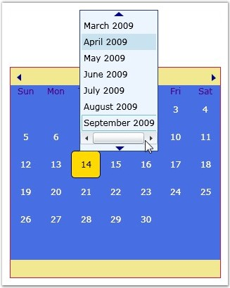
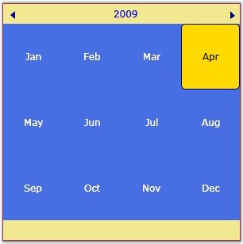
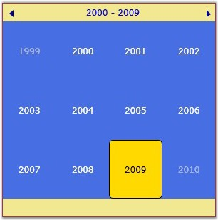
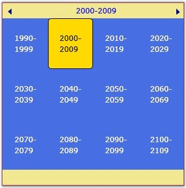

::: {style="DISPLAY: none"}
{#d2h_url_template}{#d2h_package_url style="WIDTH: 0px; DISPLAY: none; HEIGHT: 0px"}
:::

::: {.d2h_secondary_topic style="PADDING-BOTTOM: 10pt; MARGIN: 0pt; PADDING-LEFT: 0pt; PADDING-RIGHT: 0pt; PADDING-TOP: 0pt"}
##### []{#_Calendar_Style}Calendar Style

 

The **CalendarStyle** property is used to set the calendar style of the CalendarControl. It includes the following options.

 

[·      ]{style="FONT-FAMILY: Symbol"}Standard

[·      ]{style="FONT-FAMILY: Symbol"}Vista

 

The flow direction of the CalendarControl will be set depending upon the calendar style. The following code example illustrates how to set this property.

 

+-------------------------------------------------------------------------------------------------------------------------------------------------------------------------------------------------------------------------------------------------------------------------------------------------------------------------------------------------------------------------------------------------------------------------------------------------------------------------------------------------------------+
| **[\[XAML\]]{style="FONT-FAMILY: 'Courier New'; COLOR: black"}**                                                                                                                                                                                                                                                                                                                                                                                                                                            |
|                                                                                                                                                                                                                                                                                                                                                                                                                                                                                                             |
| []{style="FONT-FAMILY: 'Courier New'; COLOR: black"}                                                                                                                                                                                                                                                                                                                                                                                                                                                        |
|                                                                                                                                                                                                                                                                                                                                                                                                                                                                                                             |
| [\<]{style="FONT-FAMILY: 'Courier New'; COLOR: blue"}[Syncfusion]{style="FONT-FAMILY: 'Courier New'; COLOR: maroon"}[:]{style="FONT-FAMILY: 'Courier New'; COLOR: blue"}[CalendarControl]{style="FONT-FAMILY: 'Courier New'; COLOR: maroon"}[ [x]{style="COLOR: maroon"}[:]{style="COLOR: blue"}[Name]{style="COLOR: red"}[="calendarcontrol"]{style="COLOR: blue"} [CalendarStyle]{style="COLOR: red"}[=\"Standard\"]{style="COLOR: blue"} [/\>]{style="COLOR: blue"}]{style="FONT-FAMILY: 'Courier New'"} |
+-------------------------------------------------------------------------------------------------------------------------------------------------------------------------------------------------------------------------------------------------------------------------------------------------------------------------------------------------------------------------------------------------------------------------------------------------------------------------------------------------------------+

 

+-----------------------------------------------------------------------------------------------------------------------+
| **[\[C#\]]{style="FONT-FAMILY: 'Courier New'; COLOR: black"}**                                                        |
|                                                                                                                       |
| []{style="FONT-FAMILY: 'Courier New'"}                                                                                |
|                                                                                                                       |
| [CalendarControl calendarcontrol = [new]{style="COLOR: blue"} CalendarControl();]{style="FONT-FAMILY: 'Courier New'"} |
|                                                                                                                       |
| [calendarcontrol.CalendarStyle = CalendarStyle.Vista;]{style="FONT-FAMILY: 'Courier New'"}                            |
+-----------------------------------------------------------------------------------------------------------------------+

 

{border="0"}

 

Figure 468 : CalendarStyle = \"Standard\"

 

{border="0"}

 

Figure 469: CalendarStyle = \"Vista\"

 

{border="0"}

 

Figure 470: CalendarStyle = \"Vista\"

 

{border="0"}

 

Figure 471: CalendarStyle = \"Vista\"

[]{#related-topics}
:::
