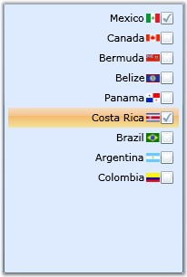

::: {style="DISPLAY: none"}
{#d2h_url_template}{#d2h_package_url style="WIDTH: 0px; DISPLAY: none; HEIGHT: 0px"}
:::

::: {.d2h_secondary_topic style="PADDING-BOTTOM: 10pt; MARGIN: 0pt; PADDING-LEFT: 0pt; PADDING-RIGHT: 0pt; PADDING-TOP: 0pt"}
##### []{#p151}[]{#_CheckedListBox_Item_Alignment}CheckedListBox Item Alignment

 

The alignment of the CheckedListBox Items can be changed by using the **RightToLeft** property. When this property is set to ***true***, the CheckedListBox Items are aligned to the right and the check boxes are placed at the right side of the items. The default value for this property is set to ***false***.

 

The following code example illustrates how to set this property.

 

+----------------------------------------------------------------------------------------------------------------------------------------------------------------------------------------------------------------------------------------------------------------------------------------------------------------------------------------------------------------------------------------------------------------------------------------------------------------------------------------------------------------------------------------------------------------------------------------------------------------------------------------------------------------------------------------------------------------------------------------------+
| **[\[XAML\]]{style="FONT-FAMILY: 'Courier New'; COLOR: black"}**                                                                                                                                                                                                                                                                                                                                                                                                                                                                                                                                                                                                                                                                             |
|                                                                                                                                                                                                                                                                                                                                                                                                                                                                                                                                                                                                                                                                                                                                              |
| []{style="FONT-FAMILY: 'Courier New'; COLOR: black"}                                                                                                                                                                                                                                                                                                                                                                                                                                                                                                                                                                                                                                                                                         |
|                                                                                                                                                                                                                                                                                                                                                                                                                                                                                                                                                                                                                                                                                                                                              |
| [\<]{style="FONT-FAMILY: 'Courier New'; COLOR: blue"}[syncfusion]{style="FONT-FAMILY: 'Courier New'; COLOR: #a31515"}[:]{style="FONT-FAMILY: 'Courier New'; COLOR: blue"}[CheckedListBox]{style="FONT-FAMILY: 'Courier New'; COLOR: #a31515"}[ Name]{style="FONT-FAMILY: 'Courier New'; COLOR: red"}[=\"checklistbox\"]{style="FONT-FAMILY: 'Courier New'; COLOR: blue"}[ RightToLeft]{style="FONT-FAMILY: 'Courier New'; COLOR: red"}[=\"True\"]{style="FONT-FAMILY: 'Courier New'; COLOR: blue"}[ Height]{style="FONT-FAMILY: 'Courier New'; COLOR: red"}[=\"350\"]{style="FONT-FAMILY: 'Courier New'; COLOR: blue"}[ Width]{style="FONT-FAMILY: 'Courier New'; COLOR: red"}[=\"200\" \>]{style="FONT-FAMILY: 'Courier New'; COLOR: blue"} |
|                                                                                                                                                                                                                                                                                                                                                                                                                                                                                                                                                                                                                                                                                                                                              |
| [    ]{style="FONT-FAMILY: 'Courier New'; COLOR: #a31515"}[\<]{style="FONT-FAMILY: 'Courier New'; COLOR: blue"}[syncfusion]{style="FONT-FAMILY: 'Courier New'; COLOR: #a31515"}[:]{style="FONT-FAMILY: 'Courier New'; COLOR: blue"}[CheckedListBoxItem]{style="FONT-FAMILY: 'Courier New'; COLOR: #a31515"}[ Content]{style="FONT-FAMILY: 'Courier New'; COLOR: red"}[=\"Belize\" /\>]{style="FONT-FAMILY: 'Courier New'; COLOR: blue"}                                                                                                                                                                                                                                                                                                      |
|                                                                                                                                                                                                                                                                                                                                                                                                                                                                                                                                                                                                                                                                                                                                              |
| [\</]{style="FONT-FAMILY: 'Courier New'; COLOR: blue"}[syncfusion]{style="FONT-FAMILY: 'Courier New'; COLOR: #a31515"}[:]{style="FONT-FAMILY: 'Courier New'; COLOR: blue"}[CheckedListBox]{style="FONT-FAMILY: 'Courier New'; COLOR: #a31515"}[\>]{style="FONT-FAMILY: 'Courier New'; COLOR: blue"}                                                                                                                                                                                                                                                                                                                                                                                                                                          |
+----------------------------------------------------------------------------------------------------------------------------------------------------------------------------------------------------------------------------------------------------------------------------------------------------------------------------------------------------------------------------------------------------------------------------------------------------------------------------------------------------------------------------------------------------------------------------------------------------------------------------------------------------------------------------------------------------------------------------------------------+

 

+----------------------------------------------------------------------------------------------------------------------------------------------------------------------------------------------+
| **[\[C#\]]{style="FONT-FAMILY: 'Courier New'; COLOR: black"}**                                                                                                                               |
|                                                                                                                                                                                              |
| []{style="FONT-FAMILY: 'Courier New'; COLOR: black"}                                                                                                                                         |
|                                                                                                                                                                                              |
| [CheckedListBox]{style="FONT-FAMILY: 'Courier New'; COLOR: teal"}[ checkedlistbox = [new]{style="COLOR: blue"} [CheckedListBox]{style="COLOR: teal"}();]{style="FONT-FAMILY: 'Courier New'"} |
|                                                                                                                                                                                              |
| [checkedlistbox.RightToLeft = [true]{style="COLOR: blue"};]{style="FONT-FAMILY: 'Courier New'"}                                                                                              |
|                                                                                                                                                                                              |
| [grid.Children.Add(checkedlistbox);]{style="FONT-FAMILY: 'Courier New'"}                                                                                                                     |
+----------------------------------------------------------------------------------------------------------------------------------------------------------------------------------------------+

 

{border="0"}

 

Figure 337 : CheckedListBox with RightToLeft property set to \"True\"

[]{#related-topics}
:::
