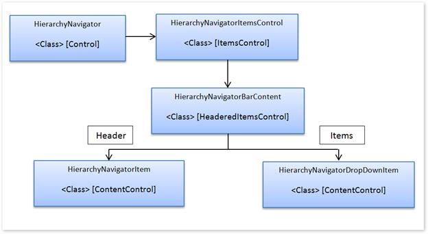

::: {style="DISPLAY: none"}
{#d2h_url_template}{#d2h_package_url style="WIDTH: 0px; DISPLAY: none; HEIGHT: 0px"}
:::

::::: {.d2h_secondary_topic style="PADDING-BOTTOM: 10pt; MARGIN: 0pt; PADDING-LEFT: 0pt; PADDING-RIGHT: 0pt; PADDING-TOP: 0pt"}
##### Class Diagram

[]{style="FONT-FAMILY: 'Calibri','sans-serif'"} 

{border="0"}

 

Figure 1010: Class Diagram[]{style="FONT-FAMILY: 'Calibri','sans-serif'"}

###### Properties

::: {align="center"}
  -------------------------------- ------------------------------------------------- ----------------------------------------------
  Name                             Value Type                                        Description
  IsEnableEditMode                 Boolean                                           Enables Edit mode
  IsEnableHistory                  Boolean                                           Displays history
  MaxDrillDownLevel                Integer                                           Restricts how far levels can be drilled down
  ShowToolTip                      Boolean                                           Shows a ToolTip if set to **true**
  Items                            ObservableCollection\< HierarchyNavigatorItem\>   Adds a hierarchical item to a control
  SelectedHierarchyNavigatorItem   HierarchyNavigatorItem                            Indicates which item is currently selected
  -------------------------------- ------------------------------------------------- ----------------------------------------------
:::

[]{style="FONT-FAMILY: 'Calibri','sans-serif'"} 

###### Methods

::: {align="center"}
  -------------------- ----------- ------------- ------------------------------------------------------------------
  Name                 Arguments   Return Type   Description
  ShowProgressBar      Empty       void          Default TimeSpan of 500 ms will be set for progress bar timeline
  ShowProgressBar      TimeSpan    void          TimeSpan can be set to control the progress bar timeline
  CancelProgressBar    Empty       void          Default TimeSpan of 500 ms will be set for progress bar timeline
   CancelProgressBar   TimeSpan    void          TimeSpan can be set to control the progress bar timeline
  -------------------- ----------- ------------- ------------------------------------------------------------------
:::

[]{style="FONT-FAMILY: 'Calibri','sans-serif'"} 

###### Events

  --------------------------------------- ------------------------------- -----------------------------------------------------------------------
  Name                                    Arguments passed along          Description
  HierarchyNavigatorSelectedItemChanged   Selected Item                   Occurs whenever an item is changed
  HierarchyNavigatorRefreshButtonClick    HierarchicalNavigator Control   Occurs when the Refresh button is clicked
  NavigationPopupOpening                  Selected Item                   Occurs when the navigation pop-up window is in the process of opening
  NavigationPopupOpened                   Selected Item                   Occurs when the navigation pop-up window is open
  NavigationPopupClosing                  Selected Item                   Occurs when the navigation pop-up window is closing
  NavigationPopupClosed                   Selected Item                   Occurs when the navigation pop-up window  is closed
  --------------------------------------- ------------------------------- -----------------------------------------------------------------------

[]{style="FONT-FAMILY: 'Calibri','sans-serif'"} 

[]{#related-topics}
:::::
