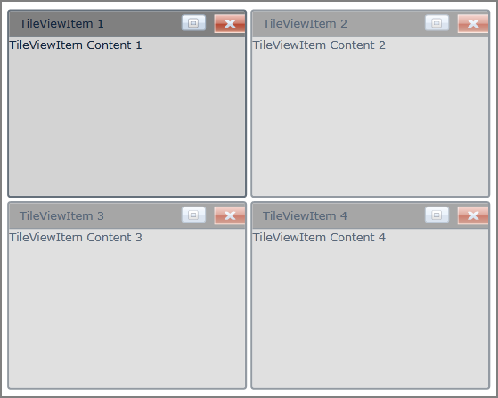

::: {style="DISPLAY: none"}
{#d2h_url_template}{#d2h_package_url style="WIDTH: 0px; DISPLAY: none; HEIGHT: 0px"}
:::

::: {.d2h_secondary_topic style="PADDING-BOTTOM: 10pt; MARGIN: 0pt; PADDING-LEFT: 0pt; PADDING-RIGHT: 0pt; PADDING-TOP: 0pt"}
#### CloseButton Support

The CloseButton feature in TileViewItem allows you to hide or delete the TileViewItem based on the CloseMode. If you click on the CloseButton when the CloseMode is set to be hidden, then the TileViewItem moves to the Hidden State. If the CloseMode is set to Delete, then the TileViewItem will be removed from the TileViewControl. By default, the visibility of the CloseButton is set to Collapsed. You can also change the style of the CloseButton using the **CloseButtonStyle** property.

Use Case Scenarios

This feature enables you to close a particular TileViewItem.

 

Adding CloseButton to an Application

The CloseButton feature can be added to an application by using either XAML or C# code.

 

The following code example illustrates how to add the CloseButton feature to an application through XAML.

 

+-------------------------------------------------------------------------------------------------------------------------------------------------------------------------------------------------------------------------------------------------------------------------------------------------------------------------------------------------------------------------------------------------------------------------------------------------------------------------------------------------------------------------------------------------------------------------------------------------------------------------------------------------------------------------------------------------------------------------------------------------------------------------+
| **[\[XAML\]]{style="FONT-FAMILY: 'Courier New'"}**                                                                                                                                                                                                                                                                                                                                                                                                                                                                                                                                                                                                                                                                                                                      |
|                                                                                                                                                                                                                                                                                                                                                                                                                                                                                                                                                                                                                                                                                                                                                                         |
| **[]{style="FONT-FAMILY: 'Courier New'"}**                                                                                                                                                                                                                                                                                                                                                                                                                                                                                                                                                                                                                                                                                                                              |
|                                                                                                                                                                                                                                                                                                                                                                                                                                                                                                                                                                                                                                                                                                                                                                         |
| [\<]{style="FONT-FAMILY: 'Courier New'; COLOR: blue"}[syncfusion]{style="FONT-FAMILY: 'Courier New'; COLOR: #a31515"}[:]{style="FONT-FAMILY: 'Courier New'; COLOR: blue"}[TileViewControl]{style="FONT-FAMILY: 'Courier New'; COLOR: #a31515"}[ x]{style="FONT-FAMILY: 'Courier New'; COLOR: red"}[:]{style="FONT-FAMILY: 'Courier New'; COLOR: blue"}[Name]{style="FONT-FAMILY: 'Courier New'; COLOR: red"}[=\"TileView1\"]{style="FONT-FAMILY: 'Courier New'; COLOR: blue"}[ Width]{style="FONT-FAMILY: 'Courier New'; COLOR: red"}[=\"500\"]{style="FONT-FAMILY: 'Courier New'; COLOR: blue"}[ Height]{style="FONT-FAMILY: 'Courier New'; COLOR: red"}[=\"400\"]{style="FONT-FAMILY: 'Courier New'; COLOR: blue"}[ ]{style="FONT-FAMILY: 'Courier New'; COLOR: red"} |
|                                                                                                                                                                                                                                                                                                                                                                                                                                                                                                                                                                                                                                                                                                                                                                         |
| [Background]{style="FONT-FAMILY: 'Courier New'; COLOR: red"}[=\"White\"\>]{style="FONT-FAMILY: 'Courier New'; COLOR: blue"}[]{style="FONT-FAMILY: 'Courier New'"}                                                                                                                                                                                                                                                                                                                                                                                                                                                                                                                                                                                                       |
|                                                                                                                                                                                                                                                                                                                                                                                                                                                                                                                                                                                                                                                                                                                                                                         |
| [   ]{style="FONT-FAMILY: 'Courier New'; COLOR: #a31515"}[\<]{style="FONT-FAMILY: 'Courier New'; COLOR: blue"}[syncfusion]{style="FONT-FAMILY: 'Courier New'; COLOR: #a31515"}[:]{style="FONT-FAMILY: 'Courier New'; COLOR: blue"}[TileViewItem]{style="FONT-FAMILY: 'Courier New'; COLOR: #a31515"}[ CloseMode]{style="FONT-FAMILY: 'Courier New'; COLOR: red"}[=\"Hide\"]{style="FONT-FAMILY: 'Courier New'; COLOR: blue"}[ BorderThickness]{style="FONT-FAMILY: 'Courier New'; COLOR: red"}[=\"2\"]{style="FONT-FAMILY: 'Courier New'; COLOR: blue"}[ ]{style="FONT-FAMILY: 'Courier New'; COLOR: red"}                                                                                                                                                              |
|                                                                                                                                                                                                                                                                                                                                                                                                                                                                                                                                                                                                                                                                                                                                                                         |
| [          Header]{style="FONT-FAMILY: 'Courier New'; COLOR: red"}[=\"TileViewItem 1\"]{style="FONT-FAMILY: 'Courier New'; COLOR: blue"}[ [Content]{style="COLOR: red"}[=\"TileViewItem Content 1\"]{style="COLOR: blue"}[ ]{style="COLOR: red"}]{style="FONT-FAMILY: 'Courier New'"}                                                                                                                                                                                                                                                                                                                                                                                                                                                                                   |
|                                                                                                                                                                                                                                                                                                                                                                                                                                                                                                                                                                                                                                                                                                                                                                         |
| [          CloseButtonVisibility]{style="FONT-FAMILY: 'Courier New'; COLOR: red"}[=\"Visible\"]{style="FONT-FAMILY: 'Courier New'; COLOR: blue"}[ [Background]{style="COLOR: red"}[=\"LightGray\"]{style="COLOR: blue"}[ ]{style="COLOR: red"}]{style="FONT-FAMILY: 'Courier New'"}                                                                                                                                                                                                                                                                                                                                                                                                                                                                                     |
|                                                                                                                                                                                                                                                                                                                                                                                                                                                                                                                                                                                                                                                                                                                                                                         |
| [          HeaderBackground]{style="FONT-FAMILY: 'Courier New'; COLOR: red"}[=\"Gray\"]{style="FONT-FAMILY: 'Courier New'; COLOR: blue"}[ Margin]{style="FONT-FAMILY: 'Courier New'; COLOR: red"}[=\"2\"]{style="FONT-FAMILY: 'Courier New'; COLOR: blue"}[ CornerRadius]{style="FONT-FAMILY: 'Courier New'; COLOR: red"}[=\"3\"/\>]{style="FONT-FAMILY: 'Courier New'; COLOR: blue"}[]{style="FONT-FAMILY: 'Courier New'"}                                                                                                                                                                                                                                                                                                                                             |
|                                                                                                                                                                                                                                                                                                                                                                                                                                                                                                                                                                                                                                                                                                                                                                         |
| [   ]{style="FONT-FAMILY: 'Courier New'; COLOR: #a31515"}[\<]{style="FONT-FAMILY: 'Courier New'; COLOR: blue"}[syncfusion]{style="FONT-FAMILY: 'Courier New'; COLOR: #a31515"}[:]{style="FONT-FAMILY: 'Courier New'; COLOR: blue"}[TileViewItem]{style="FONT-FAMILY: 'Courier New'; COLOR: #a31515"}[ CloseMode]{style="FONT-FAMILY: 'Courier New'; COLOR: red"}[=\"Hide\"]{style="FONT-FAMILY: 'Courier New'; COLOR: blue"}[ BorderThickness]{style="FONT-FAMILY: 'Courier New'; COLOR: red"}[=\"2\"]{style="FONT-FAMILY: 'Courier New'; COLOR: blue"}[ ]{style="FONT-FAMILY: 'Courier New'; COLOR: red"}                                                                                                                                                              |
|                                                                                                                                                                                                                                                                                                                                                                                                                                                                                                                                                                                                                                                                                                                                                                         |
| [          Header]{style="FONT-FAMILY: 'Courier New'; COLOR: red"}[=\"TileViewItem 2\"]{style="FONT-FAMILY: 'Courier New'; COLOR: blue"}[ [Content]{style="COLOR: red"}[=\"TileViewItem Content 2\"]{style="COLOR: blue"}[ ]{style="COLOR: red"}]{style="FONT-FAMILY: 'Courier New'"}                                                                                                                                                                                                                                                                                                                                                                                                                                                                                   |
|                                                                                                                                                                                                                                                                                                                                                                                                                                                                                                                                                                                                                                                                                                                                                                         |
| [          CloseButtonVisibility]{style="FONT-FAMILY: 'Courier New'; COLOR: red"}[=\"Visible\"]{style="FONT-FAMILY: 'Courier New'; COLOR: blue"}[ [Background]{style="COLOR: red"}[=\"LightGray\"]{style="COLOR: blue"}[ ]{style="COLOR: red"}]{style="FONT-FAMILY: 'Courier New'"}                                                                                                                                                                                                                                                                                                                                                                                                                                                                                     |
|                                                                                                                                                                                                                                                                                                                                                                                                                                                                                                                                                                                                                                                                                                                                                                         |
| [          HeaderBackground]{style="FONT-FAMILY: 'Courier New'; COLOR: red"}[=\"Gray\"]{style="FONT-FAMILY: 'Courier New'; COLOR: blue"}[ Margin]{style="FONT-FAMILY: 'Courier New'; COLOR: red"}[=\"2\"]{style="FONT-FAMILY: 'Courier New'; COLOR: blue"}[ CornerRadius]{style="FONT-FAMILY: 'Courier New'; COLOR: red"}[=\"3\"/\>]{style="FONT-FAMILY: 'Courier New'; COLOR: blue"}[]{style="FONT-FAMILY: 'Courier New'"}                                                                                                                                                                                                                                                                                                                                             |
|                                                                                                                                                                                                                                                                                                                                                                                                                                                                                                                                                                                                                                                                                                                                                                         |
| [   ]{style="FONT-FAMILY: 'Courier New'; COLOR: #a31515"}[\<]{style="FONT-FAMILY: 'Courier New'; COLOR: blue"}[syncfusion]{style="FONT-FAMILY: 'Courier New'; COLOR: #a31515"}[:]{style="FONT-FAMILY: 'Courier New'; COLOR: blue"}[TileViewItem]{style="FONT-FAMILY: 'Courier New'; COLOR: #a31515"}[ CloseMode]{style="FONT-FAMILY: 'Courier New'; COLOR: red"}[=\"Hide\"]{style="FONT-FAMILY: 'Courier New'; COLOR: blue"}[ BorderThickness]{style="FONT-FAMILY: 'Courier New'; COLOR: red"}[=\"2\"]{style="FONT-FAMILY: 'Courier New'; COLOR: blue"}[ ]{style="FONT-FAMILY: 'Courier New'; COLOR: red"}                                                                                                                                                              |
|                                                                                                                                                                                                                                                                                                                                                                                                                                                                                                                                                                                                                                                                                                                                                                         |
| [          Header]{style="FONT-FAMILY: 'Courier New'; COLOR: red"}[=\"TileViewItem 3\"]{style="FONT-FAMILY: 'Courier New'; COLOR: blue"}[ [Content]{style="COLOR: red"}[=\"TileViewItem Content 3\"]{style="COLOR: blue"}[ ]{style="COLOR: red"}]{style="FONT-FAMILY: 'Courier New'"}                                                                                                                                                                                                                                                                                                                                                                                                                                                                                   |
|                                                                                                                                                                                                                                                                                                                                                                                                                                                                                                                                                                                                                                                                                                                                                                         |
| [          CloseButtonVisibility]{style="FONT-FAMILY: 'Courier New'; COLOR: red"}[=\"Visible\"]{style="FONT-FAMILY: 'Courier New'; COLOR: blue"}[ [Background]{style="COLOR: red"}[=\"LightGray\"]{style="COLOR: blue"}[ ]{style="COLOR: red"}]{style="FONT-FAMILY: 'Courier New'"}                                                                                                                                                                                                                                                                                                                                                                                                                                                                                     |
|                                                                                                                                                                                                                                                                                                                                                                                                                                                                                                                                                                                                                                                                                                                                                                         |
| [          HeaderBackground]{style="FONT-FAMILY: 'Courier New'; COLOR: red"}[=\"Gray\"]{style="FONT-FAMILY: 'Courier New'; COLOR: blue"}[ Margin]{style="FONT-FAMILY: 'Courier New'; COLOR: red"}[=\"2\"]{style="FONT-FAMILY: 'Courier New'; COLOR: blue"}[ CornerRadius]{style="FONT-FAMILY: 'Courier New'; COLOR: red"}[=\"3\"/\>]{style="FONT-FAMILY: 'Courier New'; COLOR: blue"}[]{style="FONT-FAMILY: 'Courier New'"}                                                                                                                                                                                                                                                                                                                                             |
|                                                                                                                                                                                                                                                                                                                                                                                                                                                                                                                                                                                                                                                                                                                                                                         |
| [   ]{style="FONT-FAMILY: 'Courier New'; COLOR: #a31515"}[\<]{style="FONT-FAMILY: 'Courier New'; COLOR: blue"}[syncfusion]{style="FONT-FAMILY: 'Courier New'; COLOR: #a31515"}[:]{style="FONT-FAMILY: 'Courier New'; COLOR: blue"}[TileViewItem]{style="FONT-FAMILY: 'Courier New'; COLOR: #a31515"}[ CloseMode]{style="FONT-FAMILY: 'Courier New'; COLOR: red"}[=\"Hide\"]{style="FONT-FAMILY: 'Courier New'; COLOR: blue"}[ BorderThickness]{style="FONT-FAMILY: 'Courier New'; COLOR: red"}[=\"2\"]{style="FONT-FAMILY: 'Courier New'; COLOR: blue"}[ ]{style="FONT-FAMILY: 'Courier New'; COLOR: red"}                                                                                                                                                              |
|                                                                                                                                                                                                                                                                                                                                                                                                                                                                                                                                                                                                                                                                                                                                                                         |
| [          Header]{style="FONT-FAMILY: 'Courier New'; COLOR: red"}[=\"TileViewItem 4\"]{style="FONT-FAMILY: 'Courier New'; COLOR: blue"}[ [Content]{style="COLOR: red"}[=\"TileViewItem Content 4\"]{style="COLOR: blue"}[ ]{style="COLOR: red"}]{style="FONT-FAMILY: 'Courier New'"}                                                                                                                                                                                                                                                                                                                                                                                                                                                                                   |
|                                                                                                                                                                                                                                                                                                                                                                                                                                                                                                                                                                                                                                                                                                                                                                         |
| [          CloseButtonVisibility]{style="FONT-FAMILY: 'Courier New'; COLOR: red"}[=\"Visible\"]{style="FONT-FAMILY: 'Courier New'; COLOR: blue"}[ [Background]{style="COLOR: red"}[=\"LightGray\"]{style="COLOR: blue"}[ ]{style="COLOR: red"}]{style="FONT-FAMILY: 'Courier New'"}                                                                                                                                                                                                                                                                                                                                                                                                                                                                                     |
|                                                                                                                                                                                                                                                                                                                                                                                                                                                                                                                                                                                                                                                                                                                                                                         |
| [          HeaderBackground]{style="FONT-FAMILY: 'Courier New'; COLOR: red"}[=\"Gray\"]{style="FONT-FAMILY: 'Courier New'; COLOR: blue"}[ Margin]{style="FONT-FAMILY: 'Courier New'; COLOR: red"}[=\"2\"]{style="FONT-FAMILY: 'Courier New'; COLOR: blue"}[ CornerRadius]{style="FONT-FAMILY: 'Courier New'; COLOR: red"}[=\"3\"/\>]{style="FONT-FAMILY: 'Courier New'; COLOR: blue"}[         ]{style="FONT-FAMILY: 'Courier New'; COLOR: #a31515"}[]{style="FONT-FAMILY: 'Courier New'"}                                                                                                                                                                                                                                                                              |
|                                                                                                                                                                                                                                                                                                                                                                                                                                                                                                                                                                                                                                                                                                                                                                         |
| [\</]{style="FONT-FAMILY: 'Courier New'; COLOR: blue"}[syncfusion]{style="FONT-FAMILY: 'Courier New'; COLOR: #a31515"}[:]{style="FONT-FAMILY: 'Courier New'; COLOR: blue"}[TileViewControl]{style="FONT-FAMILY: 'Courier New'; COLOR: #a31515"}[\>]{style="FONT-FAMILY: 'Courier New'; COLOR: blue"}                                                                                                                                                                                                                                                                                                                                                                                                                                                                    |
|                                                                                                                                                                                                                                                                                                                                                                                                                                                                                                                                                                                                                                                                                                                                                                         |
|                                                                                                                                                                                                                                                                                                                                                                                                                                                                                                                                                                                                                                                                                                                                                                         |
+-------------------------------------------------------------------------------------------------------------------------------------------------------------------------------------------------------------------------------------------------------------------------------------------------------------------------------------------------------------------------------------------------------------------------------------------------------------------------------------------------------------------------------------------------------------------------------------------------------------------------------------------------------------------------------------------------------------------------------------------------------------------------+

 

The following code example illustrates how to add the CloseButton feature to an application through C#.

 

+---------------------------------------------------------------------------------------------------------------------------------------------------------------------------------------+
| **[\[C#\]]{style="FONT-FAMILY: 'Courier New'"}**                                                                                                                                      |
|                                                                                                                                                                                       |
| **[]{style="FONT-FAMILY: 'Courier New'"}**                                                                                                                                            |
|                                                                                                                                                                                       |
| [      [TileViewControl]{style="COLOR: #2b91af"} Tile = [new]{style="COLOR: blue"} [TileViewControl]{style="COLOR: #2b91af"}();]{style="FONT-FAMILY: 'Courier New'"}                  |
|                                                                                                                                                                                       |
| [      Tile.Width = 500;]{style="FONT-FAMILY: 'Courier New'"}                                                                                                                         |
|                                                                                                                                                                                       |
| [      Tile.Height = 400;]{style="FONT-FAMILY: 'Courier New'"}                                                                                                                        |
|                                                                                                                                                                                       |
| [      Tile.Background = [new]{style="COLOR: blue"} [SolidColorBrush]{style="COLOR: #2b91af"}([Colors]{style="COLOR: #2b91af"}.White);]{style="FONT-FAMILY: 'Courier New'"}           |
|                                                                                                                                                                                       |
| [      [for]{style="COLOR: blue"} ([int]{style="COLOR: blue"} i = 1; i \<= 4; i++)]{style="FONT-FAMILY: 'Courier New'"}                                                               |
|                                                                                                                                                                                       |
| [      {]{style="FONT-FAMILY: 'Courier New'"}                                                                                                                                         |
|                                                                                                                                                                                       |
| [          [TileViewItem]{style="COLOR: #2b91af"} item1 = [new]{style="COLOR: blue"} [TileViewItem]{style="COLOR: #2b91af"}();]{style="FONT-FAMILY: 'Courier New'"}                   |
|                                                                                                                                                                                       |
| [          item1.Name = [\"item\"]{style="COLOR: #a31515"} + i;]{style="FONT-FAMILY: 'Courier New'"}                                                                                  |
|                                                                                                                                                                                       |
| [          item1.Header = [\"TileViewItem \"]{style="COLOR: #a31515"} + i;]{style="FONT-FAMILY: 'Courier New'"}                                                                       |
|                                                                                                                                                                                       |
| [          item1.Content = [\"TileViewItem Content \"]{style="COLOR: #a31515"} + i;]{style="FONT-FAMILY: 'Courier New'"}                                                              |
|                                                                                                                                                                                       |
| [          item1.Background = [new]{style="COLOR: blue"} [SolidColorBrush]{style="COLOR: #2b91af"}([Colors]{style="COLOR: #2b91af"}.LightGray);]{style="FONT-FAMILY: 'Courier New'"}  |
|                                                                                                                                                                                       |
| [          item1.BorderThickness = [new]{style="COLOR: blue"} [Thickness]{style="COLOR: #2b91af"}(2d);]{style="FONT-FAMILY: 'Courier New'"}                                           |
|                                                                                                                                                                                       |
| [          item1.CornerRadius = [new]{style="COLOR: blue"} [CornerRadius]{style="COLOR: #2b91af"}(2);]{style="FONT-FAMILY: 'Courier New'"}                                            |
|                                                                                                                                                                                       |
| [          item1.Margin = [new]{style="COLOR: blue"} [Thickness]{style="COLOR: #2b91af"}(2d);]{style="FONT-FAMILY: 'Courier New'"}                                                    |
|                                                                                                                                                                                       |
| [          item1.HeaderBackground = [new]{style="COLOR: blue"} [SolidColorBrush]{style="COLOR: #2b91af"}([Colors]{style="COLOR: #2b91af"}.Gray);]{style="FONT-FAMILY: 'Courier New'"} |
|                                                                                                                                                                                       |
| [          item1.CloseMode = [CloseMode]{style="COLOR: #2b91af"}.Hide;]{style="FONT-FAMILY: 'Courier New'"}                                                                           |
|                                                                                                                                                                                       |
| [          item1.CloseButtonVisibility = System.Windows.[Visibility]{style="COLOR: #2b91af"}.Visible;]{style="FONT-FAMILY: 'Courier New'"}                                            |
|                                                                                                                                                                                       |
| [          Tile.Items.Add(item1);]{style="FONT-FAMILY: 'Courier New'"}                                                                                                                |
|                                                                                                                                                                                       |
| [      }]{style="FONT-FAMILY: 'Courier New'"}                                                                                                                                         |
|                                                                                                                                                                                       |
| [      [this]{style="COLOR: blue"}.LayoutRoot.Children.Add(Tile);]{style="FONT-FAMILY: 'Courier New'"}                                                                                |
|                                                                                                                                                                                       |
|                                                                                                                                                                                       |
+---------------------------------------------------------------------------------------------------------------------------------------------------------------------------------------+

 

{border="0"}

Figure 865: CloseButton in TileViewControl

 

Properties

Table 42: PROPERTY Table

  ----------------------- --------------------------------------------------------------------- -------------------- ---------------------- -----------------
  Property                Description                                                           Type                 Data Type              Reference links
  CloseButtonVisibility   Specifies the Visibility of the CloseButton                           DependencyProperty   Visibility.Collapsed   
  CloseButtonStyle        Gets or sets the Style for the CloseButton                            DependencyProperty   DefaultStyle            
  CloseButtonMargin       Specifies the margin that can be used to set Margin for CloseButton   DependencyProperty   Thickness(0)            
  CloseButtonBackground   Specifies the Color that can be used to set Background CloseButton    DependencyProperty   \-                      
  ----------------------- --------------------------------------------------------------------- -------------------- ---------------------- -----------------

 

Sample Link

To view samples:

 

1.   Select Start -\> Programs -\> Syncfusion -\> Essential Studio x.x.xx -\> Dashboard.

2.   Select   Run Locally Installed Samples in Silverlight Button.

3.   Now expand the DragAndDropManagerDemo tree-view item in the Sample Browser.

4.   Choose any one of the samples listed under it to launch.

.

[]{#related-topics}
:::
