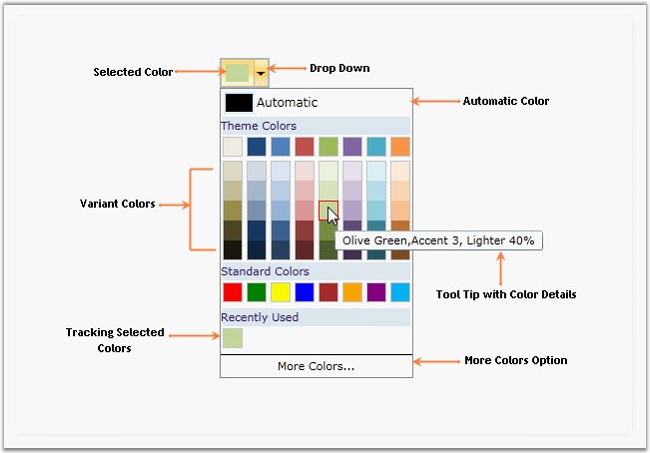

::: {style="DISPLAY: none"}
{#d2h_url_template}{#d2h_package_url style="WIDTH: 0px; DISPLAY: none; HEIGHT: 0px"}
:::

::::: {#nsbanner .d2h_main_nsbanner style="BORDER-BOTTOM: #999999 1px solid; POSITION: relative; PADDING-BOTTOM: 0px; BACKGROUND-COLOR: transparent; PADDING-LEFT: 0px; PADDING-RIGHT: 0px; DISPLAY: none; BORDER-TOP: #999999 1px solid; PADDING-TOP: 0px; LEFT: 0px"}
:::: {#TitleRow .d2h_main_titlerow style="PADDING-BOTTOM: 4px; BACKGROUND-COLOR: transparent; PADDING-LEFT: 22px; WIDTH: 100%; PADDING-RIGHT: 10px; DISPLAY: none; PADDING-TOP: 4px"}
::: {#ienav .d2h_main_ienav style="DISPLAY: none"}
{#D2HPrevious .D2HPreviousEnabled}  {#D2HNext .D2HNextEnabled}
:::
::::
:::::

::: {#nstext .d2h_main_nstext style="PADDING-BOTTOM: 10px; BACKGROUND-COLOR: transparent; PADDING-LEFT: 22px; PADDING-RIGHT: 10px; HEIGHT: 100%; OVERFLOW: auto; PADDING-TOP: 5px" hasuserbackground="true" valign="bottom"}
## []{#_HTMLHost}[]{#p414}[]{#p422}[]{#_Color_Picker}Color Picker

 

 The Color Picker (Palette) control provides a rich visual interface for color selection. The structure of the control represents a palette which is displayed as a drop-down with selected color highlighted at the top. The control also has a Tool-Tip support which bears the name of the color. More Colors options embedded with the control provides the user with wide range of color options.

 

 

{border="0"}

Figure 957: Color Picker (General Structure)

 

Key Features

 

Following are the key features of Color Picker control:

 

[·      ]{style="FONT-FAMILY: Symbol"}Theme Panel: Allows you to view the Theme Colors panel.

[·      ]{style="FONT-FAMILY: Symbol"}Standard Panel: Allows you to view the Standard Colors panel.

[·      ]{style="FONT-FAMILY: Symbol"}Recently Used Panel: Allows you to view the recently used panel.

[·      ]{style="FONT-FAMILY: Symbol"}Themes: A list of predefined themes to be applied, are available.

[·      ]{style="FONT-FAMILY: Symbol"}Standard Variants: Allows you to generate variants to standard colors.                                                        

[·      ]{style="FONT-FAMILY: Symbol"}Theme Variants: Allows you to generate variants to theme colors.

[·      ]{style="FONT-FAMILY: Symbol"}SelectedColor: Gets or sets the color chosen from Color Picker Palette.

[·      ]{style="FONT-FAMILY: Symbol"}AutomaticColor: Gets or sets the Automatic Color of the Color Picker Palette.

[·      ]{style="FONT-FAMILY: Symbol"}Black/White Visibility: Allows you to specify whether black/white or both colors should be made visible or not.

More:

[ ]{#related-topics}

[{border="0" align="absMiddle"}Getting Started](ms-xhelp:///?Id=92545791-1fdc-4813-959e-c2411ddd6295){style="TEXT-DECORATION: none"}

[{border="0" align="absMiddle"}Concepts and Features](ms-xhelp:///?Id=778e090b-763c-4323-8da2-864782dffda7){style="TEXT-DECORATION: none"}

[{border="0" align="absMiddle"}Binding Validation Error for Editor Controls](ms-xhelp:///?Id=4cc750b1-e5e6-4432-ba27-a014c7bb4d98){style="TEXT-DECORATION: none"}

[{border="0" align="absMiddle"}Splitter](ms-xhelp:///?Id=687045da-6ccf-4d61-a999-32105e3fccb8){style="TEXT-DECORATION: none"}
:::
