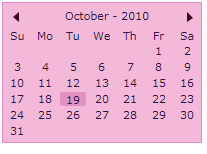

::: {style="DISPLAY: none"}
{#d2h_url_template}{#d2h_package_url style="WIDTH: 0px; DISPLAY: none; HEIGHT: 0px"}
:::

::::: {#nsbanner .d2h_main_nsbanner style="BORDER-BOTTOM: #999999 1px solid; POSITION: relative; PADDING-BOTTOM: 0px; BACKGROUND-COLOR: transparent; PADDING-LEFT: 0px; PADDING-RIGHT: 0px; DISPLAY: none; BORDER-TOP: #999999 1px solid; PADDING-TOP: 0px; LEFT: 0px"}
:::: {#TitleRow .d2h_main_titlerow style="PADDING-BOTTOM: 4px; BACKGROUND-COLOR: transparent; PADDING-LEFT: 22px; WIDTH: 100%; PADDING-RIGHT: 10px; DISPLAY: none; PADDING-TOP: 4px"}
::: {#ienav .d2h_main_ienav style="DISPLAY: none"}
{#D2HPrevious .D2HPreviousEnabled}  {#D2HNext .D2HNextEnabled}
:::
::::
:::::

::: {#nstext .d2h_main_nstext style="PADDING-BOTTOM: 10px; BACKGROUND-COLOR: transparent; PADDING-LEFT: 22px; PADDING-RIGHT: 10px; HEIGHT: 100%; OVERFLOW: auto; PADDING-TOP: 5px" hasuserbackground="true" valign="bottom"}
### Color Scheme

You can set the custom color for the Silverlight controls by using the **ActiveColorScheme** property defined in the Skin Manager class. This property can be set either in XAML or in C#.

 

Table 72: ActiveColorScheme Property

+--------------------+-----------------------------------------+-------------------+-------------+--------------------------------------------------------------------------------------------------------------------------------------------------------------------------------------------------------------------------------------------------------------+
| Property           | Description                             | Type              | Data Type   | Reference links                                                                                                                                                                                                                                              |
+--------------------+-----------------------------------------+-------------------+-------------+--------------------------------------------------------------------------------------------------------------------------------------------------------------------------------------------------------------------------------------------------------------+
|                    |                                         |                   |             | [[Setting ActiveColorScheme property in XAML]{style="COLOR: windowtext"}](../../../../../../../../Documents%20and%20Settings/riaj/Desktop/styling%20for%20ui%20silverlight/tools%20silverlight/tools%20part%202.docx#SettingActiveColorSchemepropertyinXAML) |
|                    |                                         |                   |             |                                                                                                                                                                                                                                                              |
| ActiveColorScheme  | Sets the custom color for the controls. | Attached Property | Color       | [[Setting ActiveColorScheme Property in C#]{style="COLOR: windowtext"}](../../../../../../../../Documents%20and%20Settings/riaj/Desktop/styling%20for%20ui%20silverlight/tools%20silverlight/tools%20part%202.docx#SettingActiveColorSchemePropertyinC)      |
|                    |                                         |                   |             |                                                                                                                                                                                                                                                              |
|                    |                                         |                   |             |                                                                                                                                                                                                                                                              |
+--------------------+-----------------------------------------+-------------------+-------------+--------------------------------------------------------------------------------------------------------------------------------------------------------------------------------------------------------------------------------------------------------------+

 

[]{#_Ref274476311}[Setting ActiveColorScheme property in XAML]{#SettingActiveColorSchemepropertyinXAML}

The following code snippet explains how to set the **ActiveColorScheme** property in XAML.

 

1.   Add the following namespace in the sample.

 

+--------------------------------------------------------------------------------------------------------------------------------------------------------------------------------------------------------------------------------------------------------------------------------------------------------------------+
| **[\[XAML\]]{style="FONT-FAMILY: 'Courier New'; COLOR: black"}**                                                                                                                                                                                                                                                   |
|                                                                                                                                                                                                                                                                                                                    |
| [xmlns]{style="FONT-FAMILY: 'Courier New'; COLOR: red"}[:]{style="FONT-FAMILY: 'Courier New'; COLOR: blue"}[theme]{style="FONT-FAMILY: 'Courier New'; COLOR: red"}[=\"clr-namespace:Syncfusion.Windows.Controls.Theming;assembly=Syncfusion.Shared.Silverlight\"]{style="FONT-FAMILY: 'Courier New'; COLOR: blue"} |
+--------------------------------------------------------------------------------------------------------------------------------------------------------------------------------------------------------------------------------------------------------------------------------------------------------------------+

[]{style="FONT-FAMILY: Consolas; COLOR: blue; FONT-SIZE: 9.5pt"} 

2.   Set the **ActiveColorScheme** property for the control as shown below.

 

+----------------------------------------------------------------------------------------------------------------------------------------------------------------------------------------------------------------------------------------------------------------------------------------------------------------------------------------------------------------------------------------------------------------------------------------------------------------------------------------------------------+
| **[\[XAML\]]{style="FONT-FAMILY: 'Courier New'; COLOR: black"}**                                                                                                                                                                                                                                                                                                                                                                                                                                         |
|                                                                                                                                                                                                                                                                                                                                                                                                                                                                                                          |
| [\<]{style="FONT-FAMILY: 'Courier New'; COLOR: blue"}[syncfusion]{style="FONT-FAMILY: 'Courier New'; COLOR: #a31515"}[:]{style="FONT-FAMILY: 'Courier New'; COLOR: blue"}[CalendarControl]{style="FONT-FAMILY: 'Courier New'; COLOR: #a31515"}[ theme]{style="FONT-FAMILY: 'Courier New'; COLOR: red"}[:]{style="FONT-FAMILY: 'Courier New'; COLOR: blue"}[SkinManager.ActiveColorScheme]{style="FONT-FAMILY: 'Courier New'; COLOR: red"}[=\"Red\" /\>]{style="FONT-FAMILY: 'Courier New'; COLOR: blue"} |
|                                                                                                                                                                                                                                                                                                                                                                                                                                                                                                          |
|                                                                                                                                                                                                                                                                                                                                                                                                                                                                                                          |
+----------------------------------------------------------------------------------------------------------------------------------------------------------------------------------------------------------------------------------------------------------------------------------------------------------------------------------------------------------------------------------------------------------------------------------------------------------------------------------------------------------+

 

[]{#SettingActiveColorSchemePropertyinC}[Setting ActiveColorScheme Property in C#]{#_Ref274540358}

The following code snippet explains how to set the **ActiveColorScheme** property in C#.

 

1.   Name the control using the **Name** attribute.

[]{style="FONT-FAMILY: 'Calibri','sans-serif'; FONT-SIZE: 11pt"} 

+-------------------------------------------------------------------------------------------------------------------------------------------------------------------------------------------------------------------------------------------------------------------------------------------------------------------------------------------------------------------------------------------------------------------------------------------------------------------------------------------------------------------------------------------------------------------------------------------------------------+
| **[\[XAML\]]{style="FONT-FAMILY: 'Courier New'; COLOR: black"}**                                                                                                                                                                                                                                                                                                                                                                                                                                                                                                                                            |
|                                                                                                                                                                                                                                                                                                                                                                                                                                                                                                                                                                                                             |
| [\<]{style="FONT-FAMILY: 'Courier New'; COLOR: blue"}[syncfusion]{style="FONT-FAMILY: 'Courier New'; COLOR: #a31515"}[:]{style="FONT-FAMILY: 'Courier New'; COLOR: blue"}[CalendarControl]{style="FONT-FAMILY: 'Courier New'; COLOR: #a31515"}[ Name]{style="FONT-FAMILY: 'Courier New'; COLOR: red"}[=\"file\"]{style="FONT-FAMILY: 'Courier New'; COLOR: blue"}[ Height]{style="FONT-FAMILY: 'Courier New'; COLOR: red"}[=\"350\"]{style="FONT-FAMILY: 'Courier New'; COLOR: blue"}[ Width]{style="FONT-FAMILY: 'Courier New'; COLOR: red"}[=\"600\"/\>]{style="FONT-FAMILY: 'Courier New'; COLOR: blue"} |
+-------------------------------------------------------------------------------------------------------------------------------------------------------------------------------------------------------------------------------------------------------------------------------------------------------------------------------------------------------------------------------------------------------------------------------------------------------------------------------------------------------------------------------------------------------------------------------------------------------------+

[]{style="FONT-FAMILY: 'Calibri','sans-serif'; FONT-SIZE: 11pt"} 

2.   Add the following line in code behind file.

 

+---------------------------------------------------------------------------------------------------------------------------------------------------------------------------------------------------+
| **[\[C#\]]{style="FONT-FAMILY: 'Courier New'"}**                                                                                                                                                  |
|                                                                                                                                                                                                   |
| [SkinManager]{style="FONT-FAMILY: 'Courier New'; COLOR: #2b91af"}[.SetActiveColorScheme([file]{style="COLOR: black"}, [Colors]{style="COLOR: #2b91af"}.Red);]{style="FONT-FAMILY: 'Courier New'"} |
|                                                                                                                                                                                                   |
| []{style="FONT-FAMILY: 'Courier New'"}                                                                                                                                                            |
+---------------------------------------------------------------------------------------------------------------------------------------------------------------------------------------------------+

 

The output is as shown below.

{border="0"}

Figure 1160: Calendar with Custom Color

[]{#related-topics}
:::
