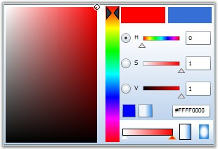
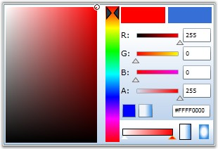
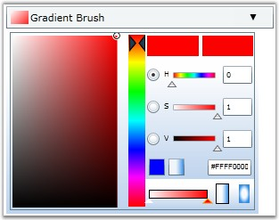
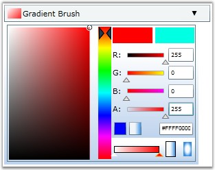

::: {style="DISPLAY: none"}
{#d2h_url_template}{#d2h_package_url style="WIDTH: 0px; DISPLAY: none; HEIGHT: 0px"}
:::

:::: {.d2h_secondary_topic style="PADDING-BOTTOM: 10pt; MARGIN: 0pt; PADDING-LEFT: 0pt; PADDING-RIGHT: 0pt; PADDING-TOP: 0pt"}
#### []{#p163}[]{#_Color_Selection_Mode}Color Selection Mode

 

BrushSelector and BrushEdit controls can be displayed in two different color modes:

 

[·      ]{style="FONT-FAMILY: Symbol"}**HSV mode -** This color model defines all the colors in terms of hue, saturation and value (brightness).

[·      ]{style="FONT-FAMILY: Symbol"}**RGB mode -** This color model defines all the colors in combination of Red, Green and Blue.

 

::: {style="BORDER-BOTTOM: windowtext 1pt solid; BORDER-LEFT: medium none; PADDING-BOTTOM: 1pt; MARGIN-TOP: 9pt; PADDING-LEFT: 0pt; PADDING-RIGHT: 0pt; MARGIN-BOTTOM: 9pt; BORDER-TOP: windowtext 1pt solid; BORDER-RIGHT: medium none; PADDING-TOP: 1pt"}
{border="0"}Note: The VisualizationStyle property is used to switch between these modes.
:::

 

10.  **A.** **Setting the Color Selection Mode for BrushEdit**

 

11.  **1. Setting Color Selection Mode to HSV**

 

The following code example illustrates how to set the Color Selection mode for BrushEdit to **HSV**.

 

+---------------------------------------------------------------------------------------------------------------------------------------------------------------------------------------------------------------------------------------------------------------------------------------------------------------------------------------------------------------------------------------------------------------------------------------------------------------------------------------+
| **[\[XAML\]]{style="FONT-FAMILY: 'Courier New'; COLOR: black"}**                                                                                                                                                                                                                                                                                                                                                                                                                      |
|                                                                                                                                                                                                                                                                                                                                                                                                                                                                                       |
| []{style="FONT-FAMILY: 'Courier New'; COLOR: black"}                                                                                                                                                                                                                                                                                                                                                                                                                                  |
|                                                                                                                                                                                                                                                                                                                                                                                                                                                                                       |
| [\<!\-- Adding BrushEdit \--\>]{style="FONT-FAMILY: 'Courier New'; COLOR: green"}                                                                                                                                                                                                                                                                                                                                                                                                     |
|                                                                                                                                                                                                                                                                                                                                                                                                                                                                                       |
| [\<]{style="FONT-FAMILY: 'Courier New'; COLOR: blue"}[syncfusion]{style="FONT-FAMILY: 'Courier New'; COLOR: #a31515"}[:]{style="FONT-FAMILY: 'Courier New'; COLOR: blue"}[BrushEdit]{style="FONT-FAMILY: 'Courier New'; COLOR: #a31515"}[ [ Margin]{style="COLOR: red"}[=\"20\"]{style="COLOR: blue"}[ VisualizationStyle]{style="COLOR: red"}[=\"HSV\"]{style="COLOR: blue"}[ Name]{style="COLOR: red"}[=\"brushedit\"/\>]{style="COLOR: blue"}]{style="FONT-FAMILY: 'Courier New'"} |
+---------------------------------------------------------------------------------------------------------------------------------------------------------------------------------------------------------------------------------------------------------------------------------------------------------------------------------------------------------------------------------------------------------------------------------------------------------------------------------------+

 

+-------------------------------------------------------------------------------------------------------------------------------------------------------------------------------+
| **[\[C#\]]{style="FONT-FAMILY: 'Courier New'; COLOR: black"}**                                                                                                                |
|                                                                                                                                                                               |
| []{style="FONT-FAMILY: 'Courier New'; COLOR: black"}                                                                                                                          |
|                                                                                                                                                                               |
| [// Creating an instance of the BrushEdit control.]{style="FONT-FAMILY: 'Courier New'; COLOR: green"}                                                                         |
|                                                                                                                                                                               |
| [BrushEdit]{style="FONT-FAMILY: 'Courier New'; COLOR: teal"}[ brushedit = [new]{style="COLOR: blue"} [BrushEdit]{style="COLOR: teal"}();]{style="FONT-FAMILY: 'Courier New'"} |
|                                                                                                                                                                               |
| []{style="FONT-FAMILY: 'Courier New'"}                                                                                                                                        |
|                                                                                                                                                                               |
| [// Setting selection mode as HSV.]{style="FONT-FAMILY: 'Courier New'; COLOR: green"}                                                                                         |
|                                                                                                                                                                               |
| [brushedit.VisualizationStyle = [ColorSelectionMode]{style="COLOR: teal"}.HSV;]{style="FONT-FAMILY: 'Courier New'"}                                                           |
+-------------------------------------------------------------------------------------------------------------------------------------------------------------------------------+

 

The BrushEdit control with HSV color model is created.

 

{border="0"}

 

Figure 352: BrushEdit with Color Selection Mode set to HSV

**** 

12.  **2. Setting Color Selection Mode to RGB**

**** 

The following code example illustrates how to set the Color Selection Mode of the BrushEdit control to \"RGB\".

 

+---------------------------------------------------------------------------------------------------------------------------------------------------------------------------------------------------------------------------------------------------------------------------------------------------------------------------------------------------------------------------------------------------------------------------------------------------------------------------------------+
| **[\[XAML\]]{style="FONT-FAMILY: 'Courier New'; COLOR: black"}**                                                                                                                                                                                                                                                                                                                                                                                                                      |
|                                                                                                                                                                                                                                                                                                                                                                                                                                                                                       |
| []{style="FONT-FAMILY: 'Courier New'; COLOR: black"}                                                                                                                                                                                                                                                                                                                                                                                                                                  |
|                                                                                                                                                                                                                                                                                                                                                                                                                                                                                       |
| [\<!\-- Adding BrushEdit \--\>]{style="FONT-FAMILY: 'Courier New'; COLOR: green"}                                                                                                                                                                                                                                                                                                                                                                                                     |
|                                                                                                                                                                                                                                                                                                                                                                                                                                                                                       |
| [\<]{style="FONT-FAMILY: 'Courier New'; COLOR: blue"}[syncfusion]{style="FONT-FAMILY: 'Courier New'; COLOR: #a31515"}[:]{style="FONT-FAMILY: 'Courier New'; COLOR: blue"}[BrushEdit]{style="FONT-FAMILY: 'Courier New'; COLOR: #a31515"}[ [ Margin]{style="COLOR: red"}[=\"20\"]{style="COLOR: blue"}[ VisualizationStyle]{style="COLOR: red"}[=\"RGB\"]{style="COLOR: blue"}[ Name]{style="COLOR: red"}[=\"brushedit\"/\>]{style="COLOR: blue"}]{style="FONT-FAMILY: 'Courier New'"} |
+---------------------------------------------------------------------------------------------------------------------------------------------------------------------------------------------------------------------------------------------------------------------------------------------------------------------------------------------------------------------------------------------------------------------------------------------------------------------------------------+

 

+-------------------------------------------------------------------------------------------------------------------------------------------------------------------------------+
| **[\[C#\]]{style="FONT-FAMILY: 'Courier New'; COLOR: black"}**                                                                                                                |
|                                                                                                                                                                               |
| []{style="FONT-FAMILY: 'Courier New'; COLOR: black"}                                                                                                                          |
|                                                                                                                                                                               |
| [// Creating an instance of the BrushEdit control.]{style="FONT-FAMILY: 'Courier New'; COLOR: green"}                                                                         |
|                                                                                                                                                                               |
| [BrushEdit]{style="FONT-FAMILY: 'Courier New'; COLOR: teal"}[ brushedit = [new]{style="COLOR: blue"} [BrushEdit]{style="COLOR: teal"}();]{style="FONT-FAMILY: 'Courier New'"} |
|                                                                                                                                                                               |
| []{style="FONT-FAMILY: 'Courier New'"}                                                                                                                                        |
|                                                                                                                                                                               |
| [// Setting selection mode as RGB.]{style="FONT-FAMILY: 'Courier New'; COLOR: green"}                                                                                         |
|                                                                                                                                                                               |
| [brushedit.VisualizationStyle = [ColorSelectionMode]{style="COLOR: teal"}.RGB;]{style="FONT-FAMILY: 'Courier New'"}                                                           |
+-------------------------------------------------------------------------------------------------------------------------------------------------------------------------------+

 

{border="0"}

 

Figure 353: BrushEdit with Color Selection Mode set to \"RGB\"

 

The BrushEdit control with RGB color model is created.

 

13.  **B. Setting the Color Selection mode for BrushSelector**

 

**3.   Setting Color Selection Mode to HSV**

 

The following code example illustrates how to set the Color Selection Mode of the BrushSelector control to \"HSV\".

 

+--------------------------------------------------------------------------------------------------------------------------------------------------------------------------------------------------------------------------------------------------------------------------------------------------------------------------------------------------------------------------------------------------------------------------------------------------------------------------------------------------------------------------------------------------------------------------------------------------------------------------------+
| **[\[XAML\]]{style="FONT-FAMILY: 'Courier New'; COLOR: black"}**                                                                                                                                                                                                                                                                                                                                                                                                                                                                                                                                                               |
|                                                                                                                                                                                                                                                                                                                                                                                                                                                                                                                                                                                                                                |
| []{style="FONT-FAMILY: 'Courier New'; COLOR: black"}                                                                                                                                                                                                                                                                                                                                                                                                                                                                                                                                                                           |
|                                                                                                                                                                                                                                                                                                                                                                                                                                                                                                                                                                                                                                |
| [\<!\-- Adding BrushSelector \--\>]{style="FONT-FAMILY: 'Courier New'; COLOR: green"}                                                                                                                                                                                                                                                                                                                                                                                                                                                                                                                                          |
|                                                                                                                                                                                                                                                                                                                                                                                                                                                                                                                                                                                                                                |
| [\<]{style="FONT-FAMILY: 'Courier New'; COLOR: blue"}[syncfusion]{style="FONT-FAMILY: 'Courier New'; COLOR: #a31515"}[:]{style="FONT-FAMILY: 'Courier New'; COLOR: blue"}[BrushSelector]{style="FONT-FAMILY: 'Courier New'; COLOR: #a31515"}[ Margin]{style="FONT-FAMILY: 'Courier New'; COLOR: red"}[=\"20\"]{style="FONT-FAMILY: 'Courier New'; COLOR: blue"}[ VisualizationStyle]{style="FONT-FAMILY: 'Courier New'; COLOR: red"}[=\"HSV\"]{style="FONT-FAMILY: 'Courier New'; COLOR: blue"}[ Name]{style="FONT-FAMILY: 'Courier New'; COLOR: red"}[=\"brushselector\"/\>]{style="FONT-FAMILY: 'Courier New'; COLOR: blue"} |
+--------------------------------------------------------------------------------------------------------------------------------------------------------------------------------------------------------------------------------------------------------------------------------------------------------------------------------------------------------------------------------------------------------------------------------------------------------------------------------------------------------------------------------------------------------------------------------------------------------------------------------+

 

+-------------------------------------------------------------------------------------------------------------------------------------------------------------------------------------------+
| **[\[C#\]]{style="FONT-FAMILY: 'Courier New'; COLOR: black"}**                                                                                                                            |
|                                                                                                                                                                                           |
| []{style="FONT-FAMILY: 'Courier New'; COLOR: black"}                                                                                                                                      |
|                                                                                                                                                                                           |
| [// Creating an instance of the BrushSelector control.]{style="FONT-FAMILY: 'Courier New'; COLOR: green"}                                                                                 |
|                                                                                                                                                                                           |
| [BrushSelector]{style="FONT-FAMILY: 'Courier New'; COLOR: teal"}[ brushselector = [new]{style="COLOR: blue"} [BrushSelector]{style="COLOR: teal"}();]{style="FONT-FAMILY: 'Courier New'"} |
|                                                                                                                                                                                           |
| []{style="FONT-FAMILY: 'Courier New'"}                                                                                                                                                    |
|                                                                                                                                                                                           |
| [// Setting selection mode as HSV.]{style="FONT-FAMILY: 'Courier New'; COLOR: green"}                                                                                                     |
|                                                                                                                                                                                           |
| [brushselector.VisualizationStyle = [ColorSelectionMode]{style="COLOR: teal"}.HSV;]{style="FONT-FAMILY: 'Courier New'"}                                                                   |
+-------------------------------------------------------------------------------------------------------------------------------------------------------------------------------------------+

 

{border="0"}

 

Figure 354 BrushSelector with Color Selection Mode set to HSV

 

The BrushSelector control with HSV color model is created.

**** 

**4.   Setting Color Selection Mode to RGB**

 

The following code example illustrates how to set the Color Selection Mode of the BrushSelector control to \"RGB\".

 

+--------------------------------------------------------------------------------------------------------------------------------------------------------------------------------------------------------------------------------------------------------------------------------------------------------------------------------------------------------------------------------------------------------------------------------------------------------------------------------------------------------------------------------------------------------------------------------------------------------------------------------+
| **[\[XAML\]]{style="FONT-FAMILY: 'Courier New'; COLOR: black"}**                                                                                                                                                                                                                                                                                                                                                                                                                                                                                                                                                               |
|                                                                                                                                                                                                                                                                                                                                                                                                                                                                                                                                                                                                                                |
| []{style="FONT-FAMILY: 'Courier New'; COLOR: black"}                                                                                                                                                                                                                                                                                                                                                                                                                                                                                                                                                                           |
|                                                                                                                                                                                                                                                                                                                                                                                                                                                                                                                                                                                                                                |
| [\<!\-- Adding BrushSelector \--\>]{style="FONT-FAMILY: 'Courier New'; COLOR: green"}                                                                                                                                                                                                                                                                                                                                                                                                                                                                                                                                          |
|                                                                                                                                                                                                                                                                                                                                                                                                                                                                                                                                                                                                                                |
| [\<]{style="FONT-FAMILY: 'Courier New'; COLOR: blue"}[syncfusion]{style="FONT-FAMILY: 'Courier New'; COLOR: #a31515"}[:]{style="FONT-FAMILY: 'Courier New'; COLOR: blue"}[BrushSelector]{style="FONT-FAMILY: 'Courier New'; COLOR: #a31515"}[ Margin]{style="FONT-FAMILY: 'Courier New'; COLOR: red"}[=\"20\"]{style="FONT-FAMILY: 'Courier New'; COLOR: blue"}[ VisualizationStyle]{style="FONT-FAMILY: 'Courier New'; COLOR: red"}[=\"RGb\"]{style="FONT-FAMILY: 'Courier New'; COLOR: blue"}[ Name]{style="FONT-FAMILY: 'Courier New'; COLOR: red"}[=\"brushselector\"/\>]{style="FONT-FAMILY: 'Courier New'; COLOR: blue"} |
+--------------------------------------------------------------------------------------------------------------------------------------------------------------------------------------------------------------------------------------------------------------------------------------------------------------------------------------------------------------------------------------------------------------------------------------------------------------------------------------------------------------------------------------------------------------------------------------------------------------------------------+

 

+-------------------------------------------------------------------------------------------------------------------------------------------------------------------------------------------+
| **[\[C#\]]{style="FONT-FAMILY: 'Courier New'; COLOR: black"}**                                                                                                                            |
|                                                                                                                                                                                           |
| []{style="FONT-FAMILY: 'Courier New'; COLOR: black"}                                                                                                                                      |
|                                                                                                                                                                                           |
| [// Creating an instance of the BrushSelector control.]{style="FONT-FAMILY: 'Courier New'; COLOR: green"}                                                                                 |
|                                                                                                                                                                                           |
| [BrushSelector]{style="FONT-FAMILY: 'Courier New'; COLOR: teal"}[ brushselector = [new]{style="COLOR: blue"} [BrushSelector]{style="COLOR: teal"}();]{style="FONT-FAMILY: 'Courier New'"} |
|                                                                                                                                                                                           |
| []{style="FONT-FAMILY: 'Courier New'"}                                                                                                                                                    |
|                                                                                                                                                                                           |
| [// Setting selection mode as RGB.]{style="FONT-FAMILY: 'Courier New'; COLOR: green"}                                                                                                     |
|                                                                                                                                                                                           |
| [brushselector.VisualizationStyle = [ColorSelectionMode]{style="COLOR: teal"}.RGB;]{style="FONT-FAMILY: 'Courier New'"}                                                                   |
+-------------------------------------------------------------------------------------------------------------------------------------------------------------------------------------------+

 

{border="0"}

 

Figure 355: BrushSelector with Color Selection Mode set to RGB

 

The BrushSelector control with RGB color model is created.

[]{#related-topics}
::::
