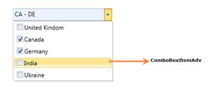

::: {style="DISPLAY: none"}
{#d2h_url_template}{#d2h_package_url style="WIDTH: 0px; DISPLAY: none; HEIGHT: 0px"}
:::

::: {.d2h_secondary_topic style="PADDING-BOTTOM: 10pt; MARGIN: 0pt; PADDING-LEFT: 0pt; PADDING-RIGHT: 0pt; PADDING-TOP: 0pt"}
#### ComboBoxAdv

Use Case Scenarios

If multiple selection of given choices are allowed for the user, then the ComboBoxAdv is useful to display those choices.  Instead of displaying all the choices initially, the choices displayed with in the dropdown whenever the user click on the ComboBoxAdv control.

Structure of the ComboBoxAdv Control

The following screenshot displays the ComboBoxAdv:

[{border="0"}]{style="BACKGROUND: red"}

Figure 1183: Structure of the ComboBoxAdv Control

**[]{style="FONT-FAMILY: 'Trebuchet MS','sans-serif'; BACKGROUND: red; COLOR: white; FONT-SIZE: 9pt"}** 

ComboBoxItemAdv:

 It can be added inside the ComboBoxAdv control. It is originally derived from the ComboBoxItem.[]{style="COLOR: #4f6228"}

Sample link

1.   Select Start -\> Programs -\> Syncfusion -\> Essential Studio 9.2.0.136 -\> Dashboard.

2.   Select Run Locally Installed Samples in WPF Combo box.

3.   Now move the mouse to the ComboBoxAdv menu in the Sample Browser.

4.   Choose ComboBoxAdv demo.

More:

[ ]{#related-topics}

[{border="0" align="absMiddle"}Adding ComboBoxAdv to an Application](ms-xhelp:///?Id=555a120d-bab5-4b26-8d5d-addbf3aeb2f2){style="TEXT-DECORATION: none"}

[{border="0" align="absMiddle"}Appearance](ms-xhelp:///?Id=aa419eac-4a87-49c8-8641-88a87ea82230){style="TEXT-DECORATION: none"}

[{border="0" align="absMiddle"}Blendability](ms-xhelp:///?Id=775325fe-ebab-4f96-91f6-048f7dd4d5f0){style="TEXT-DECORATION: none"}

[{border="0" align="absMiddle"}Features of ComboBoxAdv control](ms-xhelp:///?Id=0eee42e6-050c-4cc8-a22d-717c76c05d47){style="TEXT-DECORATION: none"}
:::
