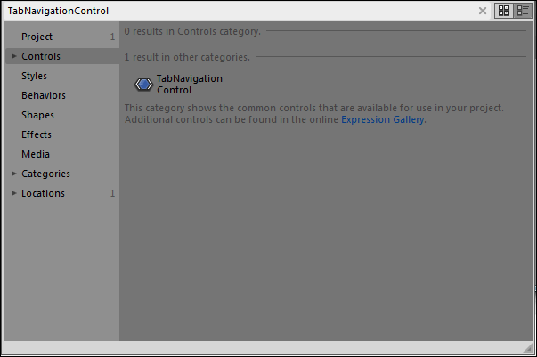
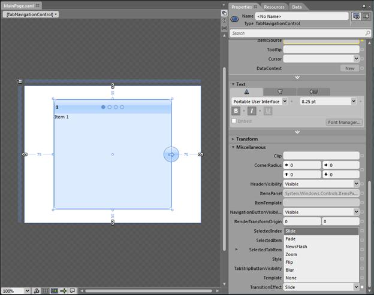
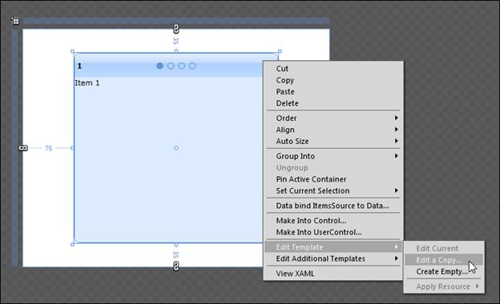
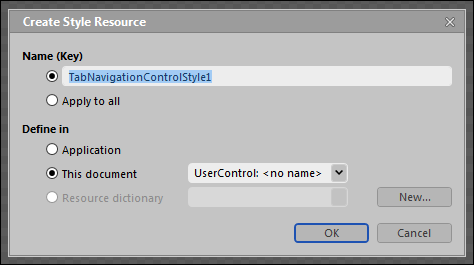
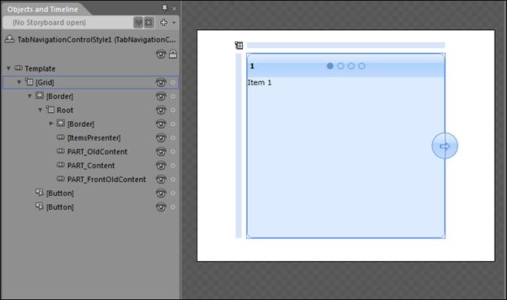
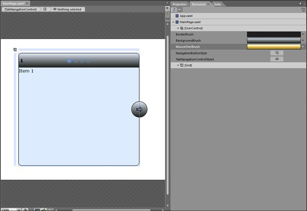

::: {style="DISPLAY: none"}
{#d2h_url_template}{#d2h_package_url style="WIDTH: 0px; DISPLAY: none; HEIGHT: 0px"}
:::

::::: {#nsbanner .d2h_main_nsbanner style="BORDER-BOTTOM: #999999 1px solid; POSITION: relative; PADDING-BOTTOM: 0px; BACKGROUND-COLOR: transparent; PADDING-LEFT: 0px; PADDING-RIGHT: 0px; DISPLAY: none; BORDER-TOP: #999999 1px solid; PADDING-TOP: 0px; LEFT: 0px"}
:::: {#TitleRow .d2h_main_titlerow style="PADDING-BOTTOM: 4px; BACKGROUND-COLOR: transparent; PADDING-LEFT: 22px; WIDTH: 100%; PADDING-RIGHT: 10px; DISPLAY: none; PADDING-TOP: 4px"}
::: {#ienav .d2h_main_ienav style="DISPLAY: none"}
{#D2HPrevious .D2HPreviousEnabled}  {#D2HNext .D2HNextEnabled}
:::
::::
:::::

::: {#nstext .d2h_main_nstext style="PADDING-BOTTOM: 10px; BACKGROUND-COLOR: transparent; PADDING-LEFT: 22px; PADDING-RIGHT: 10px; HEIGHT: 100%; OVERFLOW: auto; PADDING-TOP: 5px" hasuserbackground="true" valign="bottom"}
### Complete UI Customization through Expression Blend.

To enable UI customization through Blendability:

1.   Open the application in **Blend**.

2.   Type the control name in the **Search** text box.

{border="0"}[]{style="BACKGROUND: yellow"}

Figure 838: Tab Navigation Control

3.   Drag and drop the control in designer.

{border="0"}[]{style="BACKGROUND: yellow"}

Figure 839: Control in Designer

Properties will be displayed on the right side.

{border="0"}[]{style="BACKGROUND: yellow"}

Figure 840: Properties Displayed on Top

4.   Right-click the control and go through the **Edit template** option.

5.   Click **Edit a copy** option.

[]{style="BACKGROUND: yellow"} 

{border="0"}[]{style="BACKGROUND: yellow"}

Figure 841: Edit a Copy Option

A dialog appears, to store the Style in application.

6.   Choose the place to store the style and give a proper name for the style and click **OK**.

{border="0"}[]{style="BACKGROUND: yellow"}

Figure 842: Create Style Resource

A style and template will be generated for the control. All the template parts will be exposed on the left side (objects and timeline panel).

{border="0"}[]{style="BACKGROUND: yellow"}

Figure 843: Objects and Timeline Panel

7.   The parts can be customized by setting the properties in the property panel.

 

{border="0"}

Figure 844: Property panel

[]{#related-topics}
:::
