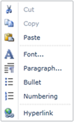

::: {style="DISPLAY: none"}
{#d2h_url_template}{#d2h_package_url style="WIDTH: 0px; DISPLAY: none; HEIGHT: 0px"}
:::

::: {.d2h_secondary_topic style="PADDING-BOTTOM: 10pt; MARGIN: 0pt; PADDING-LEFT: 0pt; PADDING-RIGHT: 0pt; PADDING-TOP: 0pt"}
#### Context Menu Support

RichTextBoxAdv supports Context Menu as MS Word.  It supports the following list of features in Context menu:

 

[·      ]{style="FONT-FAMILY: Symbol"}Cut

[·      ]{style="FONT-FAMILY: Symbol"}Copy

[·      ]{style="FONT-FAMILY: Symbol"}Paste

[·      ]{style="FONT-FAMILY: Symbol"}Font

[·      ]{style="FONT-FAMILY: Symbol"}Paragraph

[·      ]{style="FONT-FAMILY: Symbol"}Bullets

[·      ]{style="FONT-FAMILY: Symbol"}Numbering

[·      ]{style="FONT-FAMILY: Symbol"}Hyperlink

{border="0"}

Figure 1180: ContextMenu in RichTextBoxAdv

 

[]{#related-topics}
:::
