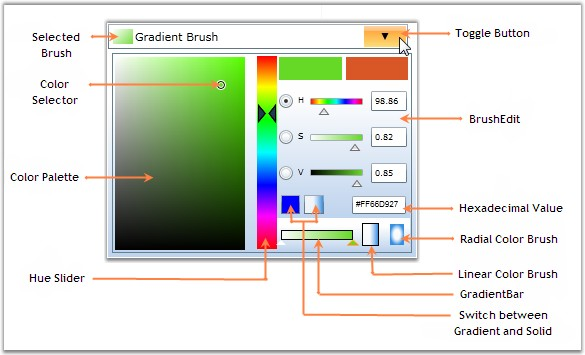

::: {style="DISPLAY: none"}
{#d2h_url_template}{#d2h_package_url style="WIDTH: 0px; DISPLAY: none; HEIGHT: 0px"}
:::

::: {.d2h_secondary_topic style="PADDING-BOTTOM: 10pt; MARGIN: 0pt; PADDING-LEFT: 0pt; PADDING-RIGHT: 0pt; PADDING-TOP: 0pt"}
#### []{#_Control_Structure_1}Control Structure

 

The various components of the BrushSelector are illustrated in the following screen shot.

 

{border="0"}

 

Figure 345: Components of BrushSelector

 

Following is a brief description on the components mentioned above.

 

[·      ]{style="FONT-FAMILY: Symbol"}**BrushEdit -** It represents the color selectable area in the BrushSelector control.

[·      ]{style="FONT-FAMILY: Symbol"}**Selected Brush -** It represents the color selected by the user.

[·      ]{style="FONT-FAMILY: Symbol"}**Color Selector -** It is used to select colors from the Color Palette by using mouse events.

[·      ]{style="FONT-FAMILY: Symbol"}**Color Palette -** It displays the range of color values.

[·      ]{style="FONT-FAMILY: Symbol"}**Hue Slider -** It is a slider which enables you to change the Hue value for the selected color.

[·      ]{style="FONT-FAMILY: Symbol"}**Switch between Gradient and Solid Brush -** This feature enables you to switch between gradient and solid brushes at run time, for BrushEdit mode.

[·      ]{style="FONT-FAMILY: Symbol"}**Gradient Bar -** It represents the gradient brush with gradient stops in it. It can be changed dynamically.

[·      ]{style="FONT-FAMILY: Symbol"}**Linear Color Brush -** It enables you to choose the Linear Gradient Brush value.

[·      ]{style="FONT-FAMILY: Symbol"}**Radial Color Brush -** It enables you to choose the Radial Gradient Brush value.

[·      ]{style="FONT-FAMILY: Symbol"}**Hexadecimal Value -** It enables you to enter the Hexadecimal value of the chosen color. Here, colors are specified as a RGB triplet in hexadecimal format (a hex triplet).

[·      ]{style="FONT-FAMILY: Symbol"}**Toggle Button -** It is used to display the BrushEdit panel for selecting the Brush values.

[]{#related-topics}
:::
