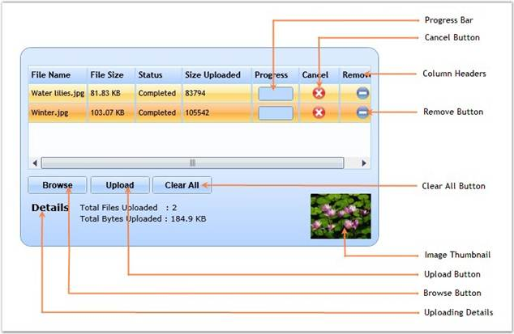

::: {style="DISPLAY: none"}
{#d2h_url_template}{#d2h_package_url style="WIDTH: 0px; DISPLAY: none; HEIGHT: 0px"}
:::

::: {.d2h_secondary_topic style="PADDING-BOTTOM: 10pt; MARGIN: 0pt; PADDING-LEFT: 0pt; PADDING-RIGHT: 0pt; PADDING-TOP: 0pt"}
#### Control Structure

 

The various elements of the FileUpload control are illustrated in the following screen shot.

 

{border="0"}

 

Figure 369 : Elements of FileUpload Control

**** 

The following is a brief description on the elements of the FileUpload control.

 

ProgressBar

 

The ProgressBar indicates the status of the file that is being uploaded.

 

Cancel Button

 

The Cancel Button allows to cancel the uploading of a particular file.

 

Column Headers

 

The Column Headers indicate the file name, size, status, size uploaded, and so on.

 

Remove Button

 

The Remove Button allows to remove a particular file from the list of files in the FileUpload control.

 

Clear All Button

 

The Clear All Button clears the entire list of uploaded files from the FileUpload control.

 

Image Thumbnail

 

This enables to view the Thumbnail of the image being uploaded.

 

Upload Button

 

The Upload Button uploads all the files in the queue.

 

Browse Button

 

The Browse Button enables to browse for files to be uploaded.

 

Uploading Details

 

This provides the uploading details of the current file like total files being uploaded, total size, and so on.

[]{#related-topics}
:::
