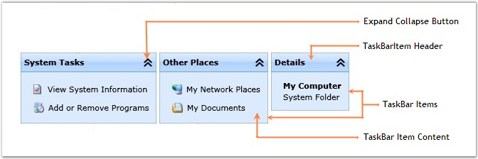

::: {style="DISPLAY: none"}
{#d2h_url_template}{#d2h_package_url style="WIDTH: 0px; DISPLAY: none; HEIGHT: 0px"}
:::

::: {.d2h_secondary_topic style="PADDING-BOTTOM: 10pt; MARGIN: 0pt; PADDING-LEFT: 0pt; PADDING-RIGHT: 0pt; PADDING-TOP: 0pt"}
#### Control Structure

 

The various elements of the TaskBar control are illustrated in the following screen shot.

 

{border="0"}

 

Figure 394 : Elements of TaskBar Control

**** 

The following is a brief description on the elements of the TaskBar control.

 

TaskBar Item Header

 

The TaskBar Item Header is the header of the TaskBarItem.

 

Expand Collapse Button

 

The Expand Collapse Button enables to expand or collapse the content of the TaskBar Item.

 

TaskBar Items

 

The TaskBar Items represent the Items placed inside the TaskBar.

 

TaskBar Item Content

 

The TaskBar Item Content is the content area where the content of the Taskbar Item is displayed.

[]{#related-topics}
:::
