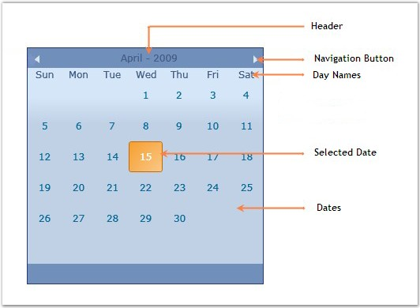

::: {style="DISPLAY: none"}
{#d2h_url_template}{#d2h_package_url style="WIDTH: 0px; DISPLAY: none; HEIGHT: 0px"}
:::

::: {.d2h_secondary_topic style="PADDING-BOTTOM: 10pt; MARGIN: 0pt; PADDING-LEFT: 0pt; PADDING-RIGHT: 0pt; PADDING-TOP: 0pt"}
#### Control Structure

 

The various elements of the CalendarEdit control are illustrated in the following screen shot.

 

{border="0"}

 

Figure 455: Elements of CalendarEdit Control

**** 

The following is a brief description on the elements of the CalendarEdit control.

 

Navigation Button

The Navigation Button is used for navigating through the calendar to view the months and years.

 

Header

 

The Header displays the current month and year selected.

 

Day Names

 

The Day Names row displays the names of the week days.

 

Selected Date

 

The Selected Date is the Date selected by the user. By default, the current date will be selected.

 

Dates

 

Dates display the dates of the selected month.

[]{#related-topics}
:::
