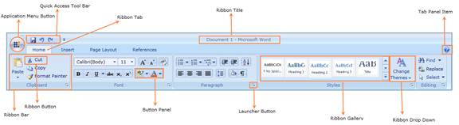

::: {style="DISPLAY: none"}
{#d2h_url_template}{#d2h_package_url style="WIDTH: 0px; DISPLAY: none; HEIGHT: 0px"}
:::

::: {.d2h_secondary_topic style="PADDING-BOTTOM: 10pt; MARGIN: 0pt; PADDING-LEFT: 0pt; PADDING-RIGHT: 0pt; PADDING-TOP: 0pt"}
#### Control Structure

 

The various parts of the Syncfusion Ribbon are shown in the following illustration:

 

{border="0"}

Figure 500: Ribbon Control Structure

[]{#related-topics}
:::
