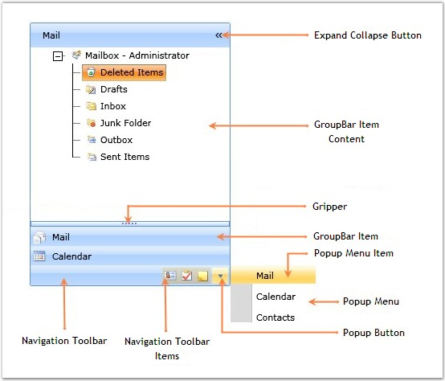

::: {style="DISPLAY: none"}
{#d2h_url_template}{#d2h_package_url style="WIDTH: 0px; DISPLAY: none; HEIGHT: 0px"}
:::

::: {.d2h_secondary_topic style="PADDING-BOTTOM: 10pt; MARGIN: 0pt; PADDING-LEFT: 0pt; PADDING-RIGHT: 0pt; PADDING-TOP: 0pt"}
#### Control Structure

 

The various elements of the GroupBar control are illustrated in the following screen shot.

 

{border="0"}

 

Figure 704: Elements of GroupBar Control

**** 

The following is a brief description on the elements of the GroupBar control.

 

Expand Collapse Button

 

The ExpandCollapse Button is used to expand or collapse the GroupBar.

 

GroupBar Item Content

 

The GroupBar Item Content is the content area where the content of the selected GroupBar Item is displayed.

 

GroupBarItem

 

The GroupBar Item represents the selectable item inside the GroupBar control.

 

Popup Menu

 

The Popup Menu enables quick navigation through the GroupBar Items.

 

Popup Menu Item

 

The Popup Menu Item represents the selectable item inside the Popup Menu.

 

Popup Button

 

The Popup Button is used for viewing the Popup Menu.

 

Gripper

 

The Gripper is used for stretching or shrinking the Stacked GroupBar Items. If it is shrunk, the icons of the GroupBar Items will be automatically added to the Navigation toolbar, but if it is stretched, those icons will be removed from the Navigation toolbar and their coresponding GroupBar Items will be added to the GroupBar Stack.

 

Navigation ToolBar

 

The Navigation Toolbar enables quick navigation through the GroupBar Items.

 

Navigation ToolBar Items

 

The Navigation ToolBar Items represent the selectable items inside the Navigation ToolBar.

[]{#related-topics}
:::
