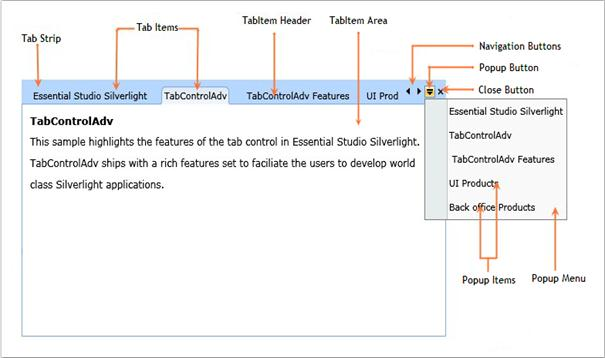

::: {style="DISPLAY: none"}
{#d2h_url_template}{#d2h_package_url style="WIDTH: 0px; DISPLAY: none; HEIGHT: 0px"}
:::

:::: {.d2h_secondary_topic style="PADDING-BOTTOM: 10pt; MARGIN: 0pt; PADDING-LEFT: 0pt; PADDING-RIGHT: 0pt; PADDING-TOP: 0pt"}
#### Control Structure

{border="0"}

Figure 775:Control Structure[]{style="FONT-FAMILY: 'Calibri','sans-serif'; FONT-SIZE: 12pt"}

**[]{style="FONT-FAMILY: 'Calibri','sans-serif'; FONT-SIZE: 12pt"}** 

::: {align="center"}
+------------------------------------------------------+------------------------------------------------------------------------------------------------------------------------------------------------+
| Control Elements                                     | Description                                                                                                                                    |
|                                                      |                                                                                                                                                |
|                                                      |                                                                                                                                                |
+------------------------------------------------------+------------------------------------------------------------------------------------------------------------------------------------------------+
| Tab Strip                                            | The Tab strip provides the layout for displaying the tab items                                                                                 |
+------------------------------------------------------+------------------------------------------------------------------------------------------------------------------------------------------------+
| Tab Items                                            | The Tab items represent the selectable items inside the *TabControlAdv*                                                                        |
|                                                      |                                                                                                                                                |
|                                                      |                                                                                                                                                |
+------------------------------------------------------+------------------------------------------------------------------------------------------------------------------------------------------------+
| Tab Item Header[]{style="TEXT-TRANSFORM: uppercase"} | The Tab Item header is the text displayed in the Tab item                                                                                      |
+------------------------------------------------------+------------------------------------------------------------------------------------------------------------------------------------------------+
| Navigation Button (Scrolling Button)                 | The Navigation buttons enable quick navigation through the Tab Items. This is also called as *Scrolling* buttons                               |
+------------------------------------------------------+------------------------------------------------------------------------------------------------------------------------------------------------+
| Close Button                                         | The *Close* button is used to close the currently selected Tab Item                                                                            |
+------------------------------------------------------+------------------------------------------------------------------------------------------------------------------------------------------------+
| PopUp Menu                                           | The Pop-up Menu enables quick navigation through the Tab Items. It is very used to navigate quickly while the control is having many Tab Items |
+------------------------------------------------------+------------------------------------------------------------------------------------------------------------------------------------------------+
| PopUpMenu Item                                       | The Pop-up Menu Item represents the selectable item inside the Popup Menu                                                                      |
+------------------------------------------------------+------------------------------------------------------------------------------------------------------------------------------------------------+
| PopUpMenu Button                                     | The Pop-up button is used for viewing the Popup Menu                                                                                           |
+------------------------------------------------------+------------------------------------------------------------------------------------------------------------------------------------------------+
:::

[]{style="FONT-FAMILY: 'Calibri','sans-serif'; FONT-SIZE: 12pt"} 

[]{#related-topics}
::::
