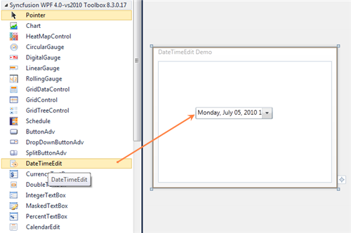

::: {style="DISPLAY: none"}
{#d2h_url_template}{#d2h_package_url style="WIDTH: 0px; DISPLAY: none; HEIGHT: 0px"}
:::

::: {.d2h_secondary_topic style="PADDING-BOTTOM: 10pt; MARGIN: 0pt; PADDING-LEFT: 0pt; PADDING-RIGHT: 0pt; PADDING-TOP: 0pt"}
##### []{#_Creating_a_DateTimeEdit_2}Creating a DateTimeEdit control in XAML

Steps to create DateTimeEdit control by using Visual Studio in XAML as follows:

1.   Create a new application in Visual Studio.

2.   In the Visual Studio Toolbox, click Syncfusion Silverlight Toolbox tab and select DateTimeEdit.

3.   Drag and Drop the DateTimeEdit control to design view in orderto add DateTimeEdit control to your application.

 

{border="0"}

Figure 420: Control added to Design View

4.   In the properties window, customize the properties of the DateTimeEdit control.

 

+-------------------------------------------------------------------------------------------------------------------------------------------------------------------------------------------------------------------------------------------------------------------------------------------------------------------------------------------------------------------------------------------------------------------------------------------------------------------------------------------------------------------------------------------------------------------------------------------------------------+
| [XAML]{style="FONT-FAMILY: 'Courier New'"}                                                                                                                                                                                                                                                                                                                                                                                                                                                                                                                                                                  |
+-------------------------------------------------------------------------------------------------------------------------------------------------------------------------------------------------------------------------------------------------------------------------------------------------------------------------------------------------------------------------------------------------------------------------------------------------------------------------------------------------------------------------------------------------------------------------------------------------------------+
| [          ]{style="FONT-FAMILY: 'Courier New'; COLOR: #a31515"}[\<]{style="FONT-FAMILY: 'Courier New'; COLOR: blue"}[syncfusion]{style="FONT-FAMILY: 'Courier New'; COLOR: #a31515"}[:]{style="FONT-FAMILY: 'Courier New'; COLOR: blue"}[DateTimeEdit]{style="FONT-FAMILY: 'Courier New'; COLOR: #a31515"}[ Height]{style="FONT-FAMILY: 'Courier New'; COLOR: red"}[=\"29\"]{style="FONT-FAMILY: 'Courier New'; COLOR: blue"}[ Margin]{style="FONT-FAMILY: 'Courier New'; COLOR: red"}[=\"75,71,50,0\"]{style="FONT-FAMILY: 'Courier New'; COLOR: blue"}[]{style="FONT-FAMILY: 'Courier New'; COLOR: red"} |
|                                                                                                                                                                                                                                                                                                                                                                                                                                                                                                                                                                                                             |
| [                                    VerticalAlignment]{style="FONT-FAMILY: 'Courier New'; COLOR: red"}[=\"Top\"/\>]{style="FONT-FAMILY: 'Courier New'; COLOR: blue"}[]{style="FONT-FAMILY: 'Courier New'"}                                                                                                                                                                                                                                                                                                                                                                                                 |
|                                                                                                                                                                                                                                                                                                                                                                                                                                                                                                                                                                                                             |
| []{style="FONT-FAMILY: 'Courier New'"}                                                                                                                                                                                                                                                                                                                                                                                                                                                                                                                                                                      |
+-------------------------------------------------------------------------------------------------------------------------------------------------------------------------------------------------------------------------------------------------------------------------------------------------------------------------------------------------------------------------------------------------------------------------------------------------------------------------------------------------------------------------------------------------------------------------------------------------------------+

 

{border="0"}

Figure 421: DateTimeEdit control

See Also

[Creating a DateTimeEdit control using C#]{.UGHyperlink}[]{.UGHyperlink}

[Creating a DateTimeEdit control by using Blend]{.UGHyperlink}[]{.UGHyperlink}

**[[[]{style="TEXT-DECORATION: none"}]{style="COLOR: black"}]{.underline}** 

[]{#related-topics}
:::
