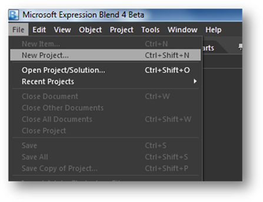
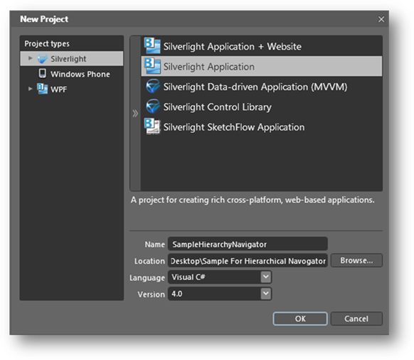
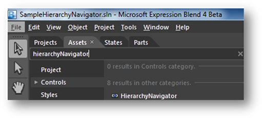
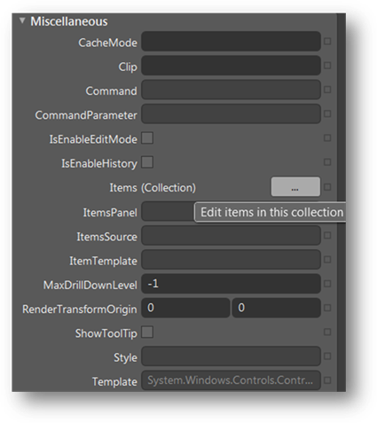
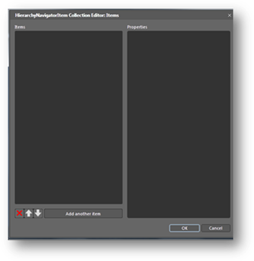
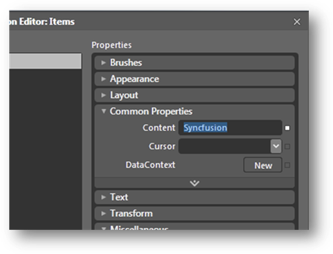
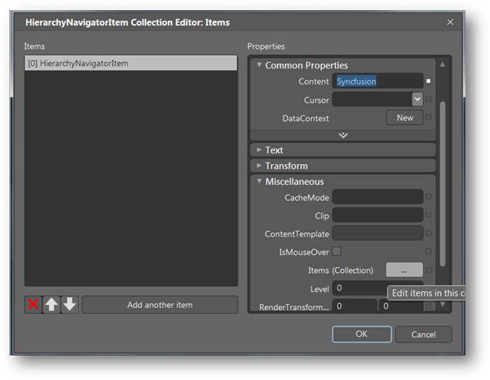
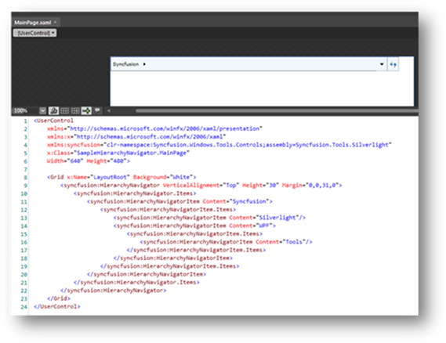

::: {style="DISPLAY: none"}
{#d2h_url_template}{#d2h_package_url style="WIDTH: 0px; DISPLAY: none; HEIGHT: 0px"}
:::

::: {.d2h_secondary_topic style="PADDING-BOTTOM: 10pt; MARGIN: 0pt; PADDING-LEFT: 0pt; PADDING-RIGHT: 0pt; PADDING-TOP: 0pt"}
##### [Creating a HierarchicalNavigator control using Expression Blend]{#_Ref261963736}

The HierarchyNavigator control is fully customizable with Microsoft Blend. The following step-by-step instructions show you how to create a Silverlight application with Blend.

Open Expression Blend, and then go to the File menu and click New Project.

{border="0"}

Figure 1013: File menu in Blend

[]{style="FONT-FAMILY: 'Calibri','sans-serif'"} 

In the New Project dialog, select Silverlight Application; name the project in the Name field and click OK.

{border="0"}

Figure 1014: New Project dialog

[]{style="FONT-FAMILY: 'Calibri','sans-serif'"} 

1.   Add the following references with the sample project:

[·      ]{style="FONT-FAMILY: Symbol"}Syncfusion.Shared.Silverlight.dll

[·      ]{style="FONT-FAMILY: Symbol"}Syncfusion.Tools.Silverlight.dll

2.   Open the Assets Library (go to the Window menu, and select Assets) in Expression Blend, and type **HierarchyNavigator** in the search box.

{border="0"}

Figure 1015: Assets library

3.   Once it is in view, drag the HierarchyNavigator control to the Design view.

4.   Now select the HierarchyNavigator control and navigate to Miscellaneous, located in the Properties pane; click the button next to the Items collection. The Object Collection Editor will appear.

{border="0"}

Figure 1016: Properties Window

**[]{style="FONT-FAMILY: 'Calibri','sans-serif'; COLOR: #4f81bd"}** 

5.   The HierarchyNavigator Collection Editor has two sections. The left side contains a list of items that can be added to the HierarchyNavigator control.

{border="0"}

Figure 1017: HierarchyNavigator Collection Editor

 

6.   To add an item, click the Add Another Item button. Then go to the Properties pane to add content and items for a selected item.

{border="0"}

Figure 1018: Properties pane

7.   To add items in a hierarchical data format, in the Properties pane, find the Items field and add items to the next level.

{border="0"}

Figure 1019: Items field to the left

[]{style="FONT-FAMILY: 'Calibri','sans-serif'"} 

[]{style="FONT-FAMILY: 'Calibri','sans-serif'"} 

8.   Items will then be displayed in XAML, as seen in **Error! Reference source not found.**.

{border="0"}

[Figure]{#_Ref262044397} 1020: Items displayed in XAML

[]{style="FONT-FAMILY: 'Calibri','sans-serif'"} 

[]{#related-topics}
:::
