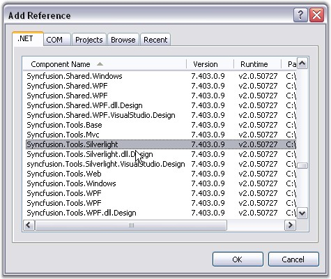

::: {style="DISPLAY: none"}
{#d2h_url_template}{#d2h_package_url style="WIDTH: 0px; DISPLAY: none; HEIGHT: 0px"}
:::

::::: {#nsbanner .d2h_main_nsbanner style="BORDER-BOTTOM: #999999 1px solid; POSITION: relative; PADDING-BOTTOM: 0px; BACKGROUND-COLOR: transparent; PADDING-LEFT: 0px; PADDING-RIGHT: 0px; DISPLAY: none; BORDER-TOP: #999999 1px solid; PADDING-TOP: 0px; LEFT: 0px"}
:::: {#TitleRow .d2h_main_titlerow style="PADDING-BOTTOM: 4px; BACKGROUND-COLOR: transparent; PADDING-LEFT: 22px; WIDTH: 100%; PADDING-RIGHT: 10px; DISPLAY: none; PADDING-TOP: 4px"}
::: {#ienav .d2h_main_ienav style="DISPLAY: none"}
{#D2HPrevious .D2HPreviousEnabled}  {#D2HNext .D2HNextEnabled}
:::
::::
:::::

::: {#nstext .d2h_main_nstext style="PADDING-BOTTOM: 10px; BACKGROUND-COLOR: transparent; PADDING-LEFT: 22px; PADDING-RIGHT: 10px; HEIGHT: 100%; OVERFLOW: auto; PADDING-TOP: 5px" hasuserbackground="true" valign="bottom"}
## []{#_Creating_a_Silverlight}Creating a Silverlight Application and Deploying Essential Tools

[]{#p11} 

Here are the step-by-step instructions for creating a Silverlight application and deploying Tools controls in that application.

 

This procedure is elaborated under the following sections:

 

1.   Creating a Silverlight Application

2.   Deploying Essential Tools to the Application

 

Creating a Silverlight Application

 

1.   Open Microsoft Visual Studio. Go to **File** menu and click **New Project**.

 

{border="0"}

Figure 13: Creating a Silverlight Application

 

2.   In the **New Project** dialog, select **Silverlight Application** template, name the project and click **OK**.

 

{border="0"}

Figure 14: new project dialog

 

A new Silverlight application is created.

 

Deploying Essential Tools to the Application

 

1.   Go to Solution Explorer. Right-click **References** folder and click **Add Reference**.

 

{border="0"}

Figure 15: Solution Explorer window

 

2.   Add the following assemblies to the project References folder.

 

[·      ]{style="FONT-FAMILY: Symbol"}Syncfusion.Tools.Silverlight.dll

[·      ]{style="FONT-FAMILY: Symbol"}Syncfusion.Shared.Silverlight.dll,

[·      ]{style="FONT-FAMILY: Symbol"}System.Windows.Controls.dll,

[·      ]{style="FONT-FAMILY: Symbol"}System.Windows.Controls.Data.dll

 

{border="0"}

Figure 16: Add Reference

 

3.   Add Syncfusion.Tools.Silverlight reference in XAML or C# code as follows.

[]{style="FONT-FAMILY: 'Segoe UI','sans-serif'; COLOR: red"} 

[]{style="FONT-FAMILY: 'Courier New'"} 

+------------------------------------------------------------------------------------------------------------------------------------------------------------------------------------------------------------------------------------------------------------------------------------------------------------------------+
| **[\[XAML\]]{style="FONT-FAMILY: 'Courier New'; COLOR: black"}**                                                                                                                                                                                                                                                       |
|                                                                                                                                                                                                                                                                                                                        |
| [ xmlns]{style="FONT-FAMILY: 'Courier New'; COLOR: red"}[:]{style="FONT-FAMILY: 'Courier New'; COLOR: blue"}[Syncfusion]{style="FONT-FAMILY: 'Courier New'; COLOR: red"}[=\"clr-namespace:Syncfusion.Windows.Tools.Controls;assembly=Syncfusion.Shared.Silverlight\"]{style="FONT-FAMILY: 'Courier New'; COLOR: blue"} |
+------------------------------------------------------------------------------------------------------------------------------------------------------------------------------------------------------------------------------------------------------------------------------------------------------------------------+

[]{style="FONT-FAMILY: 'Courier New'"} 

+-----------------------------------------------------------------------------------------------------------------------------------+
| **[\[C#\]]{style="FONT-FAMILY: 'Courier New'; COLOR: black"}**                                                                    |
|                                                                                                                                   |
| []{style="FONT-FAMILY: 'Courier New'; COLOR: blue"}                                                                               |
|                                                                                                                                   |
| [using]{style="FONT-FAMILY: 'Courier New'; COLOR: blue"}[ Syncfusion.Windows.Tools.Controls;]{style="FONT-FAMILY: 'Courier New'"} |
+-----------------------------------------------------------------------------------------------------------------------------------+

 

Essential Tools controls are deployed in your application.

 

Refer individual getting started sections of all the controls in this user\'s guide to know how to add those individual controls to this application.

 

See Also

 

[Tools Silverlight Controls]{style="COLOR: windowtext; TEXT-DECORATION: none; text-underline: none"}[]{style="COLOR: black"}

[]{#related-topics}
:::
