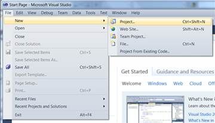
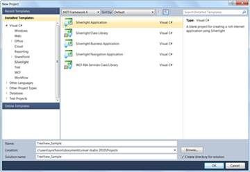
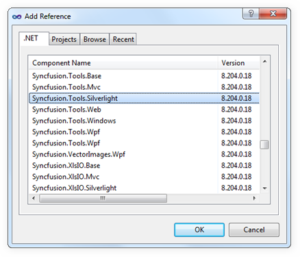
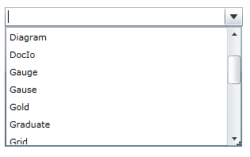

::: {style="DISPLAY: none"}
{#d2h_url_template}{#d2h_package_url style="WIDTH: 0px; DISPLAY: none; HEIGHT: 0px"}
:::

::: {.d2h_secondary_topic style="PADDING-BOTTOM: 10pt; MARGIN: 0pt; PADDING-LEFT: 0pt; PADDING-RIGHT: 0pt; PADDING-TOP: 0pt"}
#### Creating AutoComplete using C#

1.   Open Visual Studio, On the **File** menu click New -\> Project. This opens the New Project Dialog box as shown below.-.

 

{border="0"}

Figure 18: Creating New Silverlight Project

 

2.   In the Project Dialog window, select Silverlight Application and, in the Name field, type the name of the project.Click OK. This is illustrated as shown below.

[]{style="FONT-FAMILY: 'Calibri','sans-serif'; FONT-SIZE: 11pt"} 

{border="0"}

Figure 19: Creating New Silverlight Application

[]{style="FONT-FAMILY: 'Calibri','sans-serif'; FONT-SIZE: 11pt"} 

3.   Go to Solution Explorer. Right-click **References** folder and click Add Reference. Add the **Syncfusion.Tools.Silverlight** assembly to the project References folder.

         

{border="0"}

Figure 20: Adding Reference

 

+-----------------------------------------------------------------------------------------------------------------------------------------------------------------------------------------------------------------------------------------------------------------------------------------------------------------------+
| **[\[XAML\]]{style="FONT-FAMILY: 'Courier New'"}**                                                                                                                                                                                                                                                                    |
|                                                                                                                                                                                                                                                                                                                       |
| [xmlns]{style="FONT-FAMILY: 'Courier New'; COLOR: red"}[:]{style="FONT-FAMILY: 'Courier New'; COLOR: blue"}[syncfusion]{style="FONT-FAMILY: 'Courier New'; COLOR: red"}[=\"clr-namespace:Syncfusion.Windows.Tools.Controls; assembly=Syncfusion.Tools.Silverlight\"]{style="FONT-FAMILY: 'Courier New'; COLOR: blue"} |
+-----------------------------------------------------------------------------------------------------------------------------------------------------------------------------------------------------------------------------------------------------------------------------------------------------------------------+

 

4.   Add Syncfusion.Tools.Silverlight reference in XAML and C# code as follows.

 

+-----------------------------------------------------------------------------------------------------------------------------------+
| **[\[C#\]]{style="FONT-FAMILY: 'Courier New'"}**                                                                                  |
|                                                                                                                                   |
| [using]{style="FONT-FAMILY: 'Courier New'; COLOR: blue"}[ Syncfusion.Windows.Tools.Controls;]{style="FONT-FAMILY: 'Courier New'"} |
+-----------------------------------------------------------------------------------------------------------------------------------+

 

5.   Click and open the C# file and add AutoComplete to the application.

 

+-------------------------------------------------------------------------------------------------------------------------------------------------------------------------------------------------------------------------------------------------------+
| **[\[C#\]]{style="FONT-FAMILY: 'Courier New'"}**                                                                                                                                                                                                      |
|                                                                                                                                                                                                                                                       |
| [AutoComplete]{style="FONT-FAMILY: 'Courier New'; COLOR: #2b91af"}[ AutoComplete1 = [new]{style="COLOR: blue"} [AutoComplete]{style="COLOR: #2b91af"}();]{style="FONT-FAMILY: 'Courier New'"}                                                         |
|                                                                                                                                                                                                                                                       |
| [List]{style="FONT-FAMILY: 'Courier New'; COLOR: #2b91af"}[\<[String]{style="COLOR: #2b91af"}\> ProductSource = [new]{style="COLOR: blue"} [List]{style="COLOR: #2b91af"}\<[String]{style="COLOR: #2b91af"}\>();]{style="FONT-FAMILY: 'Courier New'"} |
|                                                                                                                                                                                                                                                       |
| [customSource.Add([\"WF\"]{style="COLOR: #a31515"});]{style="FONT-FAMILY: 'Courier New'"}                                                                                                                                                             |
|                                                                                                                                                                                                                                                       |
| [customSource.Add([\"WPF\"]{style="COLOR: #a31515"});]{style="FONT-FAMILY: 'Courier New'"}                                                                                                                                                            |
|                                                                                                                                                                                                                                                       |
| [customSource.Add([\"Silverlight\"]{style="COLOR: #a31515"});]{style="FONT-FAMILY: 'Courier New'"}                                                                                                                                                    |
|                                                                                                                                                                                                                                                       |
| [customSource.Add([\"Asp.Net\"]{style="COLOR: #a31515"});]{style="FONT-FAMILY: 'Courier New'"}                                                                                                                                                        |
|                                                                                                                                                                                                                                                       |
| [customSource.Add([\"Mvc\"]{style="COLOR: #a31515"});]{style="FONT-FAMILY: 'Courier New'"}                                                                                                                                                            |
|                                                                                                                                                                                                                                                       |
| [customSource.Add([\"Tools\"]{style="COLOR: #a31515"});]{style="FONT-FAMILY: 'Courier New'"}                                                                                                                                                          |
|                                                                                                                                                                                                                                                       |
| [customSource.Add([\"Diagram\"]{style="COLOR: #a31515"});]{style="FONT-FAMILY: 'Courier New'"}                                                                                                                                                        |
|                                                                                                                                                                                                                                                       |
| [customSource.Add([\"Gauge\"]{style="COLOR: #a31515"});]{style="FONT-FAMILY: 'Courier New'"}                                                                                                                                                          |
|                                                                                                                                                                                                                                                       |
| [customSource.Add([\"Gause\"]{style="COLOR: #a31515"});]{style="FONT-FAMILY: 'Courier New'"}                                                                                                                                                          |
|                                                                                                                                                                                                                                                       |
| [customSource.Add([\"GridView\"]{style="COLOR: #a31515"});]{style="FONT-FAMILY: 'Courier New'"}                                                                                                                                                       |
|                                                                                                                                                                                                                                                       |
| [customSource.Add([\"Graduate\"]{style="COLOR: #a31515"});]{style="FONT-FAMILY: 'Courier New'"}                                                                                                                                                       |
|                                                                                                                                                                                                                                                       |
| [customSource.Add([\"Gold\"]{style="COLOR: #a31515"});]{style="FONT-FAMILY: 'Courier New'"}                                                                                                                                                           |
|                                                                                                                                                                                                                                                       |
| [customSource.Add([\"Chart\"]{style="COLOR: #a31515"});]{style="FONT-FAMILY: 'Courier New'"}                                                                                                                                                          |
|                                                                                                                                                                                                                                                       |
| [customSource.Add([\"Business Intelligence\"]{style="COLOR: #a31515"});]{style="FONT-FAMILY: 'Courier New'"}                                                                                                                                          |
|                                                                                                                                                                                                                                                       |
| [customSource.Add([\"Schedule\"]{style="COLOR: #a31515"});]{style="FONT-FAMILY: 'Courier New'"}                                                                                                                                                       |
|                                                                                                                                                                                                                                                       |
| [customSource.Add([\"Grid\"]{style="COLOR: #a31515"});]{style="FONT-FAMILY: 'Courier New'"}                                                                                                                                                           |
|                                                                                                                                                                                                                                                       |
| [customSource.Add([\"DocIo\"]{style="COLOR: #a31515"});]{style="FONT-FAMILY: 'Courier New'"}                                                                                                                                                          |
|                                                                                                                                                                                                                                                       |
| [customSource.Add([\"XlsIo\"]{style="COLOR: #a31515"});]{style="FONT-FAMILY: 'Courier New'"}                                                                                                                                                          |
|                                                                                                                                                                                                                                                       |
| [customSource.Add([\"Pdf\"]{style="COLOR: #a31515"});]{style="FONT-FAMILY: 'Courier New'"}                                                                                                                                                            |
|                                                                                                                                                                                                                                                       |
| [this]{style="FONT-FAMILY: 'Courier New'; COLOR: blue"}[.AutoComplete1.CustomSource = ProductSource;]{style="FONT-FAMILY: 'Courier New'"}                                                                                                             |
+-------------------------------------------------------------------------------------------------------------------------------------------------------------------------------------------------------------------------------------------------------+

 

 

{border="0"}

Figure 21: AutoComplete Created Using C#

 

[]{#related-topics}
:::
