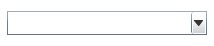
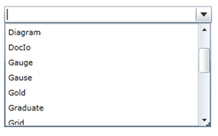

::: {style="DISPLAY: none"}
{#d2h_url_template}{#d2h_package_url style="WIDTH: 0px; DISPLAY: none; HEIGHT: 0px"}
:::

::: {.d2h_secondary_topic style="PADDING-BOTTOM: 10pt; MARGIN: 0pt; PADDING-LEFT: 0pt; PADDING-RIGHT: 0pt; PADDING-TOP: 0pt"}
#### Creating AutoComplete using XAML

 

Following are the steps to create the AutoComplete by using VisualStudio in XAML as follows.

 

1.   Create a new Silverlight application in Visual Studio.

2.   In Visual Studio Toolbox, click Syncfusion Silverlight Toolbox tab and select AutoComplete.

 

{border="0"}

 

Figure 22: Select AutoComplete From ToolBox

 

3.   Drag-and-drop the AutoComplete to Design View, to add AutoComplete to the application.

{border="0"}

Figure 23: AutoComplete Drag and Drop from ToolBox

 

4.   You can now customize the properties of AutoComplete in the Properties Window.

 

+-----------------------------------------------------------------------------------------------------------------------------------------------------------------------------------------------------------------------------------------------------------------------------------------------------------------------------------------------------------------------------------------------------------------------------------------------------------------------------------------------------------------------------------------------------------------------------------------------------+
| **[\[XAML\]]{style="FONT-FAMILY: 'Courier New'"}**                                                                                                                                                                                                                                                                                                                                                                                                                                                                                                                                                  |
|                                                                                                                                                                                                                                                                                                                                                                                                                                                                                                                                                                                                     |
| [\<]{style="FONT-FAMILY: 'Courier New'; COLOR: blue"}[local]{style="FONT-FAMILY: 'Courier New'; COLOR: #a31515"}[:]{style="FONT-FAMILY: 'Courier New'; COLOR: blue"}[ProductSource]{style="FONT-FAMILY: 'Courier New'; COLOR: #a31515"}[ [x]{style="COLOR: #a31515"}[:]{style="COLOR: blue"}[Key]{style="COLOR: red"}[=\"AutoCompleteSource\"/\>]{style="COLOR: blue"}]{style="FONT-FAMILY: 'Courier New'"}                                                                                                                                                                                         |
|                                                                                                                                                                                                                                                                                                                                                                                                                                                                                                                                                                                                     |
| [\<]{style="FONT-FAMILY: 'Courier New'; COLOR: blue"}[syncfusion]{style="FONT-FAMILY: 'Courier New'; COLOR: #a31515"}[:]{style="FONT-FAMILY: 'Courier New'; COLOR: blue"}[AutoComplete x]{style="FONT-FAMILY: 'Courier New'; COLOR: #a31515"}[:]{style="FONT-FAMILY: 'Courier New'; COLOR: blue"}[Name]{style="FONT-FAMILY: 'Courier New'; COLOR: red"}[=\"AutoComplete1\"]{style="FONT-FAMILY: 'Courier New'; COLOR: blue"}[ [Custom    Source]{style="COLOR: red"}[=\"{StaticResource AutoCompleteSource}\"]{style="COLOR: blue"} [/\>]{style="COLOR: blue"}]{style="FONT-FAMILY: 'Courier New'"} |
+-----------------------------------------------------------------------------------------------------------------------------------------------------------------------------------------------------------------------------------------------------------------------------------------------------------------------------------------------------------------------------------------------------------------------------------------------------------------------------------------------------------------------------------------------------------------------------------------------------+

 

[]{style="COLOR: #c0504d"} 

[]{style="COLOR: #c0504d"} 

{border="0"}

Figure 24: AutoComplete created using XAML

[]{#related-topics}
:::
