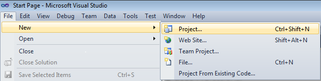
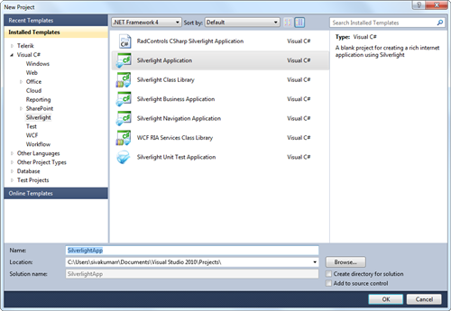
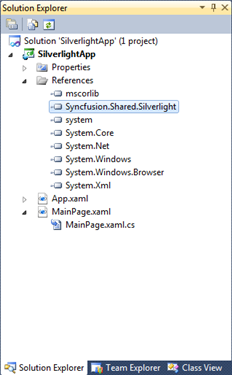

::: {style="DISPLAY: none"}
{#d2h_url_template}{#d2h_package_url style="WIDTH: 0px; DISPLAY: none; HEIGHT: 0px"}
:::

:::: {.d2h_secondary_topic style="PADDING-BOTTOM: 10pt; MARGIN: 0pt; PADDING-LEFT: 0pt; PADDING-RIGHT: 0pt; PADDING-TOP: 0pt"}
##### []{#_Creating_CurrencyTextBox_using_1}Creating CurrencyTextBox using C#

The steps to create CurrencyTextBox by using Visual Studio in C# as follows:

1.   Open Visual Studio, On the **File** menu click New -\> Project. This opens the New Project Dialog box.

 

{border="0"}

Figure 255: New Project Dialog

 

2.   Select Silverlight application in the Project dialog window and type the name of the projec t in the Name field. Click OK.

{border="0"}

Figure 256: Open New Project

3.   Add the following Reference with the sample project.

[·      ]{style="FONT-FAMILY: Symbol"}Syncfusion.Shared.Silverlight.dll

 

{border="0"}

Figure 257: Solution Explorer

4.   Click and open C# file. Add CurrencyTextBox to your application.

 

+---------------------------------------------------------------------------------------------------------------------------------------------------------------------------------------+
| [C#]{style="FONT-FAMILY: 'Courier New'"}                                                                                                                                              |
+---------------------------------------------------------------------------------------------------------------------------------------------------------------------------------------+
| [            [CurrencyTextBox]{style="COLOR: #2b91af"} currencyTextBox = [new]{style="COLOR: blue"} [CurrencyTextBox]{style="COLOR: #2b91af"}();]{style="FONT-FAMILY: 'Courier New'"} |
|                                                                                                                                                                                       |
| [            currencyTextBox.Width = 100;]{style="FONT-FAMILY: 'Courier New'"}                                                                                                        |
|                                                                                                                                                                                       |
| [            currencyTextBox.Height = 25;]{style="FONT-FAMILY: 'Courier New'"}                                                                                                        |
+---------------------------------------------------------------------------------------------------------------------------------------------------------------------------------------+

 

{border="0"}

Figure 258: CurrencyTextBox

::: {style="BORDER-BOTTOM: windowtext 1pt solid; BORDER-LEFT: medium none; PADDING-BOTTOM: 1pt; MARGIN-TOP: 9pt; PADDING-LEFT: 0pt; PADDING-RIGHT: 0pt; MARGIN-BOTTOM: 9pt; BORDER-TOP: windowtext 1pt solid; BORDER-RIGHT: medium none; PADDING-TOP: 1pt"}
{border="0"}Note: If user does not set any value to CurrencyTextBox then the default value will be as follows:

If UseNullOption set to true then,

    Value of NullValue property will be the default value.

Otherwise

   Zero will be the default value (based on the MinValue and MaxValue the default value will change).
:::

See Also

[Creating CurrencyTextBox using XAML]{.UGHyperlink}[]{.UGHyperlink}

[Creating CurrencyTextBox using Blend]{.UGHyperlink}[]{.UGHyperlink}

 

[]{#related-topics}
::::
