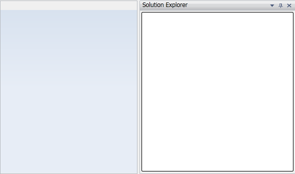

::: {style="DISPLAY: none"}
{#d2h_url_template}{#d2h_package_url style="WIDTH: 0px; DISPLAY: none; HEIGHT: 0px"}
:::

::: {.d2h_secondary_topic style="PADDING-BOTTOM: 10pt; MARGIN: 0pt; PADDING-LEFT: 0pt; PADDING-RIGHT: 0pt; PADDING-TOP: 0pt"}
#### []{#_Ref261394137}[]{#_Creating_Dock_Controls_1}Creating Dock Controls Using DockingManager through C#

[]{style="FONT-SIZE: 14pt"} 

This topic gives the step by step procedure to dock a control using DockingManager through C#.

1.   To dock a control using DockingManager, you need to add following Syncfusion assemblies as reference:

2.   Syncfusion.DockingManager.Silverlight

3.   Syncfusion.Shared.Silverlight

4.   Now include the namespace in the C# file:

[]{style="FONT-SIZE: 14pt"} 

  -----------------------------------------------------------------------------------------------------------------------------------
  [using]{style="FONT-FAMILY: 'Courier New'; COLOR: blue"}[ Syncfusion.Windows.Tools.Controls;]{style="FONT-FAMILY: 'Courier New'"}
  -----------------------------------------------------------------------------------------------------------------------------------

[]{style="FONT-SIZE: 14pt"} 

5.   Now to dock a control, you have to create an instance for DockingManager and add the controls to its collection. You have to specify the DockState, position of the control using **SideInDockedMode** property and the Caption text for the docked window using **Header** property.

 

+---------------------------------------------------------------------------------------------------------------------------------------------------------------------------------------------------------------------------------+
| [using]{style="FONT-FAMILY: 'Courier New'; COLOR: blue; FONT-SIZE: 11pt"}[ System.Collections.Generic;]{style="FONT-FAMILY: 'Courier New'; FONT-SIZE: 11pt"}                                                                    |
|                                                                                                                                                                                                                                 |
| [using]{style="FONT-FAMILY: 'Courier New'; COLOR: blue; FONT-SIZE: 11pt"}[ System.Windows;]{style="FONT-FAMILY: 'Courier New'; FONT-SIZE: 11pt"}                                                                                |
|                                                                                                                                                                                                                                 |
| [using]{style="FONT-FAMILY: 'Courier New'; COLOR: blue; FONT-SIZE: 11pt"}[ System.Windows.Controls;]{style="FONT-FAMILY: 'Courier New'; FONT-SIZE: 11pt"}                                                                       |
|                                                                                                                                                                                                                                 |
| [using]{style="FONT-FAMILY: 'Courier New'; COLOR: blue; FONT-SIZE: 11pt"}[ Syncfusion.Windows.Tools.Controls;]{style="FONT-FAMILY: 'Courier New'; FONT-SIZE: 11pt"}                                                             |
|                                                                                                                                                                                                                                 |
| [using]{style="FONT-FAMILY: 'Courier New'; COLOR: blue; FONT-SIZE: 11pt"}[ Syncfusion.Windows.Shared;]{style="FONT-FAMILY: 'Courier New'; FONT-SIZE: 11pt"}                                                                     |
|                                                                                                                                                                                                                                 |
| []{style="FONT-FAMILY: 'Courier New'; FONT-SIZE: 11pt"}                                                                                                                                                                         |
|                                                                                                                                                                                                                                 |
| [namespace]{style="FONT-FAMILY: 'Courier New'; COLOR: blue; FONT-SIZE: 11pt"}[ Sample]{style="FONT-FAMILY: 'Courier New'; FONT-SIZE: 11pt"}                                                                                     |
|                                                                                                                                                                                                                                 |
| [{]{style="FONT-FAMILY: 'Courier New'; FONT-SIZE: 11pt"}                                                                                                                                                                        |
|                                                                                                                                                                                                                                 |
| [    [public]{style="COLOR: blue"} [partial]{style="COLOR: blue"} [class]{style="COLOR: blue"} [MainPage]{style="COLOR: #2b91af"} : [UserControl]{style="COLOR: #2b91af"}]{style="FONT-FAMILY: 'Courier New'; FONT-SIZE: 11pt"} |
|                                                                                                                                                                                                                                 |
| [    {     ]{style="FONT-FAMILY: 'Courier New'; FONT-SIZE: 11pt"}                                                                                                                                                               |
|                                                                                                                                                                                                                                 |
| [        [public]{style="COLOR: blue"} MainPage()]{style="FONT-FAMILY: 'Courier New'; FONT-SIZE: 11pt"}                                                                                                                         |
|                                                                                                                                                                                                                                 |
| [        {]{style="FONT-FAMILY: 'Courier New'; FONT-SIZE: 11pt"}                                                                                                                                                                |
|                                                                                                                                                                                                                                 |
| [            InitializeComponent();]{style="FONT-FAMILY: 'Courier New'; FONT-SIZE: 11pt"}                                                                                                                                       |
|                                                                                                                                                                                                                                 |
| [             [//Creating DockingManager instance]{style="COLOR: green"}]{style="FONT-FAMILY: 'Courier New'; FONT-SIZE: 11pt"}                                                                                                  |
|                                                                                                                                                                                                                                 |
| [            [DockingManager]{style="COLOR: #2b91af"} dockingManager = [new]{style="COLOR: blue"} [DockingManager]{style="COLOR: #2b91af"}();]{style="FONT-FAMILY: 'Courier New'; FONT-SIZE: 11pt"}                             |
|                                                                                                                                                                                                                                 |
| [                [//Creating TreeView instance]{style="COLOR: green"}]{style="FONT-FAMILY: 'Courier New'; FONT-SIZE: 11pt"}                                                                                                     |
|                                                                                                                                                                                                                                 |
| [            [TreeView]{style="COLOR: #2b91af"} treeView = [new]{style="COLOR: blue"} [TreeView]{style="COLOR: #2b91af"}();]{style="FONT-FAMILY: 'Courier New'; FONT-SIZE: 11pt"}                                               |
|                                                                                                                                                                                                                                 |
| [              //Setting the position where treeView should be docked         ]{style="FONT-FAMILY: 'Courier New'; COLOR: green; FONT-SIZE: 11pt"}                                                                              |
|                                                                                                                                                                                                                                 |
| [            [DockingManager]{style="COLOR: #2b91af"}.SetSideInDockedMode(treeView,          Syncfusion.Windows.Tools.Controls.[Dock]{style="COLOR: #2b91af"}.Right);]{style="FONT-FAMILY: 'Courier New'; FONT-SIZE: 11pt"}     |
|                                                                                                                                                                                                                                 |
| [                ]{style="FONT-FAMILY: 'Courier New'; COLOR: #2b91af; FONT-SIZE: 11pt"}[//Setting the header text for treeView]{style="FONT-FAMILY: 'Courier New'; COLOR: green; FONT-SIZE: 11pt"}                              |
|                                                                                                                                                                                                                                 |
| [            [DockingManager]{style="COLOR: #2b91af"}.SetHeader(treeView, [\"SolutionExplorer\"]{style="COLOR: #a31515"});]{style="FONT-FAMILY: 'Courier New'; FONT-SIZE: 11pt"}                                                |
|                                                                                                                                                                                                                                 |
| [            [DockingManager]{style="COLOR: #2b91af"}.SetDockState(treeView, [DockState]{style="COLOR: #2b91af"}.Dock);]{style="FONT-FAMILY: 'Courier New'; FONT-SIZE: 11pt"}                                                   |
|                                                                                                                                                                                                                                 |
| [                 ]{style="FONT-FAMILY: 'Courier New'; COLOR: #2b91af; FONT-SIZE: 11pt"}[//Adding TreeView to DockingManager]{style="FONT-FAMILY: 'Courier New'; COLOR: green; FONT-SIZE: 11pt"}                                |
|                                                                                                                                                                                                                                 |
| [            dockingManager.Children.Add(treeView);]{style="FONT-FAMILY: 'Courier New'; FONT-SIZE: 11pt"}                                                                                                                       |
|                                                                                                                                                                                                                                 |
| [            LayoutRoot.Children.Add(dockingManager);]{style="FONT-FAMILY: 'Courier New'; FONT-SIZE: 11pt"}                                                                                                                     |
|                                                                                                                                                                                                                                 |
| [          }]{style="FONT-FAMILY: 'Courier New'; FONT-SIZE: 11pt"}                                                                                                                                                              |
|                                                                                                                                                                                                                                 |
| [    }]{style="FONT-FAMILY: 'Courier New'; FONT-SIZE: 11pt"}                                                                                                                                                                    |
|                                                                                                                                                                                                                                 |
| [}]{style="FONT-FAMILY: 'Courier New'; FONT-SIZE: 11pt"}                                                                                                                                                                        |
|                                                                                                                                                                                                                                 |
| []{style="FONT-FAMILY: 'Courier New'; FONT-SIZE: 11pt"}                                                                                                                                                                         |
+---------------------------------------------------------------------------------------------------------------------------------------------------------------------------------------------------------------------------------+

[]{style="FONT-FAMILY: 'Calibri','sans-serif'"} 

Output for the above code will be displayed as follows:

{border="0"}

Figure 81: Docked Window

[]{style="FONT-SIZE: 14pt"} 

[]{#related-topics}
:::
