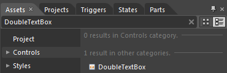
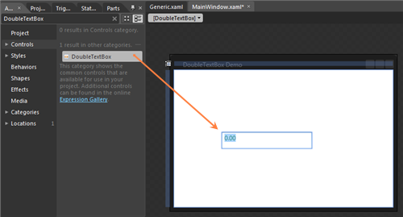

::: {style="DISPLAY: none"}
{#d2h_url_template}{#d2h_package_url style="WIDTH: 0px; DISPLAY: none; HEIGHT: 0px"}
:::

::: {.d2h_secondary_topic style="PADDING-BOTTOM: 10pt; MARGIN: 0pt; PADDING-LEFT: 0pt; PADDING-RIGHT: 0pt; PADDING-TOP: 0pt"}
##### []{#_Creating_DoubleTextBox_by}Creating DoubleTextBox by using Blend

Steps to create DoubleTextBox in application by using Blend are as follows:

1.   Open Blend, On the **File** Menu click New Project. This opens the New Project dialog box.

 

{border="0"}

Figure 44: To create DoubleTextBox using Blend

 

2.   In the Project type's panel, select Silverlight application and then click OK.

{border="0"}

Figure 45: Select Silverlight application

 

 

3.   Add the following Reference with the sample project.

[·      ]{style="FONT-FAMILY: Symbol"}Syncfusion.Shared.Silverlight.dll

4.   On the Window menu, select Assets. This opens the Assets Library dialog box.

5.   In the Search box, type DoubleTextBox. This displays the search results.

 

{border="0"}

Figure 46: Assets Library dialog box

 

6.   Drag the DoubleTextBox control to Design View as shown in the figure below.

{border="0"}

Figure 47: Drag the DoubleTextBox control to Design View

 

+----------------------------------------------------------------------------------------------------------------------------------------------------------------------------------------------------------------------------------------------------------------------------------------------------------------------------------------------------------------------------------------------------------------------------------------------------------------------------------------------------------------------------------------------------------------------------------------------------------------------------------------------------------------------------------------------------------------------------------------------------------------------------------------------------------------------------------------------------------------------------------------------------------------------------------------------------------------------------------------------------------------------------------------------------------------------------------------------------------------------+
| [XAML]{style="FONT-FAMILY: 'Courier New'"}                                                                                                                                                                                                                                                                                                                                                                                                                                                                                                                                                                                                                                                                                                                                                                                                                                                                                                                                                                                                                                                                           |
+----------------------------------------------------------------------------------------------------------------------------------------------------------------------------------------------------------------------------------------------------------------------------------------------------------------------------------------------------------------------------------------------------------------------------------------------------------------------------------------------------------------------------------------------------------------------------------------------------------------------------------------------------------------------------------------------------------------------------------------------------------------------------------------------------------------------------------------------------------------------------------------------------------------------------------------------------------------------------------------------------------------------------------------------------------------------------------------------------------------------+
| [        ]{style="FONT-FAMILY: 'Courier New'; COLOR: #a31515"}[\<]{style="FONT-FAMILY: 'Courier New'; COLOR: blue"}[syncfusion]{style="FONT-FAMILY: 'Courier New'; COLOR: #a31515"}[:]{style="FONT-FAMILY: 'Courier New'; COLOR: blue"}[DoubleTextBox]{style="FONT-FAMILY: 'Courier New'; COLOR: #a31515"}[ Height]{style="FONT-FAMILY: 'Courier New'; COLOR: red"}[=\"23\"]{style="FONT-FAMILY: 'Courier New'; COLOR: blue"}[ HorizontalAlignment]{style="FONT-FAMILY: 'Courier New'; COLOR: red"}[=\"Left\"]{style="FONT-FAMILY: 'Courier New'; COLOR: blue"}[ Margin]{style="FONT-FAMILY: 'Courier New'; COLOR: red"}[=\"110,114,0,0\"]{style="FONT-FAMILY: 'Courier New'; COLOR: blue"}[ Name]{style="FONT-FAMILY: 'Courier New'; COLOR: red"}[=\"doubleTextBox1\"]{style="FONT-FAMILY: 'Courier New'; COLOR: blue"}[ VerticalAlignment]{style="FONT-FAMILY: 'Courier New'; COLOR: red"}[=\"Top\"]{style="FONT-FAMILY: 'Courier New'; COLOR: blue"}[ Width]{style="FONT-FAMILY: 'Courier New'; COLOR: red"}[=\"120\" /\>]{style="FONT-FAMILY: 'Courier New'; COLOR: blue"}[]{style="FONT-FAMILY: 'Courier New'"} |
|                                                                                                                                                                                                                                                                                                                                                                                                                                                                                                                                                                                                                                                                                                                                                                                                                                                                                                                                                                                                                                                                                                                      |
| []{style="FONT-FAMILY: 'Courier New'; COLOR: blue"}                                                                                                                                                                                                                                                                                                                                                                                                                                                                                                                                                                                                                                                                                                                                                                                                                                                                                                                                                                                                                                                                  |
+----------------------------------------------------------------------------------------------------------------------------------------------------------------------------------------------------------------------------------------------------------------------------------------------------------------------------------------------------------------------------------------------------------------------------------------------------------------------------------------------------------------------------------------------------------------------------------------------------------------------------------------------------------------------------------------------------------------------------------------------------------------------------------------------------------------------------------------------------------------------------------------------------------------------------------------------------------------------------------------------------------------------------------------------------------------------------------------------------------------------+

 

{border="0"}

Figure 48: Nullvalue

See Also

[·      ]{style="FONT-FAMILY: Symbol"}[Creating DoubleTextBox using C#]{style="COLOR: windowtext; TEXT-DECORATION: none; text-underline: none"}

[·      ]{style="FONT-FAMILY: Symbol"}[Creating DoubleTextBox using XAML]{style="COLOR: windowtext; TEXT-DECORATION: none; text-underline: none"}

[·      ]{style="FONT-FAMILY: Symbol"}[Blendability]{style="COLOR: windowtext; TEXT-DECORATION: none; text-underline: none"}

 

[]{#related-topics}
:::
