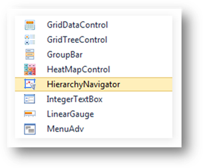
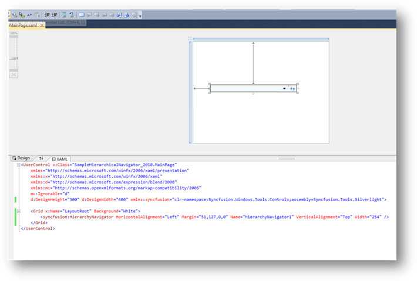

::: {style="DISPLAY: none"}
{#d2h_url_template}{#d2h_package_url style="WIDTH: 0px; DISPLAY: none; HEIGHT: 0px"}
:::

::: {.d2h_secondary_topic style="PADDING-BOTTOM: 10pt; MARGIN: 0pt; PADDING-LEFT: 0pt; PADDING-RIGHT: 0pt; PADDING-TOP: 0pt"}
##### Creating Hierarchical Navigator using Visual Studio

 

12.  Create a new Silverlight application in Visual Studio.

13.  In the Visual Studio Toolbox, select HierarchyNavigator under the Syncfusion Silverlight Toolbox tab.

{border="0"}

Figure 1011: HierarchyNavigator in Syncfusion Silverlight Toolbox

[]{style="FONT-FAMILY: 'Calibri','sans-serif'"} 

14.  To add the HierarchyNavigator control, simply drag the icon to the design view.

{border="0"}

Figure 1012: Control added to Design view

[]{style="FONT-FAMILY: 'Calibri','sans-serif'"} 

15.  Customize the properties of the HierarchyNavigator control in the Properties window.

[]{#related-topics}
:::
