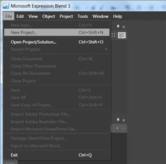
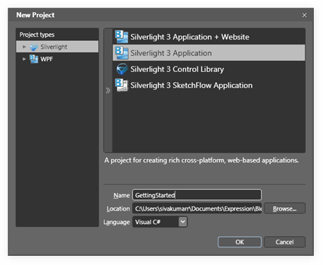
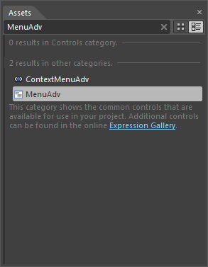
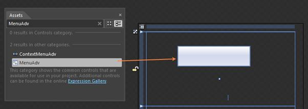
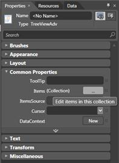

::: {style="DISPLAY: none"}
{#d2h_url_template}{#d2h_package_url style="WIDTH: 0px; DISPLAY: none; HEIGHT: 0px"}
:::

::: {.d2h_secondary_topic style="PADDING-BOTTOM: 10pt; MARGIN: 0pt; PADDING-LEFT: 0pt; PADDING-RIGHT: 0pt; PADDING-TOP: 0pt"}
#### Creating MenuAdv by Using Microsoft Expression Blend

The MenuAdv control provides Expression Blend support. To create a Silverlight application in Expression Blend:

1.   Open Expression Blend.

On the **File** menu, select **New Project**. The **New Project** dialog box is displayed.

{border="0"}

Figure 920: Create a New Project in Expression Blend

 

In the **Project types** panel, select **Silverlight Application**, and then click **OK**.

{border="0"}

Figure 921: Create a New Application in Expression Blend

 

Add the following Reference with the sample project:

[·      ]{style="FONT-FAMILY: Symbol"}Syncfusion.Shared.Silverlight.dll

 

On the **Window** menu, select **Assets**. The **Assets Library** dialog box is displayed.

In the **Search** box, type **MenuAdv**. The search results are displayed.

 

{border="0"}[]{style="FONT-FAMILY: 'Calibri','sans-serif'; FONT-SIZE: 11pt"}

Figure 922: MenuAdv Displayed in Assets Window

 

Drag the **MenuAdv** control to **Design View**.

 

{border="0"}

Figure 923: MenuAdv Dragged from Assets Window

 

In the **Properties** window, customize the properties of **MenuAdv**.

 

{border="0"}

Figure 924: Properties Window

+------------------------------------------------------------------------------------------------------------------------------------------------------------------------------------------------------------------------------------------------------------------------------------------------------------------------------------------------------------------------------------------------------------------------------------------------------------------------------------------------------+
| [\[XAML\]]{style="FONT-FAMILY: 'Courier New'"}                                                                                                                                                                                                                                                                                                                                                                                                                                                       |
|                                                                                                                                                                                                                                                                                                                                                                                                                                                                                                      |
| [\<]{style="FONT-FAMILY: 'Courier New'; COLOR: blue"}[shared]{style="FONT-FAMILY: 'Courier New'; COLOR: #a31515"}[:]{style="FONT-FAMILY: 'Courier New'; COLOR: blue"}[MenuAdv]{style="FONT-FAMILY: 'Courier New'; COLOR: #a31515"}[ x]{style="FONT-FAMILY: 'Courier New'; COLOR: red"}[:]{style="FONT-FAMILY: 'Courier New'; COLOR: blue"}[Name]{style="FONT-FAMILY: 'Courier New'; COLOR: red"}[=\"Menu\"\>]{style="FONT-FAMILY: 'Courier New'; COLOR: blue"}[]{style="FONT-FAMILY: 'Courier New'"} |
|                                                                                                                                                                                                                                                                                                                                                                                                                                                                                                      |
| [                ]{style="FONT-FAMILY: 'Courier New'; COLOR: #a31515"}[\<]{style="FONT-FAMILY: 'Courier New'; COLOR: blue"}[shared]{style="FONT-FAMILY: 'Courier New'; COLOR: #a31515"}[:]{style="FONT-FAMILY: 'Courier New'; COLOR: blue"}[MenuItemAdv]{style="FONT-FAMILY: 'Courier New'; COLOR: #a31515"}[ Header]{style="FONT-FAMILY: 'Courier New'; COLOR: red"}[=\"File\"\>]{style="FONT-FAMILY: 'Courier New'; COLOR: blue"}[]{style="FONT-FAMILY: 'Courier New'"}                            |
|                                                                                                                                                                                                                                                                                                                                                                                                                                                                                                      |
| [                    ]{style="FONT-FAMILY: 'Courier New'; COLOR: #a31515"}[\<]{style="FONT-FAMILY: 'Courier New'; COLOR: blue"}[shared]{style="FONT-FAMILY: 'Courier New'; COLOR: #a31515"}[:]{style="FONT-FAMILY: 'Courier New'; COLOR: blue"}[MenuItemAdv]{style="FONT-FAMILY: 'Courier New'; COLOR: #a31515"}[ Header]{style="FONT-FAMILY: 'Courier New'; COLOR: red"}[=\"New\"\>]{style="FONT-FAMILY: 'Courier New'; COLOR: blue"}[]{style="FONT-FAMILY: 'Courier New'"}                         |
|                                                                                                                                                                                                                                                                                                                                                                                                                                                                                                      |
| [                        ]{style="FONT-FAMILY: 'Courier New'; COLOR: #a31515"}[\<]{style="FONT-FAMILY: 'Courier New'; COLOR: blue"}[shared]{style="FONT-FAMILY: 'Courier New'; COLOR: #a31515"}[:]{style="FONT-FAMILY: 'Courier New'; COLOR: blue"}[MenuItemAdv.Icon]{style="FONT-FAMILY: 'Courier New'; COLOR: #a31515"}[\>]{style="FONT-FAMILY: 'Courier New'; COLOR: blue"}[]{style="FONT-FAMILY: 'Courier New'"}                                                                                 |
|                                                                                                                                                                                                                                                                                                                                                                                                                                                                                                      |
| [                            ]{style="FONT-FAMILY: 'Courier New'; COLOR: #a31515"}[\<]{style="FONT-FAMILY: 'Courier New'; COLOR: blue"}[Image]{style="FONT-FAMILY: 'Courier New'; COLOR: #a31515"}[ Source]{style="FONT-FAMILY: 'Courier New'; COLOR: red"}[=\"/MenuControlDemo;component/Images/NewIcon.jpg\"/\>]{style="FONT-FAMILY: 'Courier New'; COLOR: blue"}[]{style="FONT-FAMILY: 'Courier New'"}                                                                                            |
|                                                                                                                                                                                                                                                                                                                                                                                                                                                                                                      |
| [                        ]{style="FONT-FAMILY: 'Courier New'; COLOR: #a31515"}[\</]{style="FONT-FAMILY: 'Courier New'; COLOR: blue"}[shared]{style="FONT-FAMILY: 'Courier New'; COLOR: #a31515"}[:]{style="FONT-FAMILY: 'Courier New'; COLOR: blue"}[MenuItemAdv.Icon]{style="FONT-FAMILY: 'Courier New'; COLOR: #a31515"}[\>]{style="FONT-FAMILY: 'Courier New'; COLOR: blue"}[]{style="FONT-FAMILY: 'Courier New'"}                                                                                |
|                                                                                                                                                                                                                                                                                                                                                                                                                                                                                                      |
| [                    ]{style="FONT-FAMILY: 'Courier New'; COLOR: #a31515"}[\</]{style="FONT-FAMILY: 'Courier New'; COLOR: blue"}[shared]{style="FONT-FAMILY: 'Courier New'; COLOR: #a31515"}[:]{style="FONT-FAMILY: 'Courier New'; COLOR: blue"}[MenuItemAdv]{style="FONT-FAMILY: 'Courier New'; COLOR: #a31515"}[\>]{style="FONT-FAMILY: 'Courier New'; COLOR: blue"}[]{style="FONT-FAMILY: 'Courier New'"}                                                                                         |
|                                                                                                                                                                                                                                                                                                                                                                                                                                                                                                      |
| [                    ]{style="FONT-FAMILY: 'Courier New'; COLOR: #a31515"}[\<]{style="FONT-FAMILY: 'Courier New'; COLOR: blue"}[shared]{style="FONT-FAMILY: 'Courier New'; COLOR: #a31515"}[:]{style="FONT-FAMILY: 'Courier New'; COLOR: blue"}[MenuItemAdv]{style="FONT-FAMILY: 'Courier New'; COLOR: #a31515"}[ Header]{style="FONT-FAMILY: 'Courier New'; COLOR: red"}[=\"Copy\"\>]{style="FONT-FAMILY: 'Courier New'; COLOR: blue"}[]{style="FONT-FAMILY: 'Courier New'"}                        |
|                                                                                                                                                                                                                                                                                                                                                                                                                                                                                                      |
| [                        ]{style="FONT-FAMILY: 'Courier New'; COLOR: #a31515"}[\<]{style="FONT-FAMILY: 'Courier New'; COLOR: blue"}[shared]{style="FONT-FAMILY: 'Courier New'; COLOR: #a31515"}[:]{style="FONT-FAMILY: 'Courier New'; COLOR: blue"}[MenuItemAdv.Icon]{style="FONT-FAMILY: 'Courier New'; COLOR: #a31515"}[\>]{style="FONT-FAMILY: 'Courier New'; COLOR: blue"}[]{style="FONT-FAMILY: 'Courier New'"}                                                                                 |
|                                                                                                                                                                                                                                                                                                                                                                                                                                                                                                      |
| [                            ]{style="FONT-FAMILY: 'Courier New'; COLOR: #a31515"}[\<]{style="FONT-FAMILY: 'Courier New'; COLOR: blue"}[Image]{style="FONT-FAMILY: 'Courier New'; COLOR: #a31515"}[ Source]{style="FONT-FAMILY: 'Courier New'; COLOR: red"}[=\"/MenuControlDemo;component/Images/CopyIcon.jpg\"/\>]{style="FONT-FAMILY: 'Courier New'; COLOR: blue"}[]{style="FONT-FAMILY: 'Courier New'"}                                                                                           |
|                                                                                                                                                                                                                                                                                                                                                                                                                                                                                                      |
| [                        ]{style="FONT-FAMILY: 'Courier New'; COLOR: #a31515"}[\</]{style="FONT-FAMILY: 'Courier New'; COLOR: blue"}[shared]{style="FONT-FAMILY: 'Courier New'; COLOR: #a31515"}[:]{style="FONT-FAMILY: 'Courier New'; COLOR: blue"}[MenuItemAdv.Icon]{style="FONT-FAMILY: 'Courier New'; COLOR: #a31515"}[\>]{style="FONT-FAMILY: 'Courier New'; COLOR: blue"}[]{style="FONT-FAMILY: 'Courier New'"}                                                                                |
|                                                                                                                                                                                                                                                                                                                                                                                                                                                                                                      |
| [                    ]{style="FONT-FAMILY: 'Courier New'; COLOR: #a31515"}[\</]{style="FONT-FAMILY: 'Courier New'; COLOR: blue"}[shared]{style="FONT-FAMILY: 'Courier New'; COLOR: #a31515"}[:]{style="FONT-FAMILY: 'Courier New'; COLOR: blue"}[MenuItemAdv]{style="FONT-FAMILY: 'Courier New'; COLOR: #a31515"}[\>]{style="FONT-FAMILY: 'Courier New'; COLOR: blue"}[]{style="FONT-FAMILY: 'Courier New'"}                                                                                         |
|                                                                                                                                                                                                                                                                                                                                                                                                                                                                                                      |
| [                    ]{style="FONT-FAMILY: 'Courier New'; COLOR: #a31515"}[\<]{style="FONT-FAMILY: 'Courier New'; COLOR: blue"}[shared]{style="FONT-FAMILY: 'Courier New'; COLOR: #a31515"}[:]{style="FONT-FAMILY: 'Courier New'; COLOR: blue"}[MenuItemAdv]{style="FONT-FAMILY: 'Courier New'; COLOR: #a31515"}[ Header]{style="FONT-FAMILY: 'Courier New'; COLOR: red"}[=\"Cut\"\>]{style="FONT-FAMILY: 'Courier New'; COLOR: blue"}[]{style="FONT-FAMILY: 'Courier New'"}                         |
|                                                                                                                                                                                                                                                                                                                                                                                                                                                                                                      |
| [                        ]{style="FONT-FAMILY: 'Courier New'; COLOR: #a31515"}[\<]{style="FONT-FAMILY: 'Courier New'; COLOR: blue"}[shared]{style="FONT-FAMILY: 'Courier New'; COLOR: #a31515"}[:]{style="FONT-FAMILY: 'Courier New'; COLOR: blue"}[MenuItemAdv.Icon]{style="FONT-FAMILY: 'Courier New'; COLOR: #a31515"}[\>]{style="FONT-FAMILY: 'Courier New'; COLOR: blue"}[]{style="FONT-FAMILY: 'Courier New'"}                                                                                 |
|                                                                                                                                                                                                                                                                                                                                                                                                                                                                                                      |
| [                            ]{style="FONT-FAMILY: 'Courier New'; COLOR: #a31515"}[\<]{style="FONT-FAMILY: 'Courier New'; COLOR: blue"}[Image]{style="FONT-FAMILY: 'Courier New'; COLOR: #a31515"}[ Source]{style="FONT-FAMILY: 'Courier New'; COLOR: red"}[=\"/MenuControlDemo;component/Images/CutIcon.jpg\"/\>]{style="FONT-FAMILY: 'Courier New'; COLOR: blue"}[]{style="FONT-FAMILY: 'Courier New'"}                                                                                            |
|                                                                                                                                                                                                                                                                                                                                                                                                                                                                                                      |
| [                        ]{style="FONT-FAMILY: 'Courier New'; COLOR: #a31515"}[\</]{style="FONT-FAMILY: 'Courier New'; COLOR: blue"}[shared]{style="FONT-FAMILY: 'Courier New'; COLOR: #a31515"}[:]{style="FONT-FAMILY: 'Courier New'; COLOR: blue"}[MenuItemAdv.Icon]{style="FONT-FAMILY: 'Courier New'; COLOR: #a31515"}[\>]{style="FONT-FAMILY: 'Courier New'; COLOR: blue"}[]{style="FONT-FAMILY: 'Courier New'"}                                                                                |
|                                                                                                                                                                                                                                                                                                                                                                                                                                                                                                      |
| [                    ]{style="FONT-FAMILY: 'Courier New'; COLOR: #a31515"}[\</]{style="FONT-FAMILY: 'Courier New'; COLOR: blue"}[shared]{style="FONT-FAMILY: 'Courier New'; COLOR: #a31515"}[:]{style="FONT-FAMILY: 'Courier New'; COLOR: blue"}[MenuItemAdv]{style="FONT-FAMILY: 'Courier New'; COLOR: #a31515"}[\>]{style="FONT-FAMILY: 'Courier New'; COLOR: blue"}[]{style="FONT-FAMILY: 'Courier New'"}                                                                                         |
|                                                                                                                                                                                                                                                                                                                                                                                                                                                                                                      |
| [                ]{style="FONT-FAMILY: 'Courier New'; COLOR: #a31515"}[\</]{style="FONT-FAMILY: 'Courier New'; COLOR: blue"}[shared]{style="FONT-FAMILY: 'Courier New'; COLOR: #a31515"}[:]{style="FONT-FAMILY: 'Courier New'; COLOR: blue"}[MenuItemAdv]{style="FONT-FAMILY: 'Courier New'; COLOR: #a31515"}[\>]{style="FONT-FAMILY: 'Courier New'; COLOR: blue"}[]{style="FONT-FAMILY: 'Courier New'"}                                                                                             |
|                                                                                                                                                                                                                                                                                                                                                                                                                                                                                                      |
| [                ]{style="FONT-FAMILY: 'Courier New'; COLOR: #a31515"}[\<]{style="FONT-FAMILY: 'Courier New'; COLOR: blue"}[shared]{style="FONT-FAMILY: 'Courier New'; COLOR: #a31515"}[:]{style="FONT-FAMILY: 'Courier New'; COLOR: blue"}[MenuItemAdv]{style="FONT-FAMILY: 'Courier New'; COLOR: #a31515"}[ Header]{style="FONT-FAMILY: 'Courier New'; COLOR: red"}[=\"Edit\"/\>]{style="FONT-FAMILY: 'Courier New'; COLOR: blue"}[]{style="FONT-FAMILY: 'Courier New'"}                           |
|                                                                                                                                                                                                                                                                                                                                                                                                                                                                                                      |
| [\</]{style="FONT-FAMILY: 'Courier New'; COLOR: blue"}[shared]{style="FONT-FAMILY: 'Courier New'; COLOR: #a31515"}[:]{style="FONT-FAMILY: 'Courier New'; COLOR: blue"}[MenuAdv]{style="FONT-FAMILY: 'Courier New'; COLOR: #a31515"}[\>]{style="FONT-FAMILY: 'Courier New'; COLOR: blue"}[]{style="FONT-FAMILY: 'Courier New'; COLOR: blue"}                                                                                                                                                          |
+------------------------------------------------------------------------------------------------------------------------------------------------------------------------------------------------------------------------------------------------------------------------------------------------------------------------------------------------------------------------------------------------------------------------------------------------------------------------------------------------------+

 

 

 

 

 

 

 

 

 

 

 

 

 

 

 

 

 

 

 

 

 

 

 

 

 

 

 

 

 

 

 

**[]{style="COLOR: black"}** 

**[]{style="COLOR: black"}** 

{border="0"}

Figure 925: MenuAdv Created Using Expression Blend

[]{style="FONT-FAMILY: 'Calibri','sans-serif'; FONT-SIZE: 11pt"} 

[]{#related-topics}
:::
