::: {style="DISPLAY: none"}
{#d2h_url_template}{#d2h_package_url style="WIDTH: 0px; DISPLAY: none; HEIGHT: 0px"}
:::

::: {.d2h_secondary_topic style="PADDING-BOTTOM: 10pt; MARGIN: 0pt; PADDING-LEFT: 0pt; PADDING-RIGHT: 0pt; PADDING-TOP: 0pt"}
##### Creating Ribbon using MS Expression Blend

 

To create a Ribbon using MS Expression Blend:

1.   Type the name of the Ribbon Control in the Asset library search box.

 

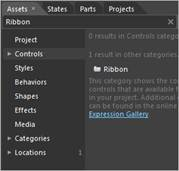{border="0"}[]{style="COLOR: black"}

Figure 503: Ribbon Control in MS Blend Assets Library

[2.   ]{style="COLOR: black"}Drag the Ribbon control to the art board[.]{style="FONT-FAMILY: 'Calibri','sans-serif'; COLOR: black"}

[]{style="FONT-FAMILY: 'Calibri','sans-serif'; COLOR: black"} 

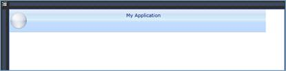{border="0"}[]{style="COLOR: black"}

Figure 504: Ribbon Control after drag and drop into Blend Designer

+-----------------------------------------------------------------------------------------------------------------------------------------------------------------------------------------------------------------------------------------------------------------------------------------------------------------------------------------------------------------------------------------------------------------------------------------------------------------------------------------------------------------------------------------------------------------------------------------------------------------------------------------------------------------------------------------------------------------------------------------------------------------------------------------------------------------------------------------+
| [XAML]{style="FONT-FAMILY: 'Courier New'"}                                                                                                                                                                                                                                                                                                                                                                                                                                                                                                                                                                                                                                                                                                                                                                                              |
|                                                                                                                                                                                                                                                                                                                                                                                                                                                                                                                                                                                                                                                                                                                                                                                                                                         |
| [\<]{style="FONT-FAMILY: 'Courier New'; COLOR: blue"}[UserControl]{style="FONT-FAMILY: 'Courier New'; COLOR: #a31515"}[]{style="FONT-FAMILY: 'Courier New'"}                                                                                                                                                                                                                                                                                                                                                                                                                                                                                                                                                                                                                                                                            |
|                                                                                                                                                                                                                                                                                                                                                                                                                                                                                                                                                                                                                                                                                                                                                                                                                                         |
| [      xmlns]{style="FONT-FAMILY: 'Courier New'; COLOR: red"}[=\"http://schemas.microsoft.com/winfx/2006/xaml/presentation\"]{style="FONT-FAMILY: 'Courier New'; COLOR: blue"}[]{style="FONT-FAMILY: 'Courier New'"}                                                                                                                                                                                                                                                                                                                                                                                                                                                                                                                                                                                                                    |
|                                                                                                                                                                                                                                                                                                                                                                                                                                                                                                                                                                                                                                                                                                                                                                                                                                         |
| [      xmlns]{style="FONT-FAMILY: 'Courier New'; COLOR: red"}[:]{style="FONT-FAMILY: 'Courier New'; COLOR: blue"}[x]{style="FONT-FAMILY: 'Courier New'; COLOR: red"}[=\"http://schemas.microsoft.com/winfx/2006/xaml\"]{style="FONT-FAMILY: 'Courier New'; COLOR: blue"}[]{style="FONT-FAMILY: 'Courier New'"}                                                                                                                                                                                                                                                                                                                                                                                                                                                                                                                          |
|                                                                                                                                                                                                                                                                                                                                                                                                                                                                                                                                                                                                                                                                                                                                                                                                                                         |
| [      xmlns]{style="FONT-FAMILY: 'Courier New'; COLOR: red"}[:]{style="FONT-FAMILY: 'Courier New'; COLOR: blue"}[syncfusion]{style="FONT-FAMILY: 'Courier New'; COLOR: red"}[=\"clr-namespace:Syncfusion.Windows.Tools.Controls;assembly=Syncfusion.Ribbon.Silverlight\"]{style="FONT-FAMILY: 'Courier New'; COLOR: blue"}[]{style="FONT-FAMILY: 'Courier New'"}                                                                                                                                                                                                                                                                                                                                                                                                                                                                       |
|                                                                                                                                                                                                                                                                                                                                                                                                                                                                                                                                                                                                                                                                                                                                                                                                                                         |
| [      x]{style="FONT-FAMILY: 'Courier New'; COLOR: red"}[:]{style="FONT-FAMILY: 'Courier New'; COLOR: blue"}[Class]{style="FONT-FAMILY: 'Courier New'; COLOR: red"}[=\"SilverlightApplication4.MainPage\"]{style="FONT-FAMILY: 'Courier New'; COLOR: blue"}[]{style="FONT-FAMILY: 'Courier New'"}                                                                                                                                                                                                                                                                                                                                                                                                                                                                                                                                      |
|                                                                                                                                                                                                                                                                                                                                                                                                                                                                                                                                                                                                                                                                                                                                                                                                                                         |
| [      Width]{style="FONT-FAMILY: 'Courier New'; COLOR: red"}[=\"640\"]{style="FONT-FAMILY: 'Courier New'; COLOR: blue"}[ Height]{style="FONT-FAMILY: 'Courier New'; COLOR: red"}[=\"480\"\>]{style="FONT-FAMILY: 'Courier New'; COLOR: blue"}[]{style="FONT-FAMILY: 'Courier New'"}                                                                                                                                                                                                                                                                                                                                                                                                                                                                                                                                                    |
|                                                                                                                                                                                                                                                                                                                                                                                                                                                                                                                                                                                                                                                                                                                                                                                                                                         |
| [  ]{style="FONT-FAMILY: 'Courier New'; COLOR: #a31515"}[\<]{style="FONT-FAMILY: 'Courier New'; COLOR: blue"}[Grid]{style="FONT-FAMILY: 'Courier New'; COLOR: #a31515"}[ x]{style="FONT-FAMILY: 'Courier New'; COLOR: red"}[:]{style="FONT-FAMILY: 'Courier New'; COLOR: blue"}[Name]{style="FONT-FAMILY: 'Courier New'; COLOR: red"}[=\"LayoutRoot\"]{style="FONT-FAMILY: 'Courier New'; COLOR: blue"}[ Background]{style="FONT-FAMILY: 'Courier New'; COLOR: red"}[=\"White\"\>]{style="FONT-FAMILY: 'Courier New'; COLOR: blue"}[]{style="FONT-FAMILY: 'Courier New'"}                                                                                                                                                                                                                                                               |
|                                                                                                                                                                                                                                                                                                                                                                                                                                                                                                                                                                                                                                                                                                                                                                                                                                         |
| [       ]{style="FONT-FAMILY: 'Courier New'; COLOR: #a31515"}[\<]{style="FONT-FAMILY: 'Courier New'; COLOR: blue"}[syncfusion]{style="FONT-FAMILY: 'Courier New'; COLOR: #a31515"}[:]{style="FONT-FAMILY: 'Courier New'; COLOR: blue"}[Ribbon]{style="FONT-FAMILY: 'Courier New'; COLOR: #a31515"}[ Margin]{style="FONT-FAMILY: 'Courier New'; COLOR: red"}[=\"0,0,43,0\"]{style="FONT-FAMILY: 'Courier New'; COLOR: blue"}[ d]{style="FONT-FAMILY: 'Courier New'; COLOR: red"}[:]{style="FONT-FAMILY: 'Courier New'; COLOR: blue"}[LayoutOverrides]{style="FONT-FAMILY: 'Courier New'; COLOR: red"}[=\"Width\"]{style="FONT-FAMILY: 'Courier New'; COLOR: blue"}[ Title]{style="FONT-FAMILY: 'Courier New'; COLOR: red"}[=\"My Application\"\>]{style="FONT-FAMILY: 'Courier New'; COLOR: blue"}[]{style="FONT-FAMILY: 'Courier New'"} |
|                                                                                                                                                                                                                                                                                                                                                                                                                                                                                                                                                                                                                                                                                                                                                                                                                                         |
| [              ]{style="FONT-FAMILY: 'Courier New'; COLOR: #a31515"}[\<]{style="FONT-FAMILY: 'Courier New'; COLOR: blue"}[syncfusion]{style="FONT-FAMILY: 'Courier New'; COLOR: #a31515"}[:]{style="FONT-FAMILY: 'Courier New'; COLOR: blue"}[Ribbon.ApplicationMenu]{style="FONT-FAMILY: 'Courier New'; COLOR: #a31515"}[\>]{style="FONT-FAMILY: 'Courier New'; COLOR: blue"}[]{style="FONT-FAMILY: 'Courier New'"}                                                                                                                                                                                                                                                                                                                                                                                                                    |
|                                                                                                                                                                                                                                                                                                                                                                                                                                                                                                                                                                                                                                                                                                                                                                                                                                         |
| [                     ]{style="FONT-FAMILY: 'Courier New'; COLOR: #a31515"}[\<]{style="FONT-FAMILY: 'Courier New'; COLOR: blue"}[syncfusion]{style="FONT-FAMILY: 'Courier New'; COLOR: #a31515"}[:]{style="FONT-FAMILY: 'Courier New'; COLOR: blue"}[ApplicationMenu]{style="FONT-FAMILY: 'Courier New'; COLOR: #a31515"}[/\>]{style="FONT-FAMILY: 'Courier New'; COLOR: blue"}[]{style="FONT-FAMILY: 'Courier New'"}                                                                                                                                                                                                                                                                                                                                                                                                                   |
|                                                                                                                                                                                                                                                                                                                                                                                                                                                                                                                                                                                                                                                                                                                                                                                                                                         |
| [             ]{style="FONT-FAMILY: 'Courier New'; COLOR: #a31515"}[\</]{style="FONT-FAMILY: 'Courier New'; COLOR: blue"}[syncfusion]{style="FONT-FAMILY: 'Courier New'; COLOR: #a31515"}[:]{style="FONT-FAMILY: 'Courier New'; COLOR: blue"}[Ribbon.ApplicationMenu]{style="FONT-FAMILY: 'Courier New'; COLOR: #a31515"}[\>]{style="FONT-FAMILY: 'Courier New'; COLOR: blue"}[]{style="FONT-FAMILY: 'Courier New'"}                                                                                                                                                                                                                                                                                                                                                                                                                    |
|                                                                                                                                                                                                                                                                                                                                                                                                                                                                                                                                                                                                                                                                                                                                                                                                                                         |
| [       ]{style="FONT-FAMILY: 'Courier New'; COLOR: #a31515"}[\</]{style="FONT-FAMILY: 'Courier New'; COLOR: blue"}[syncfusion]{style="FONT-FAMILY: 'Courier New'; COLOR: #a31515"}[:]{style="FONT-FAMILY: 'Courier New'; COLOR: blue"}[Ribbon]{style="FONT-FAMILY: 'Courier New'; COLOR: #a31515"}[\>]{style="FONT-FAMILY: 'Courier New'; COLOR: blue"}[]{style="FONT-FAMILY: 'Courier New'"}                                                                                                                                                                                                                                                                                                                                                                                                                                          |
|                                                                                                                                                                                                                                                                                                                                                                                                                                                                                                                                                                                                                                                                                                                                                                                                                                         |
| [   ]{style="FONT-FAMILY: 'Courier New'; COLOR: #a31515"}[\</]{style="FONT-FAMILY: 'Courier New'; COLOR: blue"}[Grid]{style="FONT-FAMILY: 'Courier New'; COLOR: #a31515"}[\>]{style="FONT-FAMILY: 'Courier New'; COLOR: blue"}[]{style="FONT-FAMILY: 'Courier New'"}                                                                                                                                                                                                                                                                                                                                                                                                                                                                                                                                                                    |
|                                                                                                                                                                                                                                                                                                                                                                                                                                                                                                                                                                                                                                                                                                                                                                                                                                         |
| [\</]{style="FONT-FAMILY: 'Courier New'; COLOR: blue"}[UserControl]{style="FONT-FAMILY: 'Courier New'; COLOR: #a31515"}[\>]{style="FONT-FAMILY: 'Courier New'; COLOR: blue"}[]{style="FONT-FAMILY: 'Calibri','sans-serif'; FONT-SIZE: 9.5pt"}                                                                                                                                                                                                                                                                                                                                                                                                                                                                                                                                                                                           |
+-----------------------------------------------------------------------------------------------------------------------------------------------------------------------------------------------------------------------------------------------------------------------------------------------------------------------------------------------------------------------------------------------------------------------------------------------------------------------------------------------------------------------------------------------------------------------------------------------------------------------------------------------------------------------------------------------------------------------------------------------------------------------------------------------------------------------------------------+

 

3.   Insert the Application Image.

4.   Select the Ribbon Control and navigate to the Application Menu (Ribbon Properties-\>Application Menu) in the property grid and set the Icon property.

 

[{width="47" height="47"}]{style="Z-INDEX: 251783168; POSITION: absolute; MARGIN-TOP: 23px; WIDTH: 47px; HEIGHT: 47px; MARGIN-LEFT: 199px; LEFT: 0px"}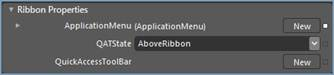{border="0"}

Figure 505: ApplicationMenu in Blend Ribbon Properties Pane

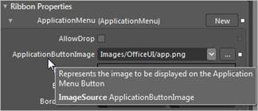{border="0"}

Figure 506: ApplicationButtonImage in Blend Ribbon Properties Pane[]{style="COLOR: black"}

The image will display on the Application menu button as shown in the following screenshot:

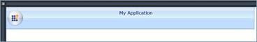{border="0"}

Figure 507: Ribbon Control with Application Icon added

+------------------------------------------------------------------------------------------------------------------------------------------------------------------------------------------------------------------------------------------------------------------------------------------------------------------------------------------------------------------------------------------------------------------------------------------------------------------------------------------+
| [XAML]{style="FONT-FAMILY: 'Courier New'"}                                                                                                                                                                                                                                                                                                                                                                                                                                               |
|                                                                                                                                                                                                                                                                                                                                                                                                                                                                                          |
| []{style="FONT-FAMILY: 'Courier New'; COLOR: blue"}                                                                                                                                                                                                                                                                                                                                                                                                                                      |
|                                                                                                                                                                                                                                                                                                                                                                                                                                                                                          |
| [\<]{style="FONT-FAMILY: 'Courier New'; COLOR: blue"}[syncfusion]{style="FONT-FAMILY: 'Courier New'; COLOR: #a31515"}[:]{style="FONT-FAMILY: 'Courier New'; COLOR: blue"}[ApplicationMenu]{style="FONT-FAMILY: 'Courier New'; COLOR: #a31515"}[ ApplicationButtonImage ]{style="FONT-FAMILY: 'Courier New'; COLOR: red"}[=\"Images/OfficeUI/app.png\"/\>]{style="FONT-FAMILY: 'Courier New'; COLOR: blue"}[]{style="FONT-FAMILY: 'Calibri','sans-serif'; COLOR: blue; FONT-SIZE: 9.5pt"} |
+------------------------------------------------------------------------------------------------------------------------------------------------------------------------------------------------------------------------------------------------------------------------------------------------------------------------------------------------------------------------------------------------------------------------------------------------------------------------------------------+

[]{style="FONT-FAMILY: 'Calibri','sans-serif'"} 

5.   Add Quick Access Toolbar to the Control.

6.   Select the Ribbon Control and navigate to the QuickAccessToolbar in Ribbon Properties.

 

[{width="184" height="21"}]{style="Z-INDEX: 251784192; POSITION: absolute; MARGIN-TOP: 49px; WIDTH: 184px; HEIGHT: 21px; MARGIN-LEFT: 208px; LEFT: 0px"}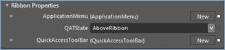{border="0"}

Figure 508: QuickAccesstoolbar in Blend Ribbon Properties Pane

Items can be added through the Items Property as shown in the following screenshot:

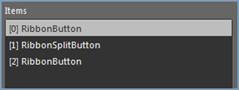{border="0"}

Figure 509: Items Pane

The result will be:

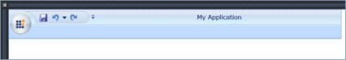{border="0"}

Figure 510: Ribbon Control with QAT Items

+----------------------------------------------------------------------------------------------------------------------------------------------------------------------------------------------------------------------------------------------------------------------------------------------------------------------------------------------------------------------------------------------------------------------------------------------------------------------------------------------------------------------------------------------------------------------------------------------------------------------------------------------------------------------------------------------------------------------------------------------------------------------------------------------------------------------------------------------------------------------------------------------+
| [XAML]{style="FONT-FAMILY: 'Calibri','sans-serif'; FONT-SIZE: 9.5pt"}                                                                                                                                                                                                                                                                                                                                                                                                                                                                                                                                                                                                                                                                                                                                                                                                                        |
|                                                                                                                                                                                                                                                                                                                                                                                                                                                                                                                                                                                                                                                                                                                                                                                                                                                                                              |
| []{style="FONT-FAMILY: 'Calibri','sans-serif'; COLOR: blue; FONT-SIZE: 9.5pt"}                                                                                                                                                                                                                                                                                                                                                                                                                                                                                                                                                                                                                                                                                                                                                                                                               |
|                                                                                                                                                                                                                                                                                                                                                                                                                                                                                                                                                                                                                                                                                                                                                                                                                                                                                              |
| [\<]{style="FONT-FAMILY: 'Calibri','sans-serif'; COLOR: blue; FONT-SIZE: 9.5pt"}[syncfusion]{style="FONT-FAMILY: 'Calibri','sans-serif'; COLOR: #a31515; FONT-SIZE: 9.5pt"}[:]{style="FONT-FAMILY: 'Calibri','sans-serif'; COLOR: blue; FONT-SIZE: 9.5pt"}[QuickAccessToolBar]{style="FONT-FAMILY: 'Calibri','sans-serif'; COLOR: #a31515; FONT-SIZE: 9.5pt"}[\>]{style="FONT-FAMILY: 'Calibri','sans-serif'; COLOR: blue; FONT-SIZE: 9.5pt"}[]{style="FONT-FAMILY: 'Calibri','sans-serif'; FONT-SIZE: 9.5pt"}                                                                                                                                                                                                                                                                                                                                                                               |
|                                                                                                                                                                                                                                                                                                                                                                                                                                                                                                                                                                                                                                                                                                                                                                                                                                                                                              |
| [        ]{style="FONT-FAMILY: 'Calibri','sans-serif'; COLOR: #a31515; FONT-SIZE: 9.5pt"}[\<]{style="FONT-FAMILY: 'Calibri','sans-serif'; COLOR: blue; FONT-SIZE: 9.5pt"}[syncfusion]{style="FONT-FAMILY: 'Calibri','sans-serif'; COLOR: #a31515; FONT-SIZE: 9.5pt"}[:]{style="FONT-FAMILY: 'Calibri','sans-serif'; COLOR: blue; FONT-SIZE: 9.5pt"}[RibbonButton]{style="FONT-FAMILY: 'Calibri','sans-serif'; COLOR: #a31515; FONT-SIZE: 9.5pt"}[ SmallIcon]{style="FONT-FAMILY: 'Calibri','sans-serif'; COLOR: red; FONT-SIZE: 9.5pt"}[=\"Save.png\"]{style="FONT-FAMILY: 'Calibri','sans-serif'; COLOR: blue; FONT-SIZE: 9.5pt"}[ SizeMode]{style="FONT-FAMILY: 'Calibri','sans-serif'; COLOR: red; FONT-SIZE: 9.5pt"}[ =\"Small\"/\>]{style="FONT-FAMILY: 'Calibri','sans-serif'; COLOR: blue; FONT-SIZE: 9.5pt"}[]{style="FONT-FAMILY: 'Calibri','sans-serif'; FONT-SIZE: 9.5pt"}        |
|                                                                                                                                                                                                                                                                                                                                                                                                                                                                                                                                                                                                                                                                                                                                                                                                                                                                                              |
| [        ]{style="FONT-FAMILY: 'Calibri','sans-serif'; COLOR: #a31515; FONT-SIZE: 9.5pt"}[\<]{style="FONT-FAMILY: 'Calibri','sans-serif'; COLOR: blue; FONT-SIZE: 9.5pt"}[syncfusion]{style="FONT-FAMILY: 'Calibri','sans-serif'; COLOR: #a31515; FONT-SIZE: 9.5pt"}[:]{style="FONT-FAMILY: 'Calibri','sans-serif'; COLOR: blue; FONT-SIZE: 9.5pt"}[RibbonSplitButton]{style="FONT-FAMILY: 'Calibri','sans-serif'; COLOR: #a31515; FONT-SIZE: 9.5pt"}[ SmallIcon]{style="FONT-FAMILY: 'Calibri','sans-serif'; COLOR: red; FONT-SIZE: 9.5pt"}[=\"Undo16.png\"]{style="FONT-FAMILY: 'Calibri','sans-serif'; COLOR: blue; FONT-SIZE: 9.5pt"}[ SizeMode]{style="FONT-FAMILY: 'Calibri','sans-serif'; COLOR: red; FONT-SIZE: 9.5pt"}[ =\"Small\"/\>]{style="FONT-FAMILY: 'Calibri','sans-serif'; COLOR: blue; FONT-SIZE: 9.5pt"}[]{style="FONT-FAMILY: 'Calibri','sans-serif'; FONT-SIZE: 9.5pt"} |
|                                                                                                                                                                                                                                                                                                                                                                                                                                                                                                                                                                                                                                                                                                                                                                                                                                                                                              |
| [        ]{style="FONT-FAMILY: 'Calibri','sans-serif'; COLOR: #a31515; FONT-SIZE: 9.5pt"}[\<]{style="FONT-FAMILY: 'Calibri','sans-serif'; COLOR: blue; FONT-SIZE: 9.5pt"}[syncfusion]{style="FONT-FAMILY: 'Calibri','sans-serif'; COLOR: #a31515; FONT-SIZE: 9.5pt"}[:]{style="FONT-FAMILY: 'Calibri','sans-serif'; COLOR: blue; FONT-SIZE: 9.5pt"}[RibbonButton]{style="FONT-FAMILY: 'Calibri','sans-serif'; COLOR: #a31515; FONT-SIZE: 9.5pt"}[ SmallIcon]{style="FONT-FAMILY: 'Calibri','sans-serif'; COLOR: red; FONT-SIZE: 9.5pt"}[=\"Redo16.png\"]{style="FONT-FAMILY: 'Calibri','sans-serif'; COLOR: blue; FONT-SIZE: 9.5pt"}[ SizeMode]{style="FONT-FAMILY: 'Calibri','sans-serif'; COLOR: red; FONT-SIZE: 9.5pt"}[ =\"Small\"/\>]{style="FONT-FAMILY: 'Calibri','sans-serif'; COLOR: blue; FONT-SIZE: 9.5pt"}[]{style="FONT-FAMILY: 'Calibri','sans-serif'; FONT-SIZE: 9.5pt"}      |
|                                                                                                                                                                                                                                                                                                                                                                                                                                                                                                                                                                                                                                                                                                                                                                                                                                                                                              |
| [\</]{style="FONT-FAMILY: 'Calibri','sans-serif'; COLOR: blue; FONT-SIZE: 9.5pt"}[syncfusion]{style="FONT-FAMILY: 'Calibri','sans-serif'; COLOR: #a31515; FONT-SIZE: 9.5pt"}[:]{style="FONT-FAMILY: 'Calibri','sans-serif'; COLOR: blue; FONT-SIZE: 9.5pt"}[QuickAccessToolBar]{style="FONT-FAMILY: 'Calibri','sans-serif'; COLOR: #a31515; FONT-SIZE: 9.5pt"}[\>]{style="FONT-FAMILY: 'Calibri','sans-serif'; COLOR: blue; FONT-SIZE: 9.5pt"}                                                                                                                                                                                                                                                                                                                                                                                                                                               |
+----------------------------------------------------------------------------------------------------------------------------------------------------------------------------------------------------------------------------------------------------------------------------------------------------------------------------------------------------------------------------------------------------------------------------------------------------------------------------------------------------------------------------------------------------------------------------------------------------------------------------------------------------------------------------------------------------------------------------------------------------------------------------------------------------------------------------------------------------------------------------------------------+

[]{style="FONT-FAMILY: 'Calibri','sans-serif'"} 

7.   Add the Ribbon tab to the Ribbon Control.

 

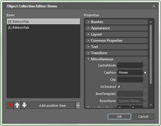{border="0"}

Figure 511: Ribbon's Items Pane to add Items

The result will be:

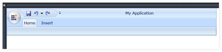{border="0"}

Figure 512: Ribbon with Ribbon Tabs

+-----------------------------------------------------------------------------------------------------------------------------------------------------------------------------------------------------------------------------------------------------------------------------------------------------------------------------------------------------------------------------------------------------------------------------------------------------------------------------------------------------------------------------------------------------------------------------------------------------------------------+
| [XAML]{style="FONT-FAMILY: 'Courier New'"}                                                                                                                                                                                                                                                                                                                                                                                                                                                                                                                                                                            |
|                                                                                                                                                                                                                                                                                                                                                                                                                                                                                                                                                                                                                       |
| []{style="FONT-FAMILY: 'Courier New'; COLOR: blue"}                                                                                                                                                                                                                                                                                                                                                                                                                                                                                                                                                                   |
|                                                                                                                                                                                                                                                                                                                                                                                                                                                                                                                                                                                                                       |
| [\<]{style="FONT-FAMILY: 'Courier New'; COLOR: blue"}[syncfusion]{style="FONT-FAMILY: 'Courier New'; COLOR: #a31515"}[:]{style="FONT-FAMILY: 'Courier New'; COLOR: blue"}[Ribbon]{style="FONT-FAMILY: 'Courier New'; COLOR: #a31515"}[ Margin]{style="FONT-FAMILY: 'Courier New'; COLOR: red"}[=\"0,0,43,0\"]{style="FONT-FAMILY: 'Courier New'; COLOR: blue"}[ Title]{style="FONT-FAMILY: 'Courier New'; COLOR: red"}[=\"My Application\"\>]{style="FONT-FAMILY: 'Courier New'; COLOR: blue"}[]{style="FONT-FAMILY: 'Courier New'"}                                                                                  |
|                                                                                                                                                                                                                                                                                                                                                                                                                                                                                                                                                                                                                       |
| [        ]{style="FONT-FAMILY: 'Courier New'; COLOR: #a31515"}[\<]{style="FONT-FAMILY: 'Courier New'; COLOR: blue"}[syncfusion]{style="FONT-FAMILY: 'Courier New'; COLOR: #a31515"}[:]{style="FONT-FAMILY: 'Courier New'; COLOR: blue"}[Ribbon.QuickAccessToolBar]{style="FONT-FAMILY: 'Courier New'; COLOR: #a31515"}[\>]{style="FONT-FAMILY: 'Courier New'; COLOR: blue"}[]{style="FONT-FAMILY: 'Courier New'"}                                                                                                                                                                                                     |
|                                                                                                                                                                                                                                                                                                                                                                                                                                                                                                                                                                                                                       |
| [            ]{style="FONT-FAMILY: 'Courier New'; COLOR: #a31515"}[\<]{style="FONT-FAMILY: 'Courier New'; COLOR: blue"}[syncfusion]{style="FONT-FAMILY: 'Courier New'; COLOR: #a31515"}[:]{style="FONT-FAMILY: 'Courier New'; COLOR: blue"}[QuickAccessToolBar]{style="FONT-FAMILY: 'Courier New'; COLOR: #a31515"}[\>]{style="FONT-FAMILY: 'Courier New'; COLOR: blue"}[]{style="FONT-FAMILY: 'Courier New'"}                                                                                                                                                                                                        |
|                                                                                                                                                                                                                                                                                                                                                                                                                                                                                                                                                                                                                       |
| [                ]{style="FONT-FAMILY: 'Courier New'; COLOR: #a31515"}[\<]{style="FONT-FAMILY: 'Courier New'; COLOR: blue"}[syncfusion]{style="FONT-FAMILY: 'Courier New'; COLOR: #a31515"}[:]{style="FONT-FAMILY: 'Courier New'; COLOR: blue"}[RibbonButton]{style="FONT-FAMILY: 'Courier New'; COLOR: #a31515"}[ SmallIcon]{style="FONT-FAMILY: 'Courier New'; COLOR: red"}[=\"Save.png\"]{style="FONT-FAMILY: 'Courier New'; COLOR: blue"}[ SizeMode]{style="FONT-FAMILY: 'Courier New'; COLOR: red"}[=\"Small\"/\>]{style="FONT-FAMILY: 'Courier New'; COLOR: blue"}[]{style="FONT-FAMILY: 'Courier New'"}        |
|                                                                                                                                                                                                                                                                                                                                                                                                                                                                                                                                                                                                                       |
| [                ]{style="FONT-FAMILY: 'Courier New'; COLOR: #a31515"}[\<]{style="FONT-FAMILY: 'Courier New'; COLOR: blue"}[syncfusion]{style="FONT-FAMILY: 'Courier New'; COLOR: #a31515"}[:]{style="FONT-FAMILY: 'Courier New'; COLOR: blue"}[RibbonSplitButton]{style="FONT-FAMILY: 'Courier New'; COLOR: #a31515"}[ SmallIcon]{style="FONT-FAMILY: 'Courier New'; COLOR: red"}[=\"Undo16.png\"]{style="FONT-FAMILY: 'Courier New'; COLOR: blue"}[ SizeMode]{style="FONT-FAMILY: 'Courier New'; COLOR: red"}[=\"Small\"/\>]{style="FONT-FAMILY: 'Courier New'; COLOR: blue"}[]{style="FONT-FAMILY: 'Courier New'"} |
|                                                                                                                                                                                                                                                                                                                                                                                                                                                                                                                                                                                                                       |
| [                ]{style="FONT-FAMILY: 'Courier New'; COLOR: #a31515"}[\<]{style="FONT-FAMILY: 'Courier New'; COLOR: blue"}[syncfusion]{style="FONT-FAMILY: 'Courier New'; COLOR: #a31515"}[:]{style="FONT-FAMILY: 'Courier New'; COLOR: blue"}[RibbonButton]{style="FONT-FAMILY: 'Courier New'; COLOR: #a31515"}[ SmallIcon]{style="FONT-FAMILY: 'Courier New'; COLOR: red"}[=\"Redo16.png\"]{style="FONT-FAMILY: 'Courier New'; COLOR: blue"}[ SizeMode]{style="FONT-FAMILY: 'Courier New'; COLOR: red"}[=\"Small\"/\>]{style="FONT-FAMILY: 'Courier New'; COLOR: blue"}[]{style="FONT-FAMILY: 'Courier New'"}      |
|                                                                                                                                                                                                                                                                                                                                                                                                                                                                                                                                                                                                                       |
| [            ]{style="FONT-FAMILY: 'Courier New'; COLOR: #a31515"}[\</]{style="FONT-FAMILY: 'Courier New'; COLOR: blue"}[syncfusion]{style="FONT-FAMILY: 'Courier New'; COLOR: #a31515"}[:]{style="FONT-FAMILY: 'Courier New'; COLOR: blue"}[QuickAccessToolBar]{style="FONT-FAMILY: 'Courier New'; COLOR: #a31515"}[\>]{style="FONT-FAMILY: 'Courier New'; COLOR: blue"}[]{style="FONT-FAMILY: 'Courier New'"}                                                                                                                                                                                                       |
|                                                                                                                                                                                                                                                                                                                                                                                                                                                                                                                                                                                                                       |
| [        ]{style="FONT-FAMILY: 'Courier New'; COLOR: #a31515"}[\</]{style="FONT-FAMILY: 'Courier New'; COLOR: blue"}[syncfusion]{style="FONT-FAMILY: 'Courier New'; COLOR: #a31515"}[:]{style="FONT-FAMILY: 'Courier New'; COLOR: blue"}[Ribbon.QuickAccessToolBar]{style="FONT-FAMILY: 'Courier New'; COLOR: #a31515"}[\>]{style="FONT-FAMILY: 'Courier New'; COLOR: blue"}[]{style="FONT-FAMILY: 'Courier New'"}                                                                                                                                                                                                    |
|                                                                                                                                                                                                                                                                                                                                                                                                                                                                                                                                                                                                                       |
| [        ]{style="FONT-FAMILY: 'Courier New'; COLOR: #a31515"}[\<]{style="FONT-FAMILY: 'Courier New'; COLOR: blue"}[syncfusion]{style="FONT-FAMILY: 'Courier New'; COLOR: #a31515"}[:]{style="FONT-FAMILY: 'Courier New'; COLOR: blue"}[Ribbon.ApplicationMenu]{style="FONT-FAMILY: 'Courier New'; COLOR: #a31515"}[\>]{style="FONT-FAMILY: 'Courier New'; COLOR: blue"}[]{style="FONT-FAMILY: 'Courier New'"}                                                                                                                                                                                                        |
|                                                                                                                                                                                                                                                                                                                                                                                                                                                                                                                                                                                                                       |
| [            ]{style="FONT-FAMILY: 'Courier New'; COLOR: #a31515"}[\<]{style="FONT-FAMILY: 'Courier New'; COLOR: blue"}[syncfusion]{style="FONT-FAMILY: 'Courier New'; COLOR: #a31515"}[:]{style="FONT-FAMILY: 'Courier New'; COLOR: blue"}[ApplicationMenu]{style="FONT-FAMILY: 'Courier New'; COLOR: #a31515"}[ ApplicationButtonImage]{style="FONT-FAMILY: 'Courier New'; COLOR: red"}[=\"app.png\"/\>]{style="FONT-FAMILY: 'Courier New'; COLOR: blue"}[]{style="FONT-FAMILY: 'Courier New'"}                                                                                                                     |
|                                                                                                                                                                                                                                                                                                                                                                                                                                                                                                                                                                                                                       |
| [        ]{style="FONT-FAMILY: 'Courier New'; COLOR: #a31515"}[\</]{style="FONT-FAMILY: 'Courier New'; COLOR: blue"}[syncfusion]{style="FONT-FAMILY: 'Courier New'; COLOR: #a31515"}[:]{style="FONT-FAMILY: 'Courier New'; COLOR: blue"}[Ribbon.ApplicationMenu]{style="FONT-FAMILY: 'Courier New'; COLOR: #a31515"}[\>]{style="FONT-FAMILY: 'Courier New'; COLOR: blue"}[]{style="FONT-FAMILY: 'Courier New'"}                                                                                                                                                                                                       |
|                                                                                                                                                                                                                                                                                                                                                                                                                                                                                                                                                                                                                       |
| [    ]{style="FONT-FAMILY: 'Courier New'; COLOR: #a31515"}[\<]{style="FONT-FAMILY: 'Courier New'; COLOR: blue"}[syncfusion]{style="FONT-FAMILY: 'Courier New'; COLOR: #a31515"}[:]{style="FONT-FAMILY: 'Courier New'; COLOR: blue"}[RibbonTab]{style="FONT-FAMILY: 'Courier New'; COLOR: #a31515"}[ Caption]{style="FONT-FAMILY: 'Courier New'; COLOR: red"}[=\"Home\"/\>]{style="FONT-FAMILY: 'Courier New'; COLOR: blue"}[]{style="FONT-FAMILY: 'Courier New'"}                                                                                                                                                     |
|                                                                                                                                                                                                                                                                                                                                                                                                                                                                                                                                                                                                                       |
| [    ]{style="FONT-FAMILY: 'Courier New'; COLOR: #a31515"}[\<]{style="FONT-FAMILY: 'Courier New'; COLOR: blue"}[syncfusion]{style="FONT-FAMILY: 'Courier New'; COLOR: #a31515"}[:]{style="FONT-FAMILY: 'Courier New'; COLOR: blue"}[RibbonTab]{style="FONT-FAMILY: 'Courier New'; COLOR: #a31515"}[ Caption]{style="FONT-FAMILY: 'Courier New'; COLOR: red"}[=\"Insert\"/\>]{style="FONT-FAMILY: 'Courier New'; COLOR: blue"}[]{style="FONT-FAMILY: 'Courier New'"}                                                                                                                                                   |
|                                                                                                                                                                                                                                                                                                                                                                                                                                                                                                                                                                                                                       |
| [\</]{style="FONT-FAMILY: 'Courier New'; COLOR: blue"}[syncfusion]{style="FONT-FAMILY: 'Courier New'; COLOR: #a31515"}[:]{style="FONT-FAMILY: 'Courier New'; COLOR: blue"}[Ribbon]{style="FONT-FAMILY: 'Courier New'; COLOR: #a31515"}[\>]{style="FONT-FAMILY: 'Courier New'; COLOR: blue"}[]{style="FONT-FAMILY: 'Calibri','sans-serif'; COLOR: blue; FONT-SIZE: 9.5pt"}                                                                                                                                                                                                                                             |
+-----------------------------------------------------------------------------------------------------------------------------------------------------------------------------------------------------------------------------------------------------------------------------------------------------------------------------------------------------------------------------------------------------------------------------------------------------------------------------------------------------------------------------------------------------------------------------------------------------------------------+

[]{style="FONT-FAMILY: 'Calibri','sans-serif'"} 

8.   Add Ribbon Bar to the Ribbon control:

 

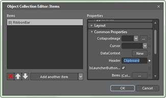{border="0"}

Figure 513: Ribbon Tab Items Pane

The result will be as shown in the figure below:

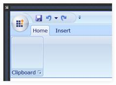{border="0"}

Figure 514: Ribbon Bar added

+---------------------------------------------------------------------------------------------------------------------------------------------------------------------------------------------------------------------------------------------------------------------------------------------------------------------------------------------------------------------------------------------------------------------------------------------------------------------------+
| [XAML]{style="FONT-FAMILY: 'Courier New'"}                                                                                                                                                                                                                                                                                                                                                                                                                                |
|                                                                                                                                                                                                                                                                                                                                                                                                                                                                           |
| []{style="FONT-FAMILY: 'Courier New'; COLOR: blue"}                                                                                                                                                                                                                                                                                                                                                                                                                       |
|                                                                                                                                                                                                                                                                                                                                                                                                                                                                           |
| [\<]{style="FONT-FAMILY: 'Courier New'; COLOR: blue"}[syncfusion]{style="FONT-FAMILY: 'Courier New'; COLOR: #a31515"}[:]{style="FONT-FAMILY: 'Courier New'; COLOR: blue"}[RibbonTab]{style="FONT-FAMILY: 'Courier New'; COLOR: #a31515"}[ Caption]{style="FONT-FAMILY: 'Courier New'; COLOR: red"}[=\"Home\"\>]{style="FONT-FAMILY: 'Courier New'; COLOR: blue"}[]{style="FONT-FAMILY: 'Courier New'"}                                                                    |
|                                                                                                                                                                                                                                                                                                                                                                                                                                                                           |
| [        ]{style="FONT-FAMILY: 'Courier New'; COLOR: #a31515"}[\<]{style="FONT-FAMILY: 'Courier New'; COLOR: blue"}[syncfusion]{style="FONT-FAMILY: 'Courier New'; COLOR: #a31515"}[:]{style="FONT-FAMILY: 'Courier New'; COLOR: blue"}[RibbonBar]{style="FONT-FAMILY: 'Courier New'; COLOR: #a31515"}[ Header]{style="FONT-FAMILY: 'Courier New'; COLOR: red"}[=\"Clipboard\"/\>]{style="FONT-FAMILY: 'Courier New'; COLOR: blue"}[]{style="FONT-FAMILY: 'Courier New'"} |
|                                                                                                                                                                                                                                                                                                                                                                                                                                                                           |
| [\</]{style="FONT-FAMILY: 'Courier New'; COLOR: blue"}[syncfusion]{style="FONT-FAMILY: 'Courier New'; COLOR: #a31515"}[:]{style="FONT-FAMILY: 'Courier New'; COLOR: blue"}[RibbonTab]{style="FONT-FAMILY: 'Courier New'; COLOR: #a31515"}[\>]{style="FONT-FAMILY: 'Courier New'; COLOR: blue"}                                                                                                                                                                            |
+---------------------------------------------------------------------------------------------------------------------------------------------------------------------------------------------------------------------------------------------------------------------------------------------------------------------------------------------------------------------------------------------------------------------------------------------------------------------------+

[]{style="FONT-FAMILY: 'Calibri','sans-serif'"} 

9.   Add Items to the Ribbon bar:

 

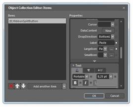{border="0"}

Figure 515: Ribbon Bar's Items Pane

The result is shown below:

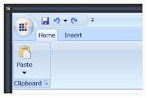{border="0"}

Figure 516: Ribbon Bar with Items

+-------------------------------------------------------------------------------------------------------------------------------------------------------------------------------------------------------------------------------------------------------------------------------------------------------------------------------------------------------------------------------------------------------------------------------------------------------------------------------------------------------------------------------------------------------------------------------------------------------------------------------------------------------------------------------------------------------------------------------------------------------------------------------------------------------------------------------------------------------------------+
| [XAML]{style="FONT-FAMILY: 'Courier New'"}                                                                                                                                                                                                                                                                                                                                                                                                                                                                                                                                                                                                                                                                                                                                                                                                                        |
|                                                                                                                                                                                                                                                                                                                                                                                                                                                                                                                                                                                                                                                                                                                                                                                                                                                                   |
| []{style="FONT-FAMILY: 'Courier New'; COLOR: blue"}                                                                                                                                                                                                                                                                                                                                                                                                                                                                                                                                                                                                                                                                                                                                                                                                               |
|                                                                                                                                                                                                                                                                                                                                                                                                                                                                                                                                                                                                                                                                                                                                                                                                                                                                   |
| [\<]{style="FONT-FAMILY: 'Courier New'; COLOR: blue"}[syncfusion]{style="FONT-FAMILY: 'Courier New'; COLOR: #a31515"}[:]{style="FONT-FAMILY: 'Courier New'; COLOR: blue"}[RibbonTab]{style="FONT-FAMILY: 'Courier New'; COLOR: #a31515"}[ Header]{style="FONT-FAMILY: 'Courier New'; COLOR: red"}[=\"Home\"\>]{style="FONT-FAMILY: 'Courier New'; COLOR: blue"}[]{style="FONT-FAMILY: 'Courier New'"}                                                                                                                                                                                                                                                                                                                                                                                                                                                             |
|                                                                                                                                                                                                                                                                                                                                                                                                                                                                                                                                                                                                                                                                                                                                                                                                                                                                   |
| [        ]{style="FONT-FAMILY: 'Courier New'; COLOR: #a31515"}[\<]{style="FONT-FAMILY: 'Courier New'; COLOR: blue"}[syncfusion]{style="FONT-FAMILY: 'Courier New'; COLOR: #a31515"}[:]{style="FONT-FAMILY: 'Courier New'; COLOR: blue"}[RibbonBar]{style="FONT-FAMILY: 'Courier New'; COLOR: #a31515"}[ Caption]{style="FONT-FAMILY: 'Courier New'; COLOR: red"}[=\"Clipboard\"\>]{style="FONT-FAMILY: 'Courier New'; COLOR: blue"}[]{style="FONT-FAMILY: 'Courier New'"}                                                                                                                                                                                                                                                                                                                                                                                         |
|                                                                                                                                                                                                                                                                                                                                                                                                                                                                                                                                                                                                                                                                                                                                                                                                                                                                   |
| [            ]{style="FONT-FAMILY: 'Courier New'; COLOR: #a31515"}[\<]{style="FONT-FAMILY: 'Courier New'; COLOR: blue"}[syncfusion]{style="FONT-FAMILY: 'Courier New'; COLOR: #a31515"}[:]{style="FONT-FAMILY: 'Courier New'; COLOR: blue"}[RibbonSplitButton]{style="FONT-FAMILY: 'Courier New'; COLOR: #a31515"}[ IsMultiLine]{style="FONT-FAMILY: 'Courier New'; COLOR: red"}[=\"True\"]{style="FONT-FAMILY: 'Courier New'; COLOR: blue"}[ Label]{style="FONT-FAMILY: 'Courier New'; COLOR: red"}[=\"Paste\"]{style="FONT-FAMILY: 'Courier New'; COLOR: blue"}[ SizeMode]{style="FONT-FAMILY: 'Courier New'; COLOR: red"}[=\"Large\"]{style="FONT-FAMILY: 'Courier New'; COLOR: blue"}[ LargeIcon]{style="FONT-FAMILY: 'Courier New'; COLOR: red"}[=\"Paste32.png\"/\>]{style="FONT-FAMILY: 'Courier New'; COLOR: blue"}[]{style="FONT-FAMILY: 'Courier New'"} |
|                                                                                                                                                                                                                                                                                                                                                                                                                                                                                                                                                                                                                                                                                                                                                                                                                                                                   |
| [        ]{style="FONT-FAMILY: 'Courier New'; COLOR: #a31515"}[\</]{style="FONT-FAMILY: 'Courier New'; COLOR: blue"}[syncfusion]{style="FONT-FAMILY: 'Courier New'; COLOR: #a31515"}[:]{style="FONT-FAMILY: 'Courier New'; COLOR: blue"}[RibbonBar]{style="FONT-FAMILY: 'Courier New'; COLOR: #a31515"}[\>]{style="FONT-FAMILY: 'Courier New'; COLOR: blue"}[]{style="FONT-FAMILY: 'Courier New'"}                                                                                                                                                                                                                                                                                                                                                                                                                                                                |
|                                                                                                                                                                                                                                                                                                                                                                                                                                                                                                                                                                                                                                                                                                                                                                                                                                                                   |
| [\</]{style="FONT-FAMILY: 'Courier New'; COLOR: blue"}[syncfusion]{style="FONT-FAMILY: 'Courier New'; COLOR: #a31515"}[:]{style="FONT-FAMILY: 'Courier New'; COLOR: blue"}[RibbonTab]{style="FONT-FAMILY: 'Courier New'; COLOR: #a31515"}[\>]{style="FONT-FAMILY: 'Courier New'; COLOR: blue"}                                                                                                                                                                                                                                                                                                                                                                                                                                                                                                                                                                    |
+-------------------------------------------------------------------------------------------------------------------------------------------------------------------------------------------------------------------------------------------------------------------------------------------------------------------------------------------------------------------------------------------------------------------------------------------------------------------------------------------------------------------------------------------------------------------------------------------------------------------------------------------------------------------------------------------------------------------------------------------------------------------------------------------------------------------------------------------------------------------+

[]{style="FONT-FAMILY: 'Calibri','sans-serif'"} 

[]{#related-topics}
:::
