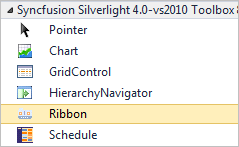
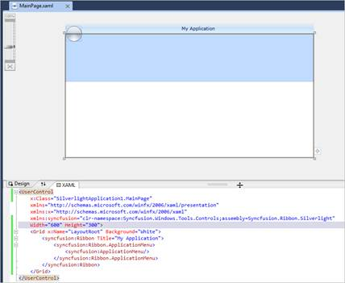

::: {style="DISPLAY: none"}
{#d2h_url_template}{#d2h_package_url style="WIDTH: 0px; DISPLAY: none; HEIGHT: 0px"}
:::

::: {.d2h_secondary_topic style="PADDING-BOTTOM: 10pt; MARGIN: 0pt; PADDING-LEFT: 0pt; PADDING-RIGHT: 0pt; PADDING-TOP: 0pt"}
##### Creating Ribbon using Visual Studio

To create a Ribbon using Visual Studio:

1.   Create a New Silverlight application in Visual Studio.

2.   In the Visual Studio toolbox, select Ribbon under the Syncfusion Silverlight toolbox tab.

 

{border="0"}

Figure 501: Ribbon in Syncfusion Silverlight Toolbox

3.   To add the Ribbon control, simply drag the Ribbon icon to the Design view.

{border="0"}

Figure 502: Ribbon in Visual Studio Designer after drag and drop from Toolbox

4.   Customize the properties of the Ribbon control in the Properties window.

 

[]{#related-topics}
:::
