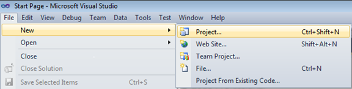
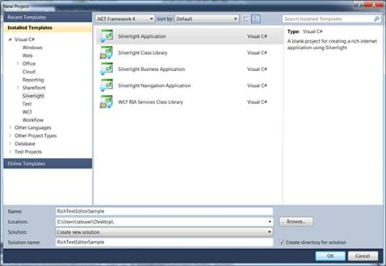
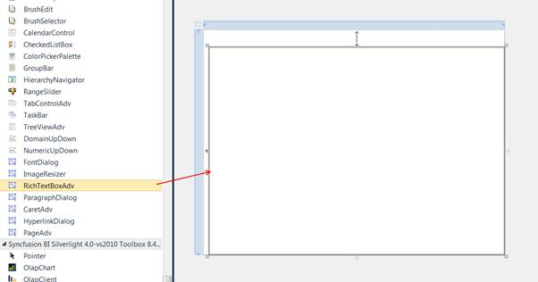

::: {style="DISPLAY: none"}
{#d2h_url_template}{#d2h_package_url style="WIDTH: 0px; DISPLAY: none; HEIGHT: 0px"}
:::

::: {.d2h_secondary_topic style="PADDING-BOTTOM: 10pt; MARGIN: 0pt; PADDING-LEFT: 0pt; PADDING-RIGHT: 0pt; PADDING-TOP: 0pt"}
#### Creating the RichTextBoxAdv Control in Visual Studio

 

To create an UpDown instance in Visual Studio:

1.   Open Visual Studio.

2.   On the **File** menu, select **New**, and then select **Project**. The **New Project** dialog box displays.

 

{border="0"}

Figure 1168: File Menu

 

3.   In the New Project dialog box, select Silverlight Application.

4.   In the Name field, type the name of the project.

5.   Click OK.

 

{border="0"}

Figure 1169: New Project Dialog Box

 

6.   Drag the **RichTextBoxAdv** control from the **Toolbox** window to the **Design View**. An instance of the **RichTextBoxAdv** control is created in **Design** view.

 

{border="0"}

Figure 1170: RichTextBoxAdv Control after Dragging to Design View

 

[]{#related-topics}
:::
