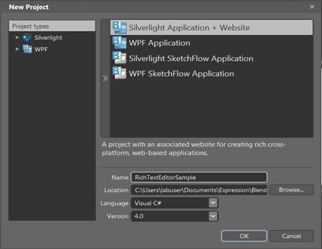
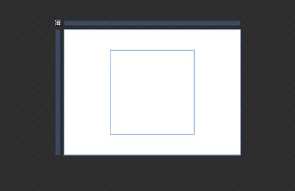

::: {style="DISPLAY: none"}
{#d2h_url_template}{#d2h_package_url style="WIDTH: 0px; DISPLAY: none; HEIGHT: 0px"}
:::

::: {.d2h_secondary_topic style="PADDING-BOTTOM: 10pt; MARGIN: 0pt; PADDING-LEFT: 0pt; PADDING-RIGHT: 0pt; PADDING-TOP: 0pt"}
#### Creating the RichTextBoxAdv Control in Expression Blend

 

To create Updown instance in Expression Blend:

1.   Open Expression Blend.

2.   On the File menu, select New Project. The New Project dialog box opens.

 

{border="0"}

Figure 1171: File Menu

 

3.   In the Project types pane, select Silverlight, and then select Silverlight Application.

4.   In the **Name** field, type the name of the project, and then click **OK**.

 

{border="0"}

Figure 1172: New Project Dialog Box

 

5.   On the **Window** menu, select **Assets**. The **Assets Library** dialog box opens.

6.   In the **Search** box, type **RichTextBoxAdv**. The search results are displayed.

7.   Drag the **RichTextBox** control to **Design** view. An instance of the **RichTextBox** control is created.

[]{style="FONT-FAMILY: 'Calibri','sans-serif'"} 

{border="0"}

Figure 1173: RichTextBoxAdv Control in Design View

[]{style="FONT-FAMILY: 'Calibri','sans-serif'"} 

[]{#related-topics}
:::
