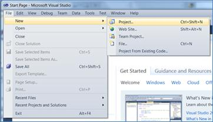
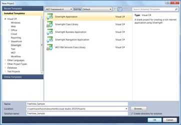
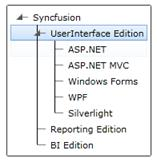

::: {style="DISPLAY: none"}
{#d2h_url_template}{#d2h_package_url style="WIDTH: 0px; DISPLAY: none; HEIGHT: 0px"}
:::

::: {.d2h_secondary_topic style="PADDING-BOTTOM: 10pt; MARGIN: 0pt; PADDING-LEFT: 0pt; PADDING-RIGHT: 0pt; PADDING-TOP: 0pt"}
##### Creating TreeViewAdv using C#

To create a TreeViewAdv using C#:

1.   Open Visual Studio.

2.   On the File menu click New -\> Project. This opens the New Project Dialog box.

 

{border="0"}

Figure 729: New Project Dialog box

 

3.   On the *Project Dialog* window, select Silverlight Application and in the name field type the name of the project and then click OK.

 

{border="0"}

Figure 730: New Project

 

4.   Navigate to solution Explorer.

5.   Right-click *References* folder and click *Add Reference*.

6.   Add the **Syncfusion.Tools.Silverlight** assembly to the project References folder.

         

{border="0"}

Figure 731:  Add Reference

 

7.   Add Syncfusion.Tools.Silverlight reference in XAML and C# code as follows.

[]{style="FONT-FAMILY: 'Calibri','sans-serif'; FONT-SIZE: 11pt"} 

+-------------------------------------------------------------------------------------------------------------------------------------------------------------------------------------------------------------------------------------------------------------------------------------------------------------------------------------------------------------+
| **[\[XAML\]]{style="FONT-FAMILY: 'Courier New'"}**                                                                                                                                                                                                                                                                                                          |
|                                                                                                                                                                                                                                                                                                                                                             |
| []{style="FONT-FAMILY: 'Courier New'"}                                                                                                                                                                                                                                                                                                                      |
|                                                                                                                                                                                                                                                                                                                                                             |
| [xmlns]{style="FONT-FAMILY: 'Courier New'; COLOR: red"}[:]{style="FONT-FAMILY: 'Courier New'; COLOR: blue"}[syncfusion]{style="FONT-FAMILY: 'Courier New'; COLOR: red"}[=\"clr-namespace:Syncfusion.Windows.Tools.Controls; assembly=Syncfusion.Tools.Silverlight\"]{style="FONT-FAMILY: 'Courier New'; COLOR: blue"}[]{style="FONT-FAMILY: 'Courier New'"} |
+-------------------------------------------------------------------------------------------------------------------------------------------------------------------------------------------------------------------------------------------------------------------------------------------------------------------------------------------------------------+

[]{style="FONT-FAMILY: 'Calibri','sans-serif'; FONT-SIZE: 11pt"} 

**[]{style="FONT-SIZE: 12pt"}** 

+-----------------------------------------------------------------------------------------------------------------------------------------------------------------------------+
| **[\[C#\]]{style="FONT-FAMILY: 'Courier New'"}**                                                                                                                            |
|                                                                                                                                                                             |
| []{style="FONT-FAMILY: 'Courier New'; COLOR: blue"}                                                                                                                         |
|                                                                                                                                                                             |
| [using]{style="FONT-FAMILY: 'Courier New'; COLOR: blue"}[ Syncfusion.Windows.Tools.Controls;]{style="FONT-FAMILY: 'Courier New'"}**[]{style="FONT-FAMILY: 'Courier New'"}** |
+-----------------------------------------------------------------------------------------------------------------------------------------------------------------------------+

[]{style="FONT-FAMILY: 'Calibri','sans-serif'; FONT-SIZE: 11pt"} 

8.   Click and open C# file and add *TreeViewAdv* to the application.

[]{style="FONT-FAMILY: 'Calibri','sans-serif'; FONT-SIZE: 11pt"} 

+-----------------------------------------------------------------------------------------------------------------------------------------------------------------------------------------------------------------------------------------------------------------+
| **[\[C#\]]{style="FONT-FAMILY: 'Courier New'"}**                                                                                                                                                                                                                |
|                                                                                                                                                                                                                                                                 |
| []{style="FONT-FAMILY: 'Courier New'"}                                                                                                                                                                                                                          |
|                                                                                                                                                                                                                                                                 |
| [TreeViewAdv]{style="FONT-FAMILY: 'Courier New'; COLOR: #2b91af"}[ treeview = [new]{style="COLOR: blue"} [TreeViewAdv]{style="COLOR: #2b91af"}();]{style="FONT-FAMILY: 'Courier New'"}                                                                          |
|                                                                                                                                                                                                                                                                 |
| [TreeViewItemAdv]{style="FONT-FAMILY: 'Courier New'; COLOR: #2b91af"}[ head = [new]{style="COLOR: blue"} [TreeViewItemAdv]{style="COLOR: #2b91af"}() { Header = [\"Syncfusion\"]{style="COLOR: #a31515"} };]{style="FONT-FAMILY: 'Courier New'"}                |
|                                                                                                                                                                                                                                                                 |
| [TreeViewItemAdv]{style="FONT-FAMILY: 'Courier New'; COLOR: #2b91af"}[ subhead1 = [new]{style="COLOR: blue"} [TreeViewItemAdv]{style="COLOR: #2b91af"}() { Header = [\"UserInterface Edition\"]{style="COLOR: #a31515"} };]{style="FONT-FAMILY: 'Courier New'"} |
|                                                                                                                                                                                                                                                                 |
| [TreeViewItemAdv]{style="FONT-FAMILY: 'Courier New'; COLOR: #2b91af"}[ item1 = [new]{style="COLOR: blue"} [TreeViewItemAdv]{style="COLOR: #2b91af"}() { Header = [\"ASP.NET\"]{style="COLOR: #a31515"} };]{style="FONT-FAMILY: 'Courier New'"}                  |
|                                                                                                                                                                                                                                                                 |
| [TreeViewItemAdv]{style="FONT-FAMILY: 'Courier New'; COLOR: #2b91af"}[ item2 = [new]{style="COLOR: blue"} [TreeViewItemAdv]{style="COLOR: #2b91af"}() { Header = [\"ASP.NET MVC\"]{style="COLOR: #a31515"} };]{style="FONT-FAMILY: 'Courier New'"}              |
|                                                                                                                                                                                                                                                                 |
| [TreeViewItemAdv]{style="FONT-FAMILY: 'Courier New'; COLOR: #2b91af"}[ item3 = [new]{style="COLOR: blue"} [TreeViewItemAdv]{style="COLOR: #2b91af"}() { Header = [\"Windows Forms\"]{style="COLOR: #a31515"} };]{style="FONT-FAMILY: 'Courier New'"}            |
|                                                                                                                                                                                                                                                                 |
| [TreeViewItemAdv]{style="FONT-FAMILY: 'Courier New'; COLOR: #2b91af"}[ item4 = [new]{style="COLOR: blue"} [TreeViewItemAdv]{style="COLOR: #2b91af"}() { Header = [\"WPF\"]{style="COLOR: #a31515"} };]{style="FONT-FAMILY: 'Courier New'"}                      |
|                                                                                                                                                                                                                                                                 |
| [TreeViewItemAdv]{style="FONT-FAMILY: 'Courier New'; COLOR: #2b91af"}[ item5 = [new]{style="COLOR: blue"} [TreeViewItemAdv]{style="COLOR: #2b91af"}() { Header = [\"Silverlight\"]{style="COLOR: #a31515"} };]{style="FONT-FAMILY: 'Courier New'"}              |
|                                                                                                                                                                                                                                                                 |
| [subhead1.Items.Add(item1);]{style="FONT-FAMILY: 'Courier New'"}                                                                                                                                                                                                |
|                                                                                                                                                                                                                                                                 |
| [subhead1.Items.Add(item2);]{style="FONT-FAMILY: 'Courier New'"}                                                                                                                                                                                                |
|                                                                                                                                                                                                                                                                 |
| [subhead1.Items.Add(item3);]{style="FONT-FAMILY: 'Courier New'"}                                                                                                                                                                                                |
|                                                                                                                                                                                                                                                                 |
| [subhead1.Items.Add(item4);]{style="FONT-FAMILY: 'Courier New'"}                                                                                                                                                                                                |
|                                                                                                                                                                                                                                                                 |
| [subhead1.Items.Add(item5);]{style="FONT-FAMILY: 'Courier New'"}                                                                                                                                                                                                |
|                                                                                                                                                                                                                                                                 |
| [TreeViewItemAdv]{style="FONT-FAMILY: 'Courier New'; COLOR: #2b91af"}[ subhead2 = [new]{style="COLOR: blue"} [TreeViewItemAdv]{style="COLOR: #2b91af"}() { Header = [\"Reporting Edition\"]{style="COLOR: #a31515"} };]{style="FONT-FAMILY: 'Courier New'"}     |
|                                                                                                                                                                                                                                                                 |
| [TreeViewItemAdv]{style="FONT-FAMILY: 'Courier New'; COLOR: #2b91af"}[ subhead3 = [new]{style="COLOR: blue"} [TreeViewItemAdv]{style="COLOR: #2b91af"}() { Header = [\"BI Edition\"]{style="COLOR: #a31515"} };]{style="FONT-FAMILY: 'Courier New'"}            |
|                                                                                                                                                                                                                                                                 |
| [head.Items.Add(subhead1);]{style="FONT-FAMILY: 'Courier New'"}                                                                                                                                                                                                 |
|                                                                                                                                                                                                                                                                 |
| [head.Items.Add(subhead2);]{style="FONT-FAMILY: 'Courier New'"}                                                                                                                                                                                                 |
|                                                                                                                                                                                                                                                                 |
| [head.Items.Add(subhead3);]{style="FONT-FAMILY: 'Courier New'"}                                                                                                                                                                                                 |
|                                                                                                                                                                                                                                                                 |
| [treeview.Items.Add(head);]{style="FONT-FAMILY: 'Courier New'"}                                                                                                                                                                                                 |
|                                                                                                                                                                                                                                                                 |
| [this]{style="FONT-FAMILY: 'Courier New'; COLOR: blue"}[.LayoutRoot.Children.Add(treeview);]{style="FONT-FAMILY: 'Courier New'"}                                                                                                                                |
+-----------------------------------------------------------------------------------------------------------------------------------------------------------------------------------------------------------------------------------------------------------------+

[]{style="FONT-FAMILY: 'Calibri','sans-serif'; FONT-SIZE: 11pt"} 

[]{style="FONT-FAMILY: 'Calibri','sans-serif'; FONT-SIZE: 11pt"} 

{border="0"}

Figure 732: TreeViewAdv

[]{#related-topics}
:::
