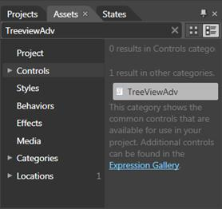
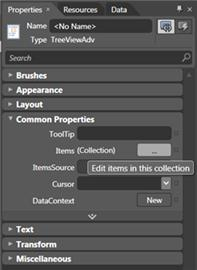
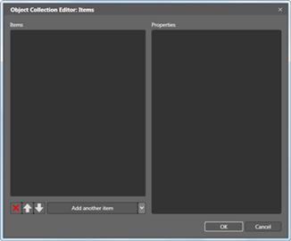
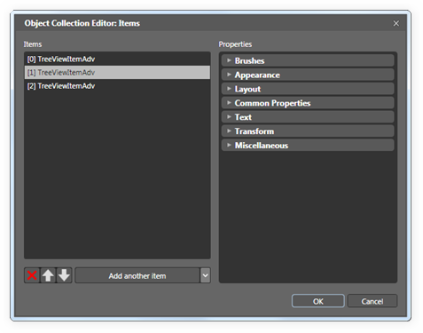

::: {style="DISPLAY: none"}
{#d2h_url_template}{#d2h_package_url style="WIDTH: 0px; DISPLAY: none; HEIGHT: 0px"}
:::

::: {.d2h_secondary_topic style="PADDING-BOTTOM: 10pt; MARGIN: 0pt; PADDING-LEFT: 0pt; PADDING-RIGHT: 0pt; PADDING-TOP: 0pt"}
##### []{#_Creating_TreeViewAdv_using}Creating TreeViewAdv using Expression Blend

TreeViewAdv Control provides full Blend support. Here are the step-by-step instructions to create Silverlight application in Blend.

To create TreeViewAdv using Expression Blend:

1.   Open *Blend*.

2.   On the *File* Menu, click *New Project*. This opens the *New Project* dialog box.

 

 

{border="0"}

Figure 736: New Project Dialog box

3.   In the Project type's panel, select Silverlight application and then click *OK*.

{border="0"}

Figure 737: New Project

4.   Add the following Reference with the sample project:

[·      ]{style="FONT-FAMILY: Symbol"}Syncfusion.Shared.WPF.dll

 

5.   On the *Window* menu, select *Assets*. This opens the *Assets Library* dialog box.

6.   In the Search box, type **TreeViewAdv**. This displays the search results.

 

{border="0"}

Figure 738:  Assets Library dialog box

 

7.   Drag the *TreeViewAdv* control to *Design* View.

8.   Now select TreeViewAdv control to add items. After you select the control, navigate to Common Properties located in the Properties pane and click the button next to Items (Collection).The Object Collection Editor will appear.

 

{border="0"}

Figure 739: Properties Window

 

 

9.   Object Collection Editor has two sections.  The left Object Collection Editor e contains the list having items of the selected TreeViewAdv.

{border="0"}

Figure 740: Object Collection Editor

 

10.  To add another item to the selected TreeViewAdv, click Add another Item button located at the bottom of the items list. To remove items, click the RemoveItem button. If you want to add child items to a specific TreeViewItemAdv, you need to select the item from the items list in the Object Collection Editor dialog. After you have selected the item, navigate to Common Properties located in the Properties pane and click the button next to Items. Again, the Object Collection Editor dialog will appear.

 

{border="0"}

Figure 741: Object Collection Editor dialog

 

11.  Click *OK* to confirm the changes and close the dialog.

 

See Also

[[Blendability]{.UGHyperlink}](../../../../../../../../Documents%20and%20Settings/riaj/Desktop/styling%20for%20ui%20silverlight/tools%20silverlight/tools%20part%202.docx#_Blendability)[]{style="FONT-FAMILY: 'Calibri','sans-serif'; FONT-SIZE: 11pt"}

[]{#related-topics}
:::
