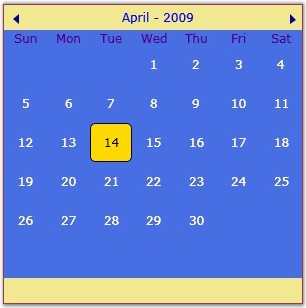
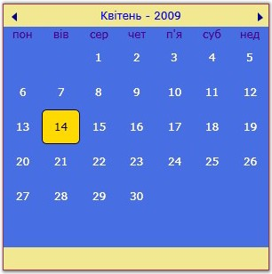

::: {style="DISPLAY: none"}
{#d2h_url_template}{#d2h_package_url style="WIDTH: 0px; DISPLAY: none; HEIGHT: 0px"}
:::

::: {.d2h_secondary_topic style="PADDING-BOTTOM: 10pt; MARGIN: 0pt; PADDING-LEFT: 0pt; PADDING-RIGHT: 0pt; PADDING-TOP: 0pt"}
#### []{#_Culture_1}Culture

[]{#p269} 

The **Culture** dependency property is used to set the culture for the CalendarControl. The following code example illustrates how to set this property.

 

+----------------------------------------------------------------------------------------------------------------------------------------------------------------------------------------------------------------------------------------------------------------------------------------------------------------------------------------------------------------------------------------------------------------------------------------------------------------------------------------------------+
| **[\[XAML\]]{style="FONT-FAMILY: 'Courier New'; COLOR: black"}**                                                                                                                                                                                                                                                                                                                                                                                                                                   |
|                                                                                                                                                                                                                                                                                                                                                                                                                                                                                                    |
| []{style="FONT-FAMILY: 'Courier New'; COLOR: black"}                                                                                                                                                                                                                                                                                                                                                                                                                                               |
|                                                                                                                                                                                                                                                                                                                                                                                                                                                                                                    |
| [\<]{style="FONT-FAMILY: 'Courier New'; COLOR: blue"}[Syncfusion]{style="FONT-FAMILY: 'Courier New'; COLOR: maroon"}[:]{style="FONT-FAMILY: 'Courier New'; COLOR: blue"}[CalendarControl]{style="FONT-FAMILY: 'Courier New'; COLOR: maroon"}[ [x]{style="COLOR: maroon"}[:]{style="COLOR: blue"}[Name]{style="COLOR: red"}[="calendarcontrol"]{style="COLOR: blue"} [Culture]{style="COLOR: red"}[=\"en-US\"]{style="COLOR: blue"} [/\>]{style="COLOR: blue"}]{style="FONT-FAMILY: 'Courier New'"} |
+----------------------------------------------------------------------------------------------------------------------------------------------------------------------------------------------------------------------------------------------------------------------------------------------------------------------------------------------------------------------------------------------------------------------------------------------------------------------------------------------------+

 

+---------------------------------------------------------------------------------------------------------------------------------------------+
| **[\[C#\]]{style="FONT-FAMILY: 'Courier New'; COLOR: black"}**                                                                              |
|                                                                                                                                             |
| []{style="FONT-FAMILY: 'Courier New'"}                                                                                                      |
|                                                                                                                                             |
| [CalendarControl calendarcontrol = [new]{style="COLOR: blue"} CalendarControl();]{style="FONT-FAMILY: 'Courier New'"}                       |
|                                                                                                                                             |
| [calendarcontrol.Culture = [new]{style="COLOR: blue"} CultureInfo([\"en-US\"]{style="COLOR: maroon"});]{style="FONT-FAMILY: 'Courier New'"} |
+---------------------------------------------------------------------------------------------------------------------------------------------+

 

{border="0"}

 

Figure 497: Culture = \"en-US\"

 

{border="0"}

 

Figure 498: Culture = \"uk-UA\"

[]{#_Ribbon_Instance}[]{#_Silverlight_Ribbon}**[]{style="FONT-FAMILY: 'Calibri','sans-serif'"}** 

**[]{style="FONT-FAMILY: 'Calibri','sans-serif'"}** 

**[]{style="FONT-FAMILY: 'Calibri','sans-serif'"}** 

[]{#related-topics}
:::
