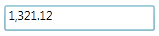
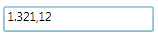

::: {style="DISPLAY: none"}
{#d2h_url_template}{#d2h_package_url style="WIDTH: 0px; DISPLAY: none; HEIGHT: 0px"}
:::

::: {.d2h_secondary_topic style="PADDING-BOTTOM: 10pt; MARGIN: 0pt; PADDING-LEFT: 0pt; PADDING-RIGHT: 0pt; PADDING-TOP: 0pt"}
#### []{#_Promp_Char}Culture and Format properties

MaskedTextBox provides globalization support through the **Culture** property. **CurrencySymbol, DateSeparator, DecimalSeparator, TimeSeparator and NumberGroupSeparator** are based on the Culture property.

+-------------------------------------------------------------------------------------------------------------------------------------------------------------------------------------------------------------------------------------------------------------------------------------------------------------------------------------------------------------------------------------------------------------------------------------------------------------------------------------------------------------------------------------------------------------------------------------------------------------------------------------------------------------------------------------------------------------------------------------------------------------------------------------------------------------------------------------------------------------------------------------------------+
| [XAML]{style="FONT-FAMILY: 'Calibri','sans-serif'; COLOR: white; FONT-SIZE: 11pt"}                                                                                                                                                                                                                                                                                                                                                                                                                                                                                                                                                                                                                                                                                                                                                                                                              |
+-------------------------------------------------------------------------------------------------------------------------------------------------------------------------------------------------------------------------------------------------------------------------------------------------------------------------------------------------------------------------------------------------------------------------------------------------------------------------------------------------------------------------------------------------------------------------------------------------------------------------------------------------------------------------------------------------------------------------------------------------------------------------------------------------------------------------------------------------------------------------------------------------+
| [\<]{style="FONT-FAMILY: 'Courier New'; COLOR: blue"}[syncfusion]{style="FONT-FAMILY: 'Courier New'; COLOR: #a31515"}[:]{style="FONT-FAMILY: 'Courier New'; COLOR: blue"}[MaskedTextBox]{style="FONT-FAMILY: 'Courier New'; COLOR: #a31515"}[ x]{style="FONT-FAMILY: 'Courier New'; COLOR: red"}[:]{style="FONT-FAMILY: 'Courier New'; COLOR: blue"}[Name]{style="FONT-FAMILY: 'Courier New'; COLOR: red"}[=\"maskedTextBox\"]{style="FONT-FAMILY: 'Courier New'; COLOR: blue"}[ Height]{style="FONT-FAMILY: 'Courier New'; COLOR: red"}[=\"25\"]{style="FONT-FAMILY: 'Courier New'; COLOR: blue"}[ Width]{style="FONT-FAMILY: 'Courier New'; COLOR: red"}[=\"150\"]{style="FONT-FAMILY: 'Courier New'; COLOR: blue"}[ Culture]{style="FONT-FAMILY: 'Courier New'; COLOR: red"}[=\"en-US\"]{style="FONT-FAMILY: 'Courier New'; COLOR: blue"}[ ]{style="FONT-FAMILY: 'Courier New'; COLOR: red"} |
|                                                                                                                                                                                                                                                                                                                                                                                                                                                                                                                                                                                                                                                                                                                                                                                                                                                                                                 |
| [                          Mask]{style="FONT-FAMILY: 'Courier New'; COLOR: red"}[=\"0,000.00\"/\>]{style="FONT-FAMILY: 'Courier New'; COLOR: blue"}                                                                                                                                                                                                                                                                                                                                                                                                                                                                                                                                                                                                                                                                                                                                             |
+-------------------------------------------------------------------------------------------------------------------------------------------------------------------------------------------------------------------------------------------------------------------------------------------------------------------------------------------------------------------------------------------------------------------------------------------------------------------------------------------------------------------------------------------------------------------------------------------------------------------------------------------------------------------------------------------------------------------------------------------------------------------------------------------------------------------------------------------------------------------------------------------------+

[]{style="FONT-FAMILY: 'Courier New'"} 

+-------------------------------------------------------------------------------------------------------------------------------------------------------------------------------------------------+
| [C#]{style="FONT-FAMILY: 'Courier New'; COLOR: white"}                                                                                                                                          |
+-------------------------------------------------------------------------------------------------------------------------------------------------------------------------------------------------+
| [MaskedTextBox]{style="FONT-FAMILY: 'Courier New'; COLOR: #2b91af"}[ maskedTextBox = [new]{style="COLOR: blue"} [MaskedTextBox]{style="COLOR: #2b91af"}();]{style="FONT-FAMILY: 'Courier New'"} |
|                                                                                                                                                                                                 |
| [maskedTextBox.Height = 25;]{style="FONT-FAMILY: 'Courier New'"}                                                                                                                                |
|                                                                                                                                                                                                 |
| [maskedTextBox.Width = 150;]{style="FONT-FAMILY: 'Courier New'"}                                                                                                                                |
|                                                                                                                                                                                                 |
| [maskedTextBox.Culture = [new]{style="COLOR: blue"} [CultureInfo]{style="COLOR: #2b91af"}([\"en-US\"]{style="COLOR: #a31515"});]{style="FONT-FAMILY: 'Courier New'"}                            |
|                                                                                                                                                                                                 |
| [maskedTextBox.Mask = [\"0,000.00\"]{style="COLOR: #a31515"};]{style="FONT-FAMILY: 'Courier New'"}                                                                                              |
+-------------------------------------------------------------------------------------------------------------------------------------------------------------------------------------------------+

[]{style="FONT-FAMILY: 'Calibri','sans-serif'; FONT-SIZE: 11pt"} 

{border="0"}

Figure 189: Culture property set to US culture (en-US)

[]{style="FONT-FAMILY: 'Calibri','sans-serif'; FONT-SIZE: 11pt"} 

[]{style="FONT-FAMILY: 'Calibri','sans-serif'; FONT-SIZE: 11pt"} 

+--------------------------------------------------------------------------------------------------------------------------------------------------------------------------------------------------------------------------------------------------------------------------------------------------------------------------------------------------------------------------------------------------------------------------------------------------------------------------------------------------------------------------------------------------------------------------------------------------------------------------------------------------------------------------------------------------------------------------------------------------------------------------+
| [XAML]{style="FONT-FAMILY: 'Calibri','sans-serif'; COLOR: white; FONT-SIZE: 11pt"}                                                                                                                                                                                                                                                                                                                                                                                                                                                                                                                                                                                                                                                                                       |
+--------------------------------------------------------------------------------------------------------------------------------------------------------------------------------------------------------------------------------------------------------------------------------------------------------------------------------------------------------------------------------------------------------------------------------------------------------------------------------------------------------------------------------------------------------------------------------------------------------------------------------------------------------------------------------------------------------------------------------------------------------------------------+
| [\<]{style="FONT-FAMILY: 'Courier New'; COLOR: blue"}[syncfusion]{style="FONT-FAMILY: 'Courier New'; COLOR: #a31515"}[:]{style="FONT-FAMILY: 'Courier New'; COLOR: blue"}[MaskedTextBox]{style="FONT-FAMILY: 'Courier New'; COLOR: #a31515"}[ x]{style="FONT-FAMILY: 'Courier New'; COLOR: red"}[:]{style="FONT-FAMILY: 'Courier New'; COLOR: blue"}[Name]{style="FONT-FAMILY: 'Courier New'; COLOR: red"}[=\"maskedTextBox\"]{style="FONT-FAMILY: 'Courier New'; COLOR: blue"}[ Height]{style="FONT-FAMILY: 'Courier New'; COLOR: red"}[=\"25\"]{style="FONT-FAMILY: 'Courier New'; COLOR: blue"}[ Width]{style="FONT-FAMILY: 'Courier New'; COLOR: red"}[=\"150\"]{style="FONT-FAMILY: 'Courier New'; COLOR: blue"}[ ]{style="FONT-FAMILY: 'Courier New'; COLOR: red"} |
|                                                                                                                                                                                                                                                                                                                                                                                                                                                                                                                                                                                                                                                                                                                                                                          |
| [                          Culture]{style="FONT-FAMILY: 'Courier New'; COLOR: red"}[=\"bs-Latn\"]{style="FONT-FAMILY: 'Courier New'; COLOR: blue"}[ Mask]{style="FONT-FAMILY: 'Courier New'; COLOR: red"}[=\"0,000.00\"/\>]{style="FONT-FAMILY: 'Courier New'; COLOR: blue"}                                                                                                                                                                                                                                                                                                                                                                                                                                                                                             |
+--------------------------------------------------------------------------------------------------------------------------------------------------------------------------------------------------------------------------------------------------------------------------------------------------------------------------------------------------------------------------------------------------------------------------------------------------------------------------------------------------------------------------------------------------------------------------------------------------------------------------------------------------------------------------------------------------------------------------------------------------------------------------+

[]{style="FONT-FAMILY: 'Courier New'"} 

+-------------------------------------------------------------------------------------------------------------------------------------------------------------------------------------------------+
| [C#]{style="FONT-FAMILY: 'Courier New'; COLOR: white"}                                                                                                                                          |
+-------------------------------------------------------------------------------------------------------------------------------------------------------------------------------------------------+
| [MaskedTextBox]{style="FONT-FAMILY: 'Courier New'; COLOR: #2b91af"}[ maskedTextBox = [new]{style="COLOR: blue"} [MaskedTextBox]{style="COLOR: #2b91af"}();]{style="FONT-FAMILY: 'Courier New'"} |
|                                                                                                                                                                                                 |
| [maskedTextBox.Height = 25;]{style="FONT-FAMILY: 'Courier New'"}                                                                                                                                |
|                                                                                                                                                                                                 |
| [maskedTextBox.Width = 150;]{style="FONT-FAMILY: 'Courier New'"}                                                                                                                                |
|                                                                                                                                                                                                 |
| [maskedTextBox.Culture = [new]{style="COLOR: blue"} [CultureInfo]{style="COLOR: #2b91af"}([\"bs-Latn\"]{style="COLOR: #a31515"});]{style="FONT-FAMILY: 'Courier New'"}                          |
|                                                                                                                                                                                                 |
| [maskedTextBox.Mask = [\"0,000.00\"]{style="COLOR: #a31515"};]{style="FONT-FAMILY: 'Courier New'"}                                                                                              |
+-------------------------------------------------------------------------------------------------------------------------------------------------------------------------------------------------+

[]{style="FONT-FAMILY: 'Calibri','sans-serif'; FONT-SIZE: 11pt"} 

{border="0"}

Figure 190: MaskedTextBox

[]{style="FONT-FAMILY: 'Calibri','sans-serif'; FONT-SIZE: 11pt"}[]{style="FONT-FAMILY: 'Calibri','sans-serif'; FONT-SIZE: 11pt"} 

As we seen in these samples whenever user change the culture property then the Value is formatted based on the Culture.

MaskedTextBox supports direct properties such as **CurrencySymbol, DateSeparator, DecimalSeparator, TimeSeparator, NumberGroupSeparator.**

+--------------------------------------------------------------------------------------------------------------------------------------------------------------------------------------------------------------------------------------------------------------------------------------------------------------------------------------------------------------------------------------------------------------------------------------------------------------------------------------------------------------------------------------------------------------------------------------------------------------------------------------------------------------------------------------------------------------------------------------------------------------------------+
| [XAML]{style="FONT-FAMILY: 'Calibri','sans-serif'; COLOR: white; FONT-SIZE: 11pt"}                                                                                                                                                                                                                                                                                                                                                                                                                                                                                                                                                                                                                                                                                       |
+--------------------------------------------------------------------------------------------------------------------------------------------------------------------------------------------------------------------------------------------------------------------------------------------------------------------------------------------------------------------------------------------------------------------------------------------------------------------------------------------------------------------------------------------------------------------------------------------------------------------------------------------------------------------------------------------------------------------------------------------------------------------------+
| [\<]{style="FONT-FAMILY: 'Courier New'; COLOR: blue"}[syncfusion]{style="FONT-FAMILY: 'Courier New'; COLOR: #a31515"}[:]{style="FONT-FAMILY: 'Courier New'; COLOR: blue"}[MaskedTextBox]{style="FONT-FAMILY: 'Courier New'; COLOR: #a31515"}[ x]{style="FONT-FAMILY: 'Courier New'; COLOR: red"}[:]{style="FONT-FAMILY: 'Courier New'; COLOR: blue"}[Name]{style="FONT-FAMILY: 'Courier New'; COLOR: red"}[=\"maskedTextBox\"]{style="FONT-FAMILY: 'Courier New'; COLOR: blue"}[ Height]{style="FONT-FAMILY: 'Courier New'; COLOR: red"}[=\"25\"]{style="FONT-FAMILY: 'Courier New'; COLOR: blue"}[ Width]{style="FONT-FAMILY: 'Courier New'; COLOR: red"}[=\"150\"]{style="FONT-FAMILY: 'Courier New'; COLOR: blue"}[ ]{style="FONT-FAMILY: 'Courier New'; COLOR: red"} |
|                                                                                                                                                                                                                                                                                                                                                                                                                                                                                                                                                                                                                                                                                                                                                                          |
| [                          Mask]{style="FONT-FAMILY: 'Courier New'; COLOR: red"}[=\"00/00/0000 00:00\"]{style="FONT-FAMILY: 'Courier New'; COLOR: blue"}[ DateSeparator]{style="FONT-FAMILY: 'Courier New'; COLOR: red"}[=\"\|\"]{style="FONT-FAMILY: 'Courier New'; COLOR: blue"}[ TimeSeparator]{style="FONT-FAMILY: 'Courier New'; COLOR: red"}[=\"\*\"/\>]{style="FONT-FAMILY: 'Courier New'; COLOR: blue"}                                                                                                                                                                                                                                                                                                                                                          |
+--------------------------------------------------------------------------------------------------------------------------------------------------------------------------------------------------------------------------------------------------------------------------------------------------------------------------------------------------------------------------------------------------------------------------------------------------------------------------------------------------------------------------------------------------------------------------------------------------------------------------------------------------------------------------------------------------------------------------------------------------------------------------+

[]{style="FONT-FAMILY: 'Courier New'"} 

+-------------------------------------------------------------------------------------------------------------------------------------------------------------------------------------------------+
| [C#]{style="FONT-FAMILY: 'Courier New'; COLOR: white"}                                                                                                                                          |
+-------------------------------------------------------------------------------------------------------------------------------------------------------------------------------------------------+
| [MaskedTextBox]{style="FONT-FAMILY: 'Courier New'; COLOR: #2b91af"}[ maskedTextBox = [new]{style="COLOR: blue"} [MaskedTextBox]{style="COLOR: #2b91af"}();]{style="FONT-FAMILY: 'Courier New'"} |
|                                                                                                                                                                                                 |
| [maskedTextBox.Height = 25;]{style="FONT-FAMILY: 'Courier New'"}                                                                                                                                |
|                                                                                                                                                                                                 |
| [maskedTextBox.Width = 150;]{style="FONT-FAMILY: 'Courier New'"}                                                                                                                                |
|                                                                                                                                                                                                 |
| [maskedTextBox.Mask = [\"00/00/0000 00:00\"]{style="COLOR: #a31515"};]{style="FONT-FAMILY: 'Courier New'"}                                                                                      |
|                                                                                                                                                                                                 |
| [maskedTextBox.DateSeparator = [\"\|\"]{style="COLOR: #a31515"};]{style="FONT-FAMILY: 'Courier New'"}                                                                                           |
|                                                                                                                                                                                                 |
| [maskedTextBox.TimeSeparator = [\"\*\"]{style="COLOR: #a31515"};]{style="FONT-FAMILY: 'Courier New'"}                                                                                           |
+-------------------------------------------------------------------------------------------------------------------------------------------------------------------------------------------------+

[]{style="FONT-FAMILY: 'Calibri','sans-serif'; FONT-SIZE: 11pt"} 

{border="0"}

Figure 191: MaskedTextBox Time and DateSeparator

[]{style="FONT-FAMILY: 'Calibri','sans-serif'; FONT-SIZE: 11pt"} 

[]{#related-topics}
:::
