::: {style="DISPLAY: none"}
{#d2h_url_template}{#d2h_package_url style="WIDTH: 0px; DISPLAY: none; HEIGHT: 0px"}
:::

::: {.d2h_secondary_topic style="PADDING-BOTTOM: 10pt; MARGIN: 0pt; PADDING-LEFT: 0pt; PADDING-RIGHT: 0pt; PADDING-TOP: 0pt"}
##### Customizing Layout

###### []{#_Close_Button_Types}[]{#_Tab_Item_Layout}Tab Item Layout

*Tab Control* ships with three different types of Layouts. They are the single-line, multiline and the multiline with full width layouts.

1.1.1.1.1.1.66     Single Line

[]{style="FONT-FAMILY: 'Calibri','sans-serif'; FONT-SIZE: 12pt"} 

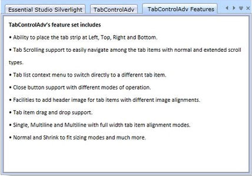{border="0"}

Figure 791: Single Line Layout[]{style="FONT-FAMILY: 'Calibri','sans-serif'; FONT-SIZE: 12pt"}

 

1.1.1.1.1.1.67     MultiLine

[]{style="FONT-FAMILY: 'Calibri','sans-serif'; FONT-SIZE: 12pt"} 

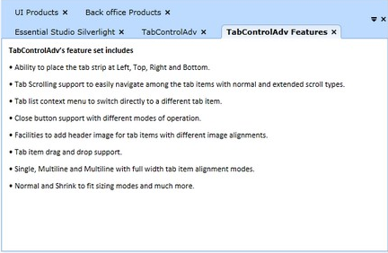{border="0"}

Figure 792: MultiLine Layout[]{style="FONT-FAMILY: 'Calibri','sans-serif'; FONT-SIZE: 12pt"}

[                                                   ** **]{style="FONT-FAMILY: 'Calibri','sans-serif'; FONT-SIZE: 12pt"}

1.1.1.1.1.1.68     Multi Line with Full Width

[]{style="FONT-FAMILY: 'Calibri','sans-serif'; FONT-SIZE: 12pt"} 

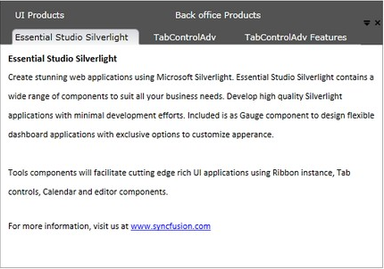{border="0"}

Figure 793: Multi Line with Full Width Layout[]{style="FONT-FAMILY: 'Calibri','sans-serif'; FONT-SIZE: 12pt"}

[            ]{style="FONT-FAMILY: 'Calibri','sans-serif'; FONT-SIZE: 12pt"}

###### []{#_Close_Button_Types_1}Close Button Types

Syncfusion TabControl offered more customizations for the close button. The following are the different types of close button customizations:

1.   Common

2.   Individual

3.   Both

4.   IndividualOnMouseOver

5.   Hide

We can customize the close button types by xaml and code behind.

+-----------------------------------------------------------------------------------------------------------------------------------------------------------------------------------------------------------------------------------------------------------------------------------------------------------------------------------------------------------------------------------------------------------------------------------------------------------------------------------------------------------------------------------------------------------------------------------------------------------------------------------------------------------------------------------+
| **[\[XAML\]]{style="FONT-FAMILY: 'Courier New'"}**                                                                                                                                                                                                                                                                                                                                                                                                                                                                                                                                                                                                                                |
|                                                                                                                                                                                                                                                                                                                                                                                                                                                                                                                                                                                                                                                                                   |
| []{style="FONT-FAMILY: 'Courier New'; COLOR: blue"}                                                                                                                                                                                                                                                                                                                                                                                                                                                                                                                                                                                                                               |
|                                                                                                                                                                                                                                                                                                                                                                                                                                                                                                                                                                                                                                                                                   |
| [      \<]{style="FONT-FAMILY: 'Courier New'; COLOR: blue"}[ syncfusion]{style="FONT-FAMILY: 'Courier New'; COLOR: #a31515"}[:]{style="FONT-FAMILY: 'Courier New'; COLOR: blue"}[TabControlAdv]{style="FONT-FAMILY: 'Courier New'; COLOR: #a31515"}[ x]{style="FONT-FAMILY: 'Courier New'; COLOR: red"}[:]{style="FONT-FAMILY: 'Courier New'; COLOR: blue"}[Name]{style="FONT-FAMILY: 'Courier New'; COLOR: red"}[=\"MyTabCtrl\"]{style="FONT-FAMILY: 'Courier New'; COLOR: blue"}[ CloseButtonType]{style="FONT-FAMILY: 'Courier New'; COLOR: red"}[=\"Both\"]{style="FONT-FAMILY: 'Courier New'; COLOR: blue"}[ [ \>]{style="COLOR: blue"}]{style="FONT-FAMILY: 'Courier New'"} |
|                                                                                                                                                                                                                                                                                                                                                                                                                                                                                                                                                                                                                                                                                   |
| [            ]{style="FONT-FAMILY: 'Courier New'; COLOR: #a31515"}[\<]{style="FONT-FAMILY: 'Courier New'; COLOR: blue"}[syncfusion]{style="FONT-FAMILY: 'Courier New'; COLOR: #a31515"}[:]{style="FONT-FAMILY: 'Courier New'; COLOR: blue"}[TabItemAdv]{style="FONT-FAMILY: 'Courier New'; COLOR: #a31515"}[ Header]{style="FONT-FAMILY: 'Courier New'; COLOR: red"}[ =\"TabItemAdv1\"/\>]{style="FONT-FAMILY: 'Courier New'; COLOR: blue"}[]{style="FONT-FAMILY: 'Courier New'"}                                                                                                                                                                                                 |
|                                                                                                                                                                                                                                                                                                                                                                                                                                                                                                                                                                                                                                                                                   |
| [            ]{style="FONT-FAMILY: 'Courier New'; COLOR: #a31515"}[\<]{style="FONT-FAMILY: 'Courier New'; COLOR: blue"}[ syncfusion]{style="FONT-FAMILY: 'Courier New'; COLOR: #a31515"}[:]{style="FONT-FAMILY: 'Courier New'; COLOR: blue"}[TabItemAdv]{style="FONT-FAMILY: 'Courier New'; COLOR: #a31515"}[ Header]{style="FONT-FAMILY: 'Courier New'; COLOR: red"}[=\"TabItemAdv2\"/\>]{style="FONT-FAMILY: 'Courier New'; COLOR: blue"}[]{style="FONT-FAMILY: 'Courier New'"}                                                                                                                                                                                                 |
|                                                                                                                                                                                                                                                                                                                                                                                                                                                                                                                                                                                                                                                                                   |
| [            ]{style="FONT-FAMILY: 'Courier New'; COLOR: #a31515"}[\<]{style="FONT-FAMILY: 'Courier New'; COLOR: blue"}[ syncfusion]{style="FONT-FAMILY: 'Courier New'; COLOR: #a31515"}[:]{style="FONT-FAMILY: 'Courier New'; COLOR: blue"}[TabItemAdv]{style="FONT-FAMILY: 'Courier New'; COLOR: #a31515"}[ Header]{style="FONT-FAMILY: 'Courier New'; COLOR: red"}[=\"TabItemAdv3\"/\>]{style="FONT-FAMILY: 'Courier New'; COLOR: blue"}[]{style="FONT-FAMILY: 'Courier New'"}                                                                                                                                                                                                 |
|                                                                                                                                                                                                                                                                                                                                                                                                                                                                                                                                                                                                                                                                                   |
| [            ]{style="FONT-FAMILY: 'Courier New'; COLOR: #a31515"}[\<]{style="FONT-FAMILY: 'Courier New'; COLOR: blue"}[ syncfusion]{style="FONT-FAMILY: 'Courier New'; COLOR: #a31515"}[:]{style="FONT-FAMILY: 'Courier New'; COLOR: blue"}[TabItemAdv]{style="FONT-FAMILY: 'Courier New'; COLOR: #a31515"}[ Header]{style="FONT-FAMILY: 'Courier New'; COLOR: red"}[=\"TabItemAdv4\"/\>]{style="FONT-FAMILY: 'Courier New'; COLOR: blue"}[]{style="FONT-FAMILY: 'Courier New'"}                                                                                                                                                                                                 |
|                                                                                                                                                                                                                                                                                                                                                                                                                                                                                                                                                                                                                                                                                   |
| [            ]{style="FONT-FAMILY: 'Courier New'; COLOR: #a31515"}[\<]{style="FONT-FAMILY: 'Courier New'; COLOR: blue"}[ syncfusion]{style="FONT-FAMILY: 'Courier New'; COLOR: #a31515"}[:]{style="FONT-FAMILY: 'Courier New'; COLOR: blue"}[TabItemAdv]{style="FONT-FAMILY: 'Courier New'; COLOR: #a31515"}[ Header]{style="FONT-FAMILY: 'Courier New'; COLOR: red"}[=\"TabItemAdv5\"/\>]{style="FONT-FAMILY: 'Courier New'; COLOR: blue"}[              ]{style="FONT-FAMILY: 'Courier New'; COLOR: #a31515"}[]{style="FONT-FAMILY: 'Courier New'"}                                                                                                                             |
|                                                                                                                                                                                                                                                                                                                                                                                                                                                                                                                                                                                                                                                                                   |
| [        ]{style="FONT-FAMILY: 'Courier New'; COLOR: #a31515"}[\</]{style="FONT-FAMILY: 'Courier New'; COLOR: blue"}[ syncfusion]{style="FONT-FAMILY: 'Courier New'; COLOR: #a31515"}[:]{style="FONT-FAMILY: 'Courier New'; COLOR: blue"}[TabControlAdv]{style="FONT-FAMILY: 'Courier New'; COLOR: #a31515"}[\>]{style="FONT-FAMILY: 'Courier New'; COLOR: blue"}                                                                                                                                                                                                                                                                                                                 |
|                                                                                                                                                                                                                                                                                                                                                                                                                                                                                                                                                                                                                                                                                   |
| **[]{style="FONT-FAMILY: 'Courier New'"}**                                                                                                                                                                                                                                                                                                                                                                                                                                                                                                                                                                                                                                        |
+-----------------------------------------------------------------------------------------------------------------------------------------------------------------------------------------------------------------------------------------------------------------------------------------------------------------------------------------------------------------------------------------------------------------------------------------------------------------------------------------------------------------------------------------------------------------------------------------------------------------------------------------------------------------------------------+

[]{style="FONT-FAMILY: 'Calibri','sans-serif'; FONT-SIZE: 12pt"} 

+---------------------------------------------------------------------------------------------------------------------------------------------------------------------------------------------+
| **[\[C#\]]{style="FONT-FAMILY: 'Courier New'"}**                                                                                                                                            |
|                                                                                                                                                                                             |
| [TabControlAdv]{style="FONT-FAMILY: 'Courier New'; COLOR: #2b91af"}[ MyTabCtrl = [new]{style="COLOR: blue"} [TabControlAdv]{style="COLOR: #2b91af"}();]{style="FONT-FAMILY: 'Courier New'"} |
|                                                                                                                                                                                             |
| [  MyTabCtrl .CloseButtonType =[CloseButtonType]{style="COLOR: #2b91af"} .Both ;]{style="FONT-FAMILY: 'Courier New'"}                                                                       |
|                                                                                                                                                                                             |
| []{style="FONT-FAMILY: 'Courier New'"}                                                                                                                                                      |
+---------------------------------------------------------------------------------------------------------------------------------------------------------------------------------------------+

 

1.1.1.1.1.1.69     Common

            In this option, the close button will show on the corner of the Tab panel. The entire tab items close event will share this button click event. When we click on the close button, the current selected tab item will get closed.

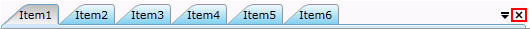{border="0"}

Figure 794: Common type Close Button[]{style="FONT-FAMILY: 'Calibri','sans-serif'; FONT-SIZE: 12pt"}

[                                    ** **]{style="FONT-FAMILY: 'Calibri','sans-serif'; FONT-SIZE: 12pt"}

1.1.1.1.1.1.70     Individual

            If we select the CloseButtonType as individual, then the close button will show all the tab items. We can close the tab items by clicking the close buttons  individually.                                                                         

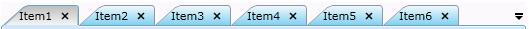{border="0"}

Figure 795: Individual type Close Button[]{style="FONT-FAMILY: 'Calibri','sans-serif'; FONT-SIZE: 12pt"}

[                        ** **]{style="FONT-FAMILY: 'Calibri','sans-serif'; FONT-SIZE: 12pt"}

1.1.1.1.1.1.71     Both

            If the CloseButtonType is *Both*, then the close button will show on common and individual also.

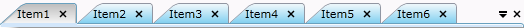{border="0"}

Figure 796: Close Button on Both type[]{style="FONT-FAMILY: 'Calibri','sans-serif'; FONT-SIZE: 12pt"}

[                                    ** **]{style="FONT-FAMILY: 'Calibri','sans-serif'; FONT-SIZE: 12pt"}

1.1.1.1.1.1.72     IndividualOnMouseOver

            In this type, the close button will show when we move the mouse on the Tab Item. The common close button will not show.

1.1.1.1.1.1.73     Hide

            If the user wants to hide the close button visibility on the control, then select the closeButtonType as hide.

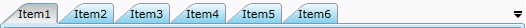{border="0"}

Figure 797: Hide type Close Button[]{style="FONT-FAMILY: 'Calibri','sans-serif'; FONT-SIZE: 12pt"}

**[                         ]{style="FONT-FAMILY: 'Calibri','sans-serif'; FONT-SIZE: 12pt"}**

###### []{#_TabStrip_Placement}TabStrip Placement

The Tab control supports four different modes of tab-strip placement. It helps the user place tab-strips at the left, lower, upper and right sides of the window.

The user may define the TabStripPlacement through xaml and code behind.

[]{style="FONT-FAMILY: 'Calibri','sans-serif'; FONT-SIZE: 12pt"} 

+-----------------------------------------------------------------------------------------------------------------------------------------------------------------------------------------------------------------------------------------------------------------------------------------------------------------------------------------------------------------------------------------------------------------------------------------------------------------------------------------------------------------------------------------------------------------------------------------------------------------------------------------------------------------------------------+
| **[\[XAML\]]{style="FONT-FAMILY: 'Courier New'"}**                                                                                                                                                                                                                                                                                                                                                                                                                                                                                                                                                                                                                                |
|                                                                                                                                                                                                                                                                                                                                                                                                                                                                                                                                                                                                                                                                                   |
| **[]{style="FONT-FAMILY: 'Courier New'"}**                                                                                                                                                                                                                                                                                                                                                                                                                                                                                                                                                                                                                                        |
|                                                                                                                                                                                                                                                                                                                                                                                                                                                                                                                                                                                                                                                                                   |
| [      \<]{style="FONT-FAMILY: 'Courier New'; COLOR: blue"}[syncfusion]{style="FONT-FAMILY: 'Courier New'; COLOR: #a31515"}[:]{style="FONT-FAMILY: 'Courier New'; COLOR: blue"}[TabControlAdv]{style="FONT-FAMILY: 'Courier New'; COLOR: #a31515"}[ x]{style="FONT-FAMILY: 'Courier New'; COLOR: red"}[:]{style="FONT-FAMILY: 'Courier New'; COLOR: blue"}[Name]{style="FONT-FAMILY: 'Courier New'; COLOR: red"}[=\"MyTabCtrl\"]{style="FONT-FAMILY: 'Courier New'; COLOR: blue"}[ TabStripPlacement]{style="FONT-FAMILY: 'Courier New'; COLOR: red"}[=\"Top\"]{style="FONT-FAMILY: 'Courier New'; COLOR: blue"}[ [ \>]{style="COLOR: blue"}]{style="FONT-FAMILY: 'Courier New'"} |
|                                                                                                                                                                                                                                                                                                                                                                                                                                                                                                                                                                                                                                                                                   |
| [            ]{style="FONT-FAMILY: 'Courier New'; COLOR: #a31515"}[\<]{style="FONT-FAMILY: 'Courier New'; COLOR: blue"}[syncfusion]{style="FONT-FAMILY: 'Courier New'; COLOR: #a31515"}[:]{style="FONT-FAMILY: 'Courier New'; COLOR: blue"}[TabItemAdv]{style="FONT-FAMILY: 'Courier New'; COLOR: #a31515"}[ Header]{style="FONT-FAMILY: 'Courier New'; COLOR: red"}[ =\"TabItemAdv1\"/\>]{style="FONT-FAMILY: 'Courier New'; COLOR: blue"}[]{style="FONT-FAMILY: 'Courier New'"}                                                                                                                                                                                                 |
|                                                                                                                                                                                                                                                                                                                                                                                                                                                                                                                                                                                                                                                                                   |
| [            ]{style="FONT-FAMILY: 'Courier New'; COLOR: #a31515"}[\<]{style="FONT-FAMILY: 'Courier New'; COLOR: blue"}[syncfusion]{style="FONT-FAMILY: 'Courier New'; COLOR: #a31515"}[:]{style="FONT-FAMILY: 'Courier New'; COLOR: blue"}[TabItemAdv]{style="FONT-FAMILY: 'Courier New'; COLOR: #a31515"}[ Header]{style="FONT-FAMILY: 'Courier New'; COLOR: red"}[=\"TabItemAdv2\"/\>]{style="FONT-FAMILY: 'Courier New'; COLOR: blue"}[]{style="FONT-FAMILY: 'Courier New'"}                                                                                                                                                                                                  |
|                                                                                                                                                                                                                                                                                                                                                                                                                                                                                                                                                                                                                                                                                   |
| [            ]{style="FONT-FAMILY: 'Courier New'; COLOR: #a31515"}[\<]{style="FONT-FAMILY: 'Courier New'; COLOR: blue"}[ syncfusion]{style="FONT-FAMILY: 'Courier New'; COLOR: #a31515"}[:]{style="FONT-FAMILY: 'Courier New'; COLOR: blue"}[TabItemAdv]{style="FONT-FAMILY: 'Courier New'; COLOR: #a31515"}[ Header]{style="FONT-FAMILY: 'Courier New'; COLOR: red"}[=\"TabItemAdv3\"/\>]{style="FONT-FAMILY: 'Courier New'; COLOR: blue"}[]{style="FONT-FAMILY: 'Courier New'"}                                                                                                                                                                                                 |
|                                                                                                                                                                                                                                                                                                                                                                                                                                                                                                                                                                                                                                                                                   |
| [            ]{style="FONT-FAMILY: 'Courier New'; COLOR: #a31515"}[\<]{style="FONT-FAMILY: 'Courier New'; COLOR: blue"}[ syncfusion]{style="FONT-FAMILY: 'Courier New'; COLOR: #a31515"}[:]{style="FONT-FAMILY: 'Courier New'; COLOR: blue"}[TabItemAdv]{style="FONT-FAMILY: 'Courier New'; COLOR: #a31515"}[ Header]{style="FONT-FAMILY: 'Courier New'; COLOR: red"}[=\"TabItemAdv4\"/\>]{style="FONT-FAMILY: 'Courier New'; COLOR: blue"}[]{style="FONT-FAMILY: 'Courier New'"}                                                                                                                                                                                                 |
|                                                                                                                                                                                                                                                                                                                                                                                                                                                                                                                                                                                                                                                                                   |
| [            ]{style="FONT-FAMILY: 'Courier New'; COLOR: #a31515"}[\<]{style="FONT-FAMILY: 'Courier New'; COLOR: blue"}[ syncfusion]{style="FONT-FAMILY: 'Courier New'; COLOR: #a31515"}[:]{style="FONT-FAMILY: 'Courier New'; COLOR: blue"}[TabItemAdv]{style="FONT-FAMILY: 'Courier New'; COLOR: #a31515"}[ Header]{style="FONT-FAMILY: 'Courier New'; COLOR: red"}[=\"TabItemAdv5\"/\>]{style="FONT-FAMILY: 'Courier New'; COLOR: blue"}[              ]{style="FONT-FAMILY: 'Courier New'; COLOR: #a31515"}[]{style="FONT-FAMILY: 'Courier New'"}                                                                                                                             |
|                                                                                                                                                                                                                                                                                                                                                                                                                                                                                                                                                                                                                                                                                   |
| [        ]{style="FONT-FAMILY: 'Courier New'; COLOR: #a31515"}[\</]{style="FONT-FAMILY: 'Courier New'; COLOR: blue"}[ syncfusion]{style="FONT-FAMILY: 'Courier New'; COLOR: #a31515"}[:]{style="FONT-FAMILY: 'Courier New'; COLOR: blue"}[TabControlAdv]{style="FONT-FAMILY: 'Courier New'; COLOR: #a31515"}[\>]{style="FONT-FAMILY: 'Courier New'; COLOR: blue"}                                                                                                                                                                                                                                                                                                                 |
|                                                                                                                                                                                                                                                                                                                                                                                                                                                                                                                                                                                                                                                                                   |
| **[]{style="FONT-FAMILY: 'Courier New'"}**                                                                                                                                                                                                                                                                                                                                                                                                                                                                                                                                                                                                                                        |
+-----------------------------------------------------------------------------------------------------------------------------------------------------------------------------------------------------------------------------------------------------------------------------------------------------------------------------------------------------------------------------------------------------------------------------------------------------------------------------------------------------------------------------------------------------------------------------------------------------------------------------------------------------------------------------------+

[]{style="FONT-FAMILY: 'Calibri','sans-serif'; FONT-SIZE: 12pt"} 

+--------------------------------------------------------------------------------------------------------------------------------------------------------------------+
| **[\[C#\]]{style="FONT-FAMILY: 'Courier New'"}**                                                                                                                   |
|                                                                                                                                                                    |
| [   [TabControlAdv]{style="COLOR: #2b91af"} MyTabCtrl = [new]{style="COLOR: blue"} [TabControlAdv]{style="COLOR: #2b91af"}();]{style="FONT-FAMILY: 'Courier New'"} |
|                                                                                                                                                                    |
| [     MyTabCtrl.TabStripPlacement = [TabStripPlacement]{style="COLOR: #2b91af"}.Top;]{style="FONT-FAMILY: 'Courier New'"}                                          |
|                                                                                                                                                                    |
| **[]{style="FONT-FAMILY: 'Courier New'"}**                                                                                                                         |
+--------------------------------------------------------------------------------------------------------------------------------------------------------------------+

[]{style="FONT-FAMILY: 'Calibri','sans-serif'; FONT-SIZE: 12pt"} 

[]{style="FONT-FAMILY: 'Calibri','sans-serif'; FONT-SIZE: 12pt"} 

1.1.1.1.1.1.74     Left TabStrip Placement

[]{style="FONT-FAMILY: 'Calibri','sans-serif'; FONT-SIZE: 12pt"} 

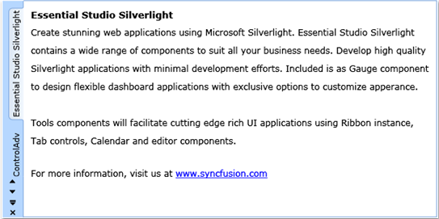{border="0"}

Figure 798: Left Placement[]{style="FONT-FAMILY: 'Calibri','sans-serif'; FONT-SIZE: 12pt"}

[                                    ** **]{style="FONT-FAMILY: 'Calibri','sans-serif'; FONT-SIZE: 12pt"}

[]{style="FONT-FAMILY: 'Calibri','sans-serif'; FONT-SIZE: 12pt"} 

[]{style="FONT-FAMILY: 'Calibri','sans-serif'; FONT-SIZE: 12pt"} 

[]{style="FONT-FAMILY: 'Calibri','sans-serif'; FONT-SIZE: 12pt"} 

[]{style="FONT-FAMILY: 'Calibri','sans-serif'; FONT-SIZE: 12pt"} 

1.1.1.1.1.1.75     Right TabStrip Placement

[]{style="FONT-FAMILY: 'Calibri','sans-serif'; FONT-SIZE: 12pt"} 

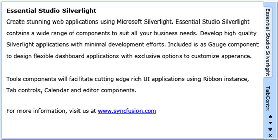{border="0"}

Figure 799: Right Placement[]{style="FONT-FAMILY: 'Calibri','sans-serif'; FONT-SIZE: 12pt"}

[            ** **]{style="FONT-FAMILY: 'Calibri','sans-serif'; FONT-SIZE: 12pt"}

1.1.1.1.1.1.76     Top TabStrip Placement

[]{style="FONT-FAMILY: 'Calibri','sans-serif'; FONT-SIZE: 12pt"} 

[                                          ]{style="FONT-FAMILY: 'Calibri','sans-serif'; FONT-SIZE: 12pt"}

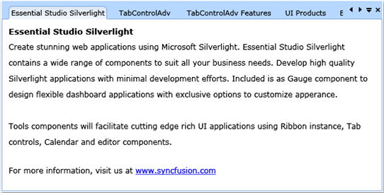{border="0"}

Figure 800: Top Placement[]{style="FONT-FAMILY: 'Calibri','sans-serif'; FONT-SIZE: 12pt"}

**[             ]{style="FONT-FAMILY: 'Calibri','sans-serif'; FONT-SIZE: 12pt"}**

1.1.1.1.1.1.77     Bottom TabStrip Placement                                                                                                                        

[                        ]{style="FONT-FAMILY: 'Calibri','sans-serif'; FONT-SIZE: 12pt"}

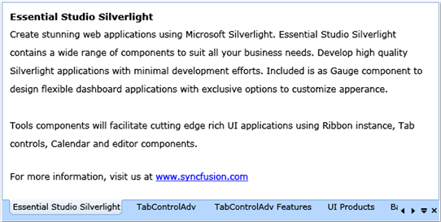{border="0"}

Figure 801: Bottom Placement[]{style="FONT-FAMILY: 'Calibri','sans-serif'; FONT-SIZE: 12pt"}

###### []{#_TabItemSize_Modes}TabItemSize Modes

[]{style="FONT-FAMILY: 'Calibri','sans-serif'"} 

            This feature having a facility to shrink the tab item header content into a visual area will have many items in TabControl. At that time, all the tab items could be visible in the given area. By this property, the user can shrink the content into the visible area.

1.1.1.1.1.1.78     Normal

            In this mode of TabItemSize, all tab items will show in normal visualization. It means the header content will display in full length.

[]{style="FONT-FAMILY: 'Calibri','sans-serif'; FONT-SIZE: 12pt"} 

+-------------------------------------------------------------------------------------------------------------------------------------------------------------------------------------------------------------------------------------------------------------------------------------------------------------------------------------------------------------------------------------------------------------------------------------------------------------------------------------------------------------------------------------------------------------------------------------------------------------------------------------------------------------------+
| **[\[XAML\]]{style="FONT-FAMILY: 'Courier New'"}**                                                                                                                                                                                                                                                                                                                                                                                                                                                                                                                                                                                                                |
|                                                                                                                                                                                                                                                                                                                                                                                                                                                                                                                                                                                                                                                                   |
| [\<]{style="FONT-FAMILY: 'Courier New'; COLOR: blue"}[syncfusion]{style="FONT-FAMILY: 'Courier New'; COLOR: #a31515"}[:]{style="FONT-FAMILY: 'Courier New'; COLOR: blue"}[TabControlAdv]{style="FONT-FAMILY: 'Courier New'; COLOR: #a31515"}[ x]{style="FONT-FAMILY: 'Courier New'; COLOR: red"}[:]{style="FONT-FAMILY: 'Courier New'; COLOR: blue"}[Name]{style="FONT-FAMILY: 'Courier New'; COLOR: red"}[=\"MyTabCtrl\"]{style="FONT-FAMILY: 'Courier New'; COLOR: blue"}[ TabStripPlacement]{style="FONT-FAMILY: 'Courier New'; COLOR: red"}[=\"Top\"]{style="FONT-FAMILY: 'Courier New'; COLOR: blue"}[     ]{style="FONT-FAMILY: 'Courier New'; COLOR: red"} |
|                                                                                                                                                                                                                                                                                                                                                                                                                                                                                                                                                                                                                                                                   |
| [                                                     TabItemSizeMode]{style="FONT-FAMILY: 'Courier New'; COLOR: red"}[=\"Normal\" \>]{style="FONT-FAMILY: 'Courier New'; COLOR: blue"}[]{style="FONT-FAMILY: 'Courier New'"}                                                                                                                                                                                                                                                                                                                                                                                                                                     |
|                                                                                                                                                                                                                                                                                                                                                                                                                                                                                                                                                                                                                                                                   |
| [           ]{style="FONT-FAMILY: 'Courier New'; COLOR: #a31515"}[\<]{style="FONT-FAMILY: 'Courier New'; COLOR: blue"}[syncfusion]{style="FONT-FAMILY: 'Courier New'; COLOR: #a31515"}[:]{style="FONT-FAMILY: 'Courier New'; COLOR: blue"}[TabItemAdv]{style="FONT-FAMILY: 'Courier New'; COLOR: #a31515"}[ Header]{style="FONT-FAMILY: 'Courier New'; COLOR: red"}[ =\"TabItemAdv1\"/\>]{style="FONT-FAMILY: 'Courier New'; COLOR: blue"}[]{style="FONT-FAMILY: 'Courier New'"}                                                                                                                                                                                  |
|                                                                                                                                                                                                                                                                                                                                                                                                                                                                                                                                                                                                                                                                   |
| [            ]{style="FONT-FAMILY: 'Courier New'; COLOR: #a31515"}[\<]{style="FONT-FAMILY: 'Courier New'; COLOR: blue"}[syncfusion]{style="FONT-FAMILY: 'Courier New'; COLOR: #a31515"}[:]{style="FONT-FAMILY: 'Courier New'; COLOR: blue"}[TabItemAdv]{style="FONT-FAMILY: 'Courier New'; COLOR: #a31515"}[ Header]{style="FONT-FAMILY: 'Courier New'; COLOR: red"}[=\"TabItemAdv2\"/\>]{style="FONT-FAMILY: 'Courier New'; COLOR: blue"}[]{style="FONT-FAMILY: 'Courier New'"}                                                                                                                                                                                  |
|                                                                                                                                                                                                                                                                                                                                                                                                                                                                                                                                                                                                                                                                   |
| [            ]{style="FONT-FAMILY: 'Courier New'; COLOR: #a31515"}[\<]{style="FONT-FAMILY: 'Courier New'; COLOR: blue"}[syncfusion]{style="FONT-FAMILY: 'Courier New'; COLOR: #a31515"}[:]{style="FONT-FAMILY: 'Courier New'; COLOR: blue"}[TabItemAdv]{style="FONT-FAMILY: 'Courier New'; COLOR: #a31515"}[ Header]{style="FONT-FAMILY: 'Courier New'; COLOR: red"}[=\"TabItemAdv3\"/\>]{style="FONT-FAMILY: 'Courier New'; COLOR: blue"}[]{style="FONT-FAMILY: 'Courier New'"}                                                                                                                                                                                  |
|                                                                                                                                                                                                                                                                                                                                                                                                                                                                                                                                                                                                                                                                   |
| [            ]{style="FONT-FAMILY: 'Courier New'; COLOR: #a31515"}[\<]{style="FONT-FAMILY: 'Courier New'; COLOR: blue"}[syncfusion]{style="FONT-FAMILY: 'Courier New'; COLOR: #a31515"}[:]{style="FONT-FAMILY: 'Courier New'; COLOR: blue"}[TabItemAdv]{style="FONT-FAMILY: 'Courier New'; COLOR: #a31515"}[ Header]{style="FONT-FAMILY: 'Courier New'; COLOR: red"}[=\"TabItemAdv4\"/\>]{style="FONT-FAMILY: 'Courier New'; COLOR: blue"}[]{style="FONT-FAMILY: 'Courier New'"}                                                                                                                                                                                  |
|                                                                                                                                                                                                                                                                                                                                                                                                                                                                                                                                                                                                                                                                   |
| [            ]{style="FONT-FAMILY: 'Courier New'; COLOR: #a31515"}[\<]{style="FONT-FAMILY: 'Courier New'; COLOR: blue"}[syncfusion]{style="FONT-FAMILY: 'Courier New'; COLOR: #a31515"}[:]{style="FONT-FAMILY: 'Courier New'; COLOR: blue"}[TabItemAdv]{style="FONT-FAMILY: 'Courier New'; COLOR: #a31515"}[ Header]{style="FONT-FAMILY: 'Courier New'; COLOR: red"}[=\"TabItemAdv5\"/\>]{style="FONT-FAMILY: 'Courier New'; COLOR: blue"}[        ]{style="FONT-FAMILY: 'Courier New'; COLOR: #a31515"}[]{style="FONT-FAMILY: 'Courier New'"}                                                                                                                    |
|                                                                                                                                                                                                                                                                                                                                                                                                                                                                                                                                                                                                                                                                   |
| [        ]{style="FONT-FAMILY: 'Courier New'; COLOR: #a31515"}[\</]{style="FONT-FAMILY: 'Courier New'; COLOR: blue"}[syncfusion]{style="FONT-FAMILY: 'Courier New'; COLOR: #a31515"}[:]{style="FONT-FAMILY: 'Courier New'; COLOR: blue"}[TabControlAdv]{style="FONT-FAMILY: 'Courier New'; COLOR: #a31515"}[\>]{style="FONT-FAMILY: 'Courier New'; COLOR: blue"}                                                                                                                                                                                                                                                                                                  |
|                                                                                                                                                                                                                                                                                                                                                                                                                                                                                                                                                                                                                                                                   |
| **[]{style="FONT-FAMILY: 'Courier New'"}**                                                                                                                                                                                                                                                                                                                                                                                                                                                                                                                                                                                                                        |
+-------------------------------------------------------------------------------------------------------------------------------------------------------------------------------------------------------------------------------------------------------------------------------------------------------------------------------------------------------------------------------------------------------------------------------------------------------------------------------------------------------------------------------------------------------------------------------------------------------------------------------------------------------------------+

[]{style="FONT-FAMILY: 'Calibri','sans-serif'; FONT-SIZE: 12pt"} 

+----------------------------------------------------------------------------------------------------------------------------------------------------------------------------------------------------+
| **[\[C#\]]{style="FONT-FAMILY: 'Courier New'"}**                                                                                                                                                   |
|                                                                                                                                                                                                    |
| [       TabControlAdv]{style="FONT-FAMILY: 'Courier New'; COLOR: #2b91af"}[ MyTabCtrl = [new]{style="COLOR: blue"} [TabControlAdv]{style="COLOR: #2b91af"}();]{style="FONT-FAMILY: 'Courier New'"} |
|                                                                                                                                                                                                    |
| [            MyTabCtrl.TabStripPlacement = [TabStripPlacement]{style="COLOR: #2b91af"}.Top;]{style="FONT-FAMILY: 'Courier New'"}                                                                   |
|                                                                                                                                                                                                    |
| [            MyTabCtrl.TabItemSizeMode = [TabItemSizeMode]{style="COLOR: #2b91af"}.Normal;]{style="FONT-FAMILY: 'Courier New'"}                                                                    |
+----------------------------------------------------------------------------------------------------------------------------------------------------------------------------------------------------+

[]{style="FONT-FAMILY: 'Calibri','sans-serif'; FONT-SIZE: 12pt"} 

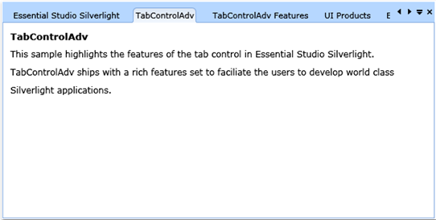{border="0"}

Figure 802: Normal TabItemSize mode[]{style="FONT-FAMILY: 'Calibri','sans-serif'; FONT-SIZE: 12pt"}

[                        ** **]{style="FONT-FAMILY: 'Calibri','sans-serif'; FONT-SIZE: 12pt"}

1.1.1.1.1.1.79     ShrinkToFit

            In this mode of TabItemSize, all tab items will show in the visible area by shrinking its sizes. The header of each item will shrink respect to the visual area of the Tap Panel. Syncfusion Tab Control is the only tabcontrol in the market that allows you to customize the header by shrinking it.

[]{style="FONT-FAMILY: 'Calibri','sans-serif'; FONT-SIZE: 12pt"} 

+-------------------------------------------------------------------------------------------------------------------------------------------------------------------------------------------------------------------------------------------------------------------------------------------------------------------------------------------------------------------------------------------------------------------------------------------------------------------------------------------------------------------------------------------------------------------------------------------------------------------------------------------------------------------+
| **[\[XAML\]]{style="FONT-FAMILY: 'Courier New'"}**                                                                                                                                                                                                                                                                                                                                                                                                                                                                                                                                                                                                                |
|                                                                                                                                                                                                                                                                                                                                                                                                                                                                                                                                                                                                                                                                   |
| [\<]{style="FONT-FAMILY: 'Courier New'; COLOR: blue"}[syncfusion]{style="FONT-FAMILY: 'Courier New'; COLOR: #a31515"}[:]{style="FONT-FAMILY: 'Courier New'; COLOR: blue"}[TabControlAdv]{style="FONT-FAMILY: 'Courier New'; COLOR: #a31515"}[ x]{style="FONT-FAMILY: 'Courier New'; COLOR: red"}[:]{style="FONT-FAMILY: 'Courier New'; COLOR: blue"}[Name]{style="FONT-FAMILY: 'Courier New'; COLOR: red"}[=\"MyTabCtrl\"]{style="FONT-FAMILY: 'Courier New'; COLOR: blue"}[ TabStripPlacement]{style="FONT-FAMILY: 'Courier New'; COLOR: red"}[=\"Top\"]{style="FONT-FAMILY: 'Courier New'; COLOR: blue"}[     ]{style="FONT-FAMILY: 'Courier New'; COLOR: red"} |
|                                                                                                                                                                                                                                                                                                                                                                                                                                                                                                                                                                                                                                                                   |
| [                                                     TabItemSizeMode]{style="FONT-FAMILY: 'Courier New'; COLOR: red"}[=\"ShrinkToFit\" \>]{style="FONT-FAMILY: 'Courier New'; COLOR: blue"}[]{style="FONT-FAMILY: 'Courier New'"}                                                                                                                                                                                                                                                                                                                                                                                                                                |
|                                                                                                                                                                                                                                                                                                                                                                                                                                                                                                                                                                                                                                                                   |
| [           ]{style="FONT-FAMILY: 'Courier New'; COLOR: #a31515"}[\<]{style="FONT-FAMILY: 'Courier New'; COLOR: blue"}[syncfusion]{style="FONT-FAMILY: 'Courier New'; COLOR: #a31515"}[:]{style="FONT-FAMILY: 'Courier New'; COLOR: blue"}[TabItemAdv]{style="FONT-FAMILY: 'Courier New'; COLOR: #a31515"}[ Header]{style="FONT-FAMILY: 'Courier New'; COLOR: red"}[ =\"TabItemAdv1\"/\>]{style="FONT-FAMILY: 'Courier New'; COLOR: blue"}[]{style="FONT-FAMILY: 'Courier New'"}                                                                                                                                                                                  |
|                                                                                                                                                                                                                                                                                                                                                                                                                                                                                                                                                                                                                                                                   |
| [            ]{style="FONT-FAMILY: 'Courier New'; COLOR: #a31515"}[\<]{style="FONT-FAMILY: 'Courier New'; COLOR: blue"}[syncfusion]{style="FONT-FAMILY: 'Courier New'; COLOR: #a31515"}[:]{style="FONT-FAMILY: 'Courier New'; COLOR: blue"}[TabItemAdv]{style="FONT-FAMILY: 'Courier New'; COLOR: #a31515"}[ Header]{style="FONT-FAMILY: 'Courier New'; COLOR: red"}[=\"TabItemAdv2\"/\>]{style="FONT-FAMILY: 'Courier New'; COLOR: blue"}[]{style="FONT-FAMILY: 'Courier New'"}                                                                                                                                                                                  |
|                                                                                                                                                                                                                                                                                                                                                                                                                                                                                                                                                                                                                                                                   |
| [            ]{style="FONT-FAMILY: 'Courier New'; COLOR: #a31515"}[\<]{style="FONT-FAMILY: 'Courier New'; COLOR: blue"}[syncfusion]{style="FONT-FAMILY: 'Courier New'; COLOR: #a31515"}[:]{style="FONT-FAMILY: 'Courier New'; COLOR: blue"}[TabItemAdv]{style="FONT-FAMILY: 'Courier New'; COLOR: #a31515"}[ Header]{style="FONT-FAMILY: 'Courier New'; COLOR: red"}[=\"TabItemAdv3\"/\>]{style="FONT-FAMILY: 'Courier New'; COLOR: blue"}[]{style="FONT-FAMILY: 'Courier New'"}                                                                                                                                                                                  |
|                                                                                                                                                                                                                                                                                                                                                                                                                                                                                                                                                                                                                                                                   |
| [            ]{style="FONT-FAMILY: 'Courier New'; COLOR: #a31515"}[\<]{style="FONT-FAMILY: 'Courier New'; COLOR: blue"}[syncfusion]{style="FONT-FAMILY: 'Courier New'; COLOR: #a31515"}[:]{style="FONT-FAMILY: 'Courier New'; COLOR: blue"}[TabItemAdv]{style="FONT-FAMILY: 'Courier New'; COLOR: #a31515"}[ Header]{style="FONT-FAMILY: 'Courier New'; COLOR: red"}[=\"TabItemAdv4\"/\>]{style="FONT-FAMILY: 'Courier New'; COLOR: blue"}[]{style="FONT-FAMILY: 'Courier New'"}                                                                                                                                                                                  |
|                                                                                                                                                                                                                                                                                                                                                                                                                                                                                                                                                                                                                                                                   |
| [            ]{style="FONT-FAMILY: 'Courier New'; COLOR: #a31515"}[\<]{style="FONT-FAMILY: 'Courier New'; COLOR: blue"}[syncfusion]{style="FONT-FAMILY: 'Courier New'; COLOR: #a31515"}[:]{style="FONT-FAMILY: 'Courier New'; COLOR: blue"}[TabItemAdv]{style="FONT-FAMILY: 'Courier New'; COLOR: #a31515"}[ Header]{style="FONT-FAMILY: 'Courier New'; COLOR: red"}[=\"TabItemAdv5\"/\>]{style="FONT-FAMILY: 'Courier New'; COLOR: blue"}[        ]{style="FONT-FAMILY: 'Courier New'; COLOR: #a31515"}[]{style="FONT-FAMILY: 'Courier New'"}                                                                                                                    |
|                                                                                                                                                                                                                                                                                                                                                                                                                                                                                                                                                                                                                                                                   |
| [        ]{style="FONT-FAMILY: 'Courier New'; COLOR: #a31515"}[\</]{style="FONT-FAMILY: 'Courier New'; COLOR: blue"}[syncfusion]{style="FONT-FAMILY: 'Courier New'; COLOR: #a31515"}[:]{style="FONT-FAMILY: 'Courier New'; COLOR: blue"}[TabControlAdv]{style="FONT-FAMILY: 'Courier New'; COLOR: #a31515"}[\>]{style="FONT-FAMILY: 'Courier New'; COLOR: blue"}                                                                                                                                                                                                                                                                                                  |
|                                                                                                                                                                                                                                                                                                                                                                                                                                                                                                                                                                                                                                                                   |
| **[]{style="FONT-FAMILY: 'Courier New'"}**                                                                                                                                                                                                                                                                                                                                                                                                                                                                                                                                                                                                                        |
+-------------------------------------------------------------------------------------------------------------------------------------------------------------------------------------------------------------------------------------------------------------------------------------------------------------------------------------------------------------------------------------------------------------------------------------------------------------------------------------------------------------------------------------------------------------------------------------------------------------------------------------------------------------------+

[]{style="FONT-FAMILY: 'Calibri','sans-serif'; FONT-SIZE: 12pt"} 

+----------------------------------------------------------------------------------------------------------------------------------------------------------------------------------------------------+
| **[\[C#\]]{style="FONT-FAMILY: 'Courier New'"}**                                                                                                                                                   |
|                                                                                                                                                                                                    |
| [       TabControlAdv]{style="FONT-FAMILY: 'Courier New'; COLOR: #2b91af"}[ MyTabCtrl = [new]{style="COLOR: blue"} [TabControlAdv]{style="COLOR: #2b91af"}();]{style="FONT-FAMILY: 'Courier New'"} |
|                                                                                                                                                                                                    |
| [            MyTabCtrl.TabStripPlacement = [TabStripPlacement]{style="COLOR: #2b91af"}.Top;]{style="FONT-FAMILY: 'Courier New'"}                                                                   |
|                                                                                                                                                                                                    |
| [            MyTabCtrl.TabItemSizeMode = [TabItemSizeMode]{style="COLOR: #2b91af"}.ShrinkToFit;]{style="FONT-FAMILY: 'Courier New'"}                                                               |
+----------------------------------------------------------------------------------------------------------------------------------------------------------------------------------------------------+

[                                               ]{style="FONT-FAMILY: 'Calibri','sans-serif'; FONT-SIZE: 12pt"}

[                                          ]{style="FONT-FAMILY: 'Calibri','sans-serif'; FONT-SIZE: 12pt"}

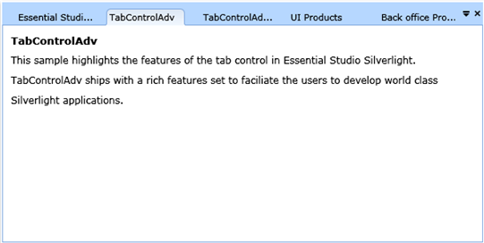{border="0"}

Figure 803: ShrinkToFit TabItemSize mode

[                        ** **]{style="FONT-FAMILY: 'Calibri','sans-serif'; FONT-SIZE: 12pt"}

###### []{#_Scrolling__Support}Scrolling Support

[]{style="FONT-FAMILY: 'Calibri','sans-serif'; FONT-SIZE: 12pt"} 

Scrolling Support in this control is used to navigate the tab items easily. We can customize the Scrolling button by making it Normal or Extended style.

            The user can navigate the tab items by scrolling the items. The Scroll bar buttons are used to navigate different items quickly. We can make the Scrolling speed variation while scrolling the tab items. This will look like an animation.

+---------------------------------------------------------------------------------------------------------------------------------------------------------------------------------------------------------------------------------------------------------------------------------------------------------------------------------------------------------------------------------------------------------------------------------------------------------------------------------------------------------------------------------------------------------------------------------------------------------------------------------------------------------------------------------------------------------------------------------------------------------------------------------------------------------------------------------------------------------------------------+
| **[\[Xaml\]]{style="FONT-FAMILY: 'Courier New'"}**                                                                                                                                                                                                                                                                                                                                                                                                                                                                                                                                                                                                                                                                                                                                                                                                                        |
|                                                                                                                                                                                                                                                                                                                                                                                                                                                                                                                                                                                                                                                                                                                                                                                                                                                                           |
| [\<]{style="FONT-FAMILY: 'Courier New'; COLOR: blue"}[syncfusion]{style="FONT-FAMILY: 'Courier New'; COLOR: #a31515"}[:]{style="FONT-FAMILY: 'Courier New'; COLOR: blue"}[TabControlAdv]{style="FONT-FAMILY: 'Courier New'; COLOR: #a31515"}[ Name]{style="FONT-FAMILY: 'Courier New'; COLOR: red"}[=\"MyTabCtrl\"]{style="FONT-FAMILY: 'Courier New'; COLOR: blue"}[ Height]{style="FONT-FAMILY: 'Courier New'; COLOR: red"}[=\"250\"]{style="FONT-FAMILY: 'Courier New'; COLOR: blue"}[ Width]{style="FONT-FAMILY: 'Courier New'; COLOR: red"}[=\"250\"]{style="FONT-FAMILY: 'Courier New'; COLOR: blue"}[ TabScrollStyle]{style="FONT-FAMILY: 'Courier New'; COLOR: red"}[=\"Extended\"]{style="FONT-FAMILY: 'Courier New'; COLOR: blue"}[ ScrollingTime]{style="FONT-FAMILY: 'Courier New'; COLOR: red"}[=\"150\"\>]{style="FONT-FAMILY: 'Courier New'; COLOR: blue"} |
|                                                                                                                                                                                                                                                                                                                                                                                                                                                                                                                                                                                                                                                                                                                                                                                                                                                                           |
| []{style="FONT-FAMILY: 'Courier New'"}                                                                                                                                                                                                                                                                                                                                                                                                                                                                                                                                                                                                                                                                                                                                                                                                                                    |
+---------------------------------------------------------------------------------------------------------------------------------------------------------------------------------------------------------------------------------------------------------------------------------------------------------------------------------------------------------------------------------------------------------------------------------------------------------------------------------------------------------------------------------------------------------------------------------------------------------------------------------------------------------------------------------------------------------------------------------------------------------------------------------------------------------------------------------------------------------------------------+

[]{style="FONT-FAMILY: 'Calibri','sans-serif'; FONT-SIZE: 12pt"} 

+---------------------------------------------------------------------------------------------------------------------------------------------------------------------------+
| **[\[C#\]]{style="FONT-FAMILY: 'Courier New'"}**                                                                                                                          |
|                                                                                                                                                                           |
| [this]{style="FONT-FAMILY: 'Courier New'; COLOR: blue"}[.MyTabCtrl.TabScrollStyle = [TabScrollStyle]{style="COLOR: #2b91af"}.Normal;]{style="FONT-FAMILY: 'Courier New'"} |
|                                                                                                                                                                           |
| [//To enter the Scrolling Time in milli seconds - 150 milli seconds]{style="FONT-FAMILY: 'Courier New'; COLOR: green"}[]{style="FONT-FAMILY: 'Courier New'"}              |
|                                                                                                                                                                           |
| [this]{style="FONT-FAMILY: 'Courier New'; COLOR: blue"}[.MyTabCtrl.ScrollingTime = 150;]{style="FONT-FAMILY: 'Courier New'"}                                              |
|                                                                                                                                                                           |
| **[]{style="FONT-FAMILY: 'Courier New'"}**                                                                                                                                |
+---------------------------------------------------------------------------------------------------------------------------------------------------------------------------+

[]{style="FONT-FAMILY: 'Calibri','sans-serif'; FONT-SIZE: 12pt"} 

1.1.1.1.1.1.80     Normal

In Normal style, Scrolling bars have only two buttons. Here , one button is for left navigation and other one is for right navigation.

{border="0"}

Figure 804: Normal Scrolling mode

[            ** **]{style="FONT-FAMILY: 'Calibri','sans-serif'; FONT-SIZE: 12pt"}

1.1.1.1.1.1.81     Extended

In an Extended style, the scrolling bar has six buttons. These buttons are used to navigate first item, last item, next page items, previous page items, previous item and next item.

[           ]{style="FONT-FAMILY: 'Calibri','sans-serif'; FONT-SIZE: 12pt"}

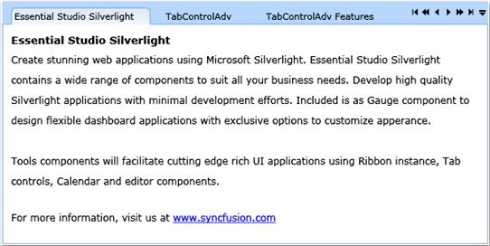{border="0"}

Figure 805: Extended Scrolling mode

[            ** **]{style="FONT-FAMILY: 'Calibri','sans-serif'; FONT-SIZE: 12pt"}

###### Visual Styles

Visual styles are available for *TabControlAdv*, which gives the rich and professional look and feel. The visual style for the *TabControlAdv* is set using the *VisualStyle* property. The following are some of the visual styles that can be applied to the TabControl.[]{style="FONT-FAMILY: 'Times New Roman','serif'"}

[]{style="FONT-FAMILY: 'Calibri','sans-serif'; FONT-SIZE: 12pt"} 

+-----------------------------------+--------------------------------------------------------+
| Property                          | Description                                            |
+-----------------------------------+--------------------------------------------------------+
| VisualStyle                       | [·      ]{style="FONT-FAMILY: Symbol"}Default          |
|                                   |                                                        |
|                                   | [·      ]{style="FONT-FAMILY: Symbol"}Blend            |
|                                   |                                                        |
|                                   | [·      ]{style="FONT-FAMILY: Symbol"}Office2007Blue   |
|                                   |                                                        |
|                                   | [·      ]{style="FONT-FAMILY: Symbol"}Office2007Black  |
|                                   |                                                        |
|                                   | [·      ]{style="FONT-FAMILY: Symbol"}Office2007Silver |
|                                   |                                                        |
|                                   | [·      ]{style="FONT-FAMILY: Symbol"}Office2010Blue   |
|                                   |                                                        |
|                                   | [·      ]{style="FONT-FAMILY: Symbol"}Office2010Black  |
|                                   |                                                        |
|                                   | [·      ]{style="FONT-FAMILY: Symbol"}Office2010Silver |
+-----------------------------------+--------------------------------------------------------+

[]{style="FONT-FAMILY: 'Calibri','sans-serif'; FONT-SIZE: 12pt"} 

Sample Screenshots:

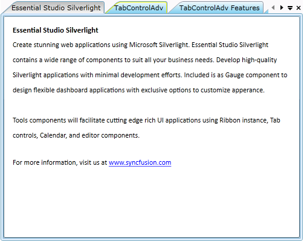{border="0"}

Figure 806: Default Style

**[]{style="FONT-FAMILY: 'Calibri','sans-serif'; FONT-SIZE: 12pt"}** 

**[]{style="FONT-FAMILY: 'Calibri','sans-serif'; FONT-SIZE: 12pt"}** 

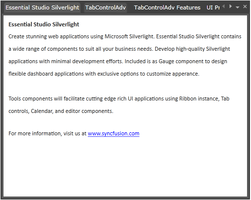{border="0"}

Figure 807: Blend Style

[]{style="FONT-FAMILY: 'Calibri','sans-serif'; FONT-SIZE: 12pt"} 

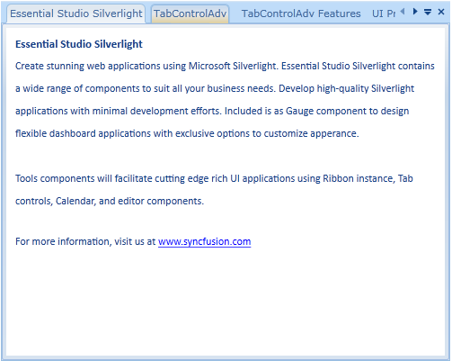{border="0"}

Figure 808: Office2007Blue Style

[]{style="FONT-FAMILY: 'Calibri','sans-serif'; FONT-SIZE: 12pt"} 

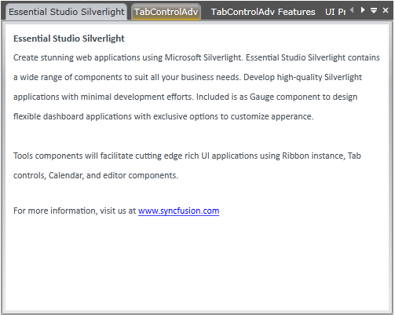{border="0"}

Figure 809: Office2007Black Style

**[]{style="FONT-FAMILY: 'Calibri','sans-serif'; FONT-SIZE: 12pt"}** 

**[]{style="FONT-FAMILY: 'Calibri','sans-serif'; FONT-SIZE: 12pt"}** 

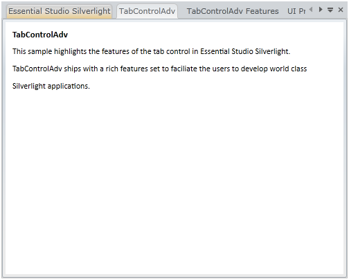{border="0"}

Figure 810: Office2007Silver Style

**[]{style="FONT-FAMILY: 'Calibri','sans-serif'; FONT-SIZE: 12pt"}** 

**[]{style="FONT-FAMILY: 'Calibri','sans-serif'; FONT-SIZE: 12pt"}** 

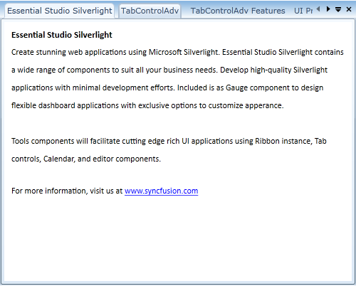{border="0"}

Figure 811: Office2010Blue Style

[]{style="FONT-FAMILY: 'Calibri','sans-serif'; FONT-SIZE: 12pt"} 

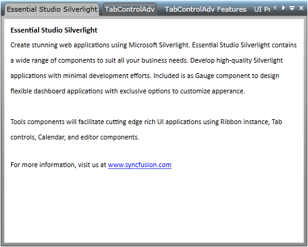{border="0"}

Figure 812: Office2010BlackStyle

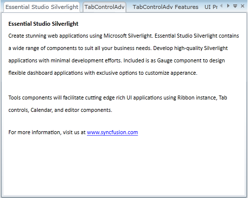{border="0"}

Figure 813: Office2010Silver Style

[                                               ** **]{style="FONT-FAMILY: 'Calibri','sans-serif'; FONT-SIZE: 12pt"}

[]{style="FONT-FAMILY: 'Calibri','sans-serif'; FONT-SIZE: 12pt"} 

###### Templating

1.1.1.1.1.1.82     Blend Support

            *TabControlAdv* is created in the sense of having support in blend. We can edit all properties of the control in Blend. This control has full customization to handle in blend with all its properties. User can easily define custom Visual States of each part of the control in blend.

 

The user can edit all TabControl properties in Blend. The TabControl properties are available in the Tab Control Properties tab on right side of the Blend window.

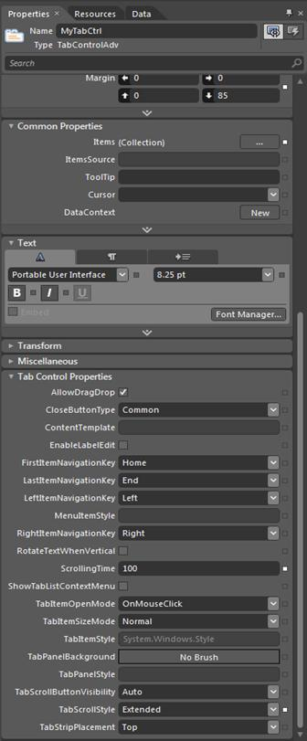{border="0"}

Figure 814: TabControlAdv properties

[                                                ** **]{style="FONT-FAMILY: 'Calibri','sans-serif'; FONT-SIZE: 12pt"}

Edit Visual States with Parts for Tab Control:

            The user can edit all propertites of the

1.   Right click the Tab Control and select *EditTemplate -\> Edit a Copy.*

*[]{style="FONT-FAMILY: 'Calibri','sans-serif'; FONT-SIZE: 12pt"}* 

*[]{style="FONT-FAMILY: 'Calibri','sans-serif'; FONT-SIZE: 12pt"}* 

**[]{style="FONT-FAMILY: 'Calibri','sans-serif'; FONT-SIZE: 12pt"}** 

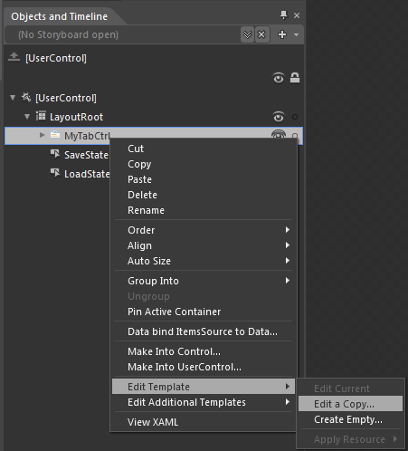{border="0"}

Figure 815: Edit TabControlAdv Template

[                                                ** **]{style="FONT-FAMILY: 'Calibri','sans-serif'; FONT-SIZE: 12pt"}

2.   The *Create Style Resource* dialog window will open to get the style name. Enter the custom style name in the Name field and click *OK*.

[]{style="FONT-FAMILY: 'Calibri','sans-serif'; FONT-SIZE: 12pt"} 

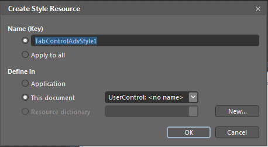{border="0"}

Figure 816: Give a Name for the Style

[                                    ** **]{style="FONT-FAMILY: 'Calibri','sans-serif'; FONT-SIZE: 12pt"}

3.   In the *States* tab, Tab Control visual states are shown. The user can change the visual state behavior for each part of the Tab Control.

[]{style="FONT-FAMILY: 'Calibri','sans-serif'; FONT-SIZE: 12pt"} 

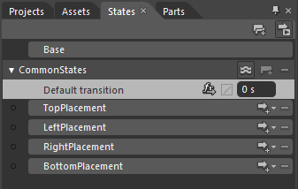{border="0"}

Figure 817: Visual States in TabControlAdv

[                                                ** **]{style="FONT-FAMILY: 'Calibri','sans-serif'; FONT-SIZE: 12pt"}

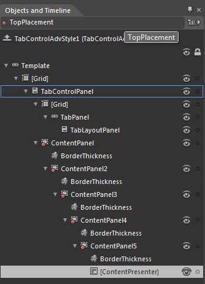{border="0"}

Figure 818: Parts in TabControlAdv

[                        ** **]{style="FONT-FAMILY: 'Calibri','sans-serif'; FONT-SIZE: 12pt"}

Users can customize Tab control using the following properties:

For Tab Item:

4.   Right-click the Tab Item and select *EditTemplate -\> Edit a Copy.*

[]{style="FONT-FAMILY: 'Calibri','sans-serif'; FONT-SIZE: 12pt"} 

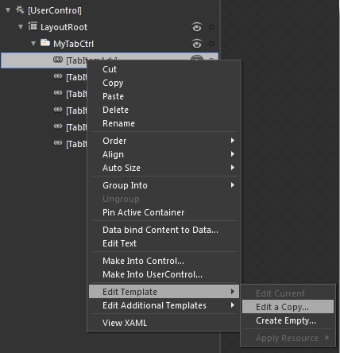{border="0"}

Figure 819: Edit TabItemAdv Template

[                                    ** **]{style="FONT-FAMILY: 'Calibri','sans-serif'; FONT-SIZE: 12pt"}

5.   *Create Style Resource dialog* window will open to get the style name. Enter your custom style name in the Name field and click *OK*.

\
                 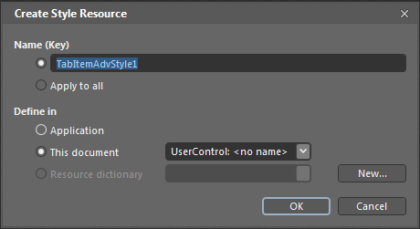{border="0"}

Figure 820: Give a Name for the Style

6.   In the States tab, the Tab item visual states are shown. Change the visual state behavior for each part of the Tab Item.

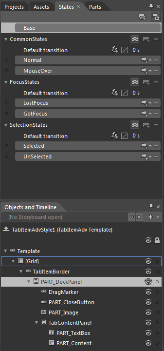{border="0"}

Figure 821: Visual States and Parts of TabItemAdv

[                                                ** **]{style="FONT-FAMILY: 'Calibri','sans-serif'; FONT-SIZE: 12pt"}

[]{#related-topics}
:::
