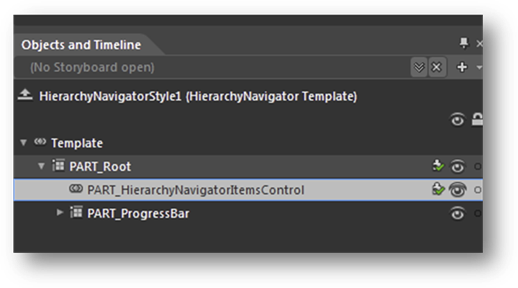
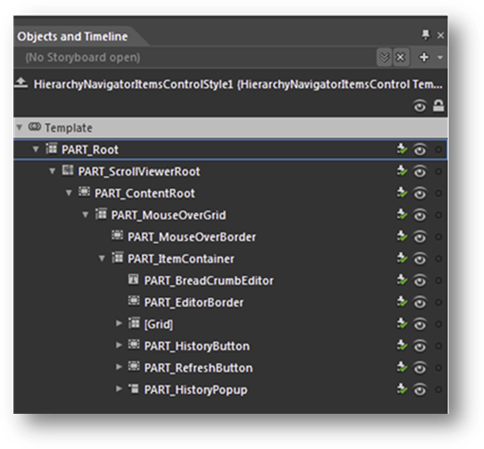
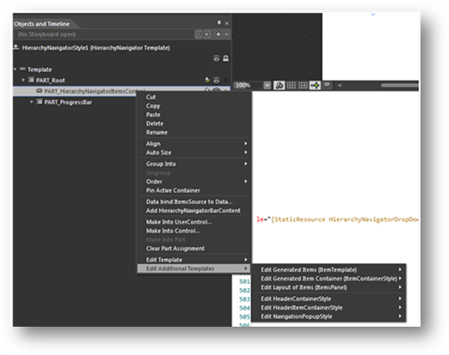
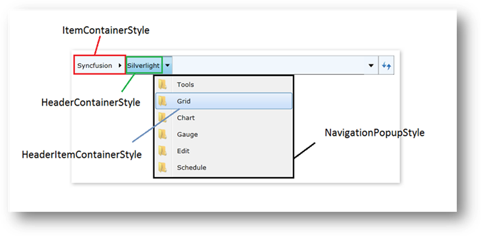
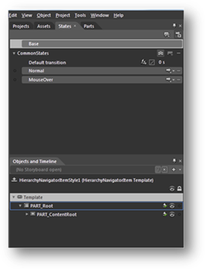
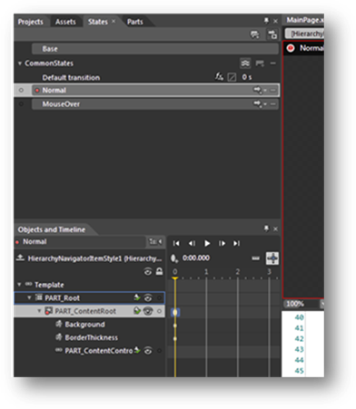

::: {style="DISPLAY: none"}
{#d2h_url_template}{#d2h_package_url style="WIDTH: 0px; DISPLAY: none; HEIGHT: 0px"}
:::

::: {.d2h_secondary_topic style="PADDING-BOTTOM: 10pt; MARGIN: 0pt; PADDING-LEFT: 0pt; PADDING-RIGHT: 0pt; PADDING-TOP: 0pt"}
#### [Customizing templates with MS Blend]{#_Ref262127604}

First, create a new application in Microsoft Blend (refer to Creating a HierarchicalNavigator control using Expression Blend).

1.   Once the new application has been created, right-click on the HierarchyNavigator control and choose **Edit**, then select **Style** and specify a name.

{border="0"}

Figure 1031: HierarchyNavigator in Blend

[]{style="FONT-FAMILY: 'Calibri','sans-serif'"} 

2.   Right-click on HierarchyNavigatorItemsControl; choose **Edit**, then **Template**, and select the **Edit a Copy** option to edit the Refresh button, the History button, or the overall content. Additional styles (templates) can be used to edit a template available in the **HierarchyNavigatorItemsControl** class.

{border="0"}

Figure 1032: HierarchyNavigatorItemsControl in Blend

3.   Right-click on **Part_HierarchyNavigatorItemsControl**; choose **Edit**, then **Additional Templates**. A list of additional styles to edit will be displayed; those style names are mentioned in **Error! Reference source not found.**4.

{border="0"}

Figure 1033: Edit Additional Templates

[]{style="FONT-FAMILY: 'Calibri','sans-serif'"} 

{border="0"} Figure 1034: Additional styles illustrated

4.   Storyboards, which are used in the VisualStateManager of every control, are easy to customize and manage. For example, the HierarchyNavigatorItem control has two states: Normal and MouseOver; they can be found in the States window, which can be reached by going to the **Window** menu and selecting **States**.

{border="0"}

Figure 1035: States window

5.   By clicking on the VisualState name, you can then edit the storyboard.

{border="0"}

Figure 1036: Editing the storyboard

**[]{style="FONT-FAMILY: 'Cambria','serif'; COLOR: #4f81bd"}** 

More:

[ ]{#related-topics}

[{border="0" align="absMiddle"}Customized sample styles](ms-xhelp:///?Id=f459e474-2e59-4b96-b9d3-cb95e2edd4cc){style="TEXT-DECORATION: none"}

[{border="0" align="absMiddle"}Sample XAML for ItemContainerStyle](ms-xhelp:///?Id=5107b513-faf6-4db3-bca5-a2f9b9d3bdbb){style="TEXT-DECORATION: none"}

[{border="0" align="absMiddle"}Sample XAML for NavigationPopupStyle](ms-xhelp:///?Id=9eb4d39f-0806-47ff-b7d2-06855102eff8){style="TEXT-DECORATION: none"}
:::
