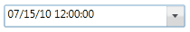

::: {style="DISPLAY: none"}
{#d2h_url_template}{#d2h_package_url style="WIDTH: 0px; DISPLAY: none; HEIGHT: 0px"}
:::

::: {.d2h_secondary_topic style="PADDING-BOTTOM: 10pt; MARGIN: 0pt; PADDING-LEFT: 0pt; PADDING-RIGHT: 0pt; PADDING-TOP: 0pt"}
#### []{#_DateTime_Format}DateTime Format

**DateTimeFormat** property defines the format to display date value in DateTimeEdit control. Using this property you can customize Standard datetime formats such as **YearMonthPattern**, **ShortTimePattern, ShortDatePattern, MonthDayPattern, LongTimePattern, LongDatePattern, FullDateTimePattern.[ ]{style="FONT-FAMILY: Consolas; FONT-SIZE: 9.5pt"}**

**[]{style="COLOR: green"}** 

+---------------------------------------------------------------------------------------------------------------------------------------------------------------------------------------------------------------------------------------------------------------------------------------------------------------------------------------------------------------------------------------------------------------------------------------------------------------------------------------------------------------------------------------------------------------------------------------------------------------------------------------------------------------------------------------------------------------------------------------------------------------------------------------------------------------------------------------------------------------------------------------------------------------------------------------------------------------------------------------------------------------------+
| [XAML[]{style="COLOR: green"}]{style="FONT-FAMILY: 'Courier New'"}                                                                                                                                                                                                                                                                                                                                                                                                                                                                                                                                                                                                                                                                                                                                                                                                                                                                                                                                                  |
+---------------------------------------------------------------------------------------------------------------------------------------------------------------------------------------------------------------------------------------------------------------------------------------------------------------------------------------------------------------------------------------------------------------------------------------------------------------------------------------------------------------------------------------------------------------------------------------------------------------------------------------------------------------------------------------------------------------------------------------------------------------------------------------------------------------------------------------------------------------------------------------------------------------------------------------------------------------------------------------------------------------------+
| [\<]{style="FONT-FAMILY: 'Courier New'; COLOR: blue"}[syncfusion]{style="FONT-FAMILY: 'Courier New'; COLOR: #a31515"}[:]{style="FONT-FAMILY: 'Courier New'; COLOR: blue"}[DateTimeEdit]{style="FONT-FAMILY: 'Courier New'; COLOR: #a31515"}[ x]{style="FONT-FAMILY: 'Courier New'; COLOR: red"}[:]{style="FONT-FAMILY: 'Courier New'; COLOR: blue"}[Name]{style="FONT-FAMILY: 'Courier New'; COLOR: red"}[=\"dateTimeEdit\"]{style="FONT-FAMILY: 'Courier New'; COLOR: blue"}[ Height]{style="FONT-FAMILY: 'Courier New'; COLOR: red"}[=\"25\"]{style="FONT-FAMILY: 'Courier New'; COLOR: blue"}[ Width]{style="FONT-FAMILY: 'Courier New'; COLOR: red"}[=\"200\"]{style="FONT-FAMILY: 'Courier New'; COLOR: blue"}[ DateTime]{style="FONT-FAMILY: 'Courier New'; COLOR: red"}[=\"07/15/2010\"]{style="FONT-FAMILY: 'Courier New'; COLOR: blue"}[ Pattern]{style="FONT-FAMILY: 'Courier New'; COLOR: red"}[=\"ShortDate\"\>]{style="FONT-FAMILY: 'Courier New'; COLOR: blue"}[]{style="FONT-FAMILY: 'Courier New'"} |
|                                                                                                                                                                                                                                                                                                                                                                                                                                                                                                                                                                                                                                                                                                                                                                                                                                                                                                                                                                                                                     |
| [    ]{style="FONT-FAMILY: 'Courier New'; COLOR: #a31515"}[\<]{style="FONT-FAMILY: 'Courier New'; COLOR: blue"}[syncfusion]{style="FONT-FAMILY: 'Courier New'; COLOR: #a31515"}[:]{style="FONT-FAMILY: 'Courier New'; COLOR: blue"}[DateTimeEdit.DateTimeFormat]{style="FONT-FAMILY: 'Courier New'; COLOR: #a31515"}[\>]{style="FONT-FAMILY: 'Courier New'; COLOR: blue"}[]{style="FONT-FAMILY: 'Courier New'"}                                                                                                                                                                                                                                                                                                                                                                                                                                                                                                                                                                                                     |
|                                                                                                                                                                                                                                                                                                                                                                                                                                                                                                                                                                                                                                                                                                                                                                                                                                                                                                                                                                                                                     |
| [        ]{style="FONT-FAMILY: 'Courier New'; COLOR: #a31515"}[\<]{style="FONT-FAMILY: 'Courier New'; COLOR: blue"}[global]{style="FONT-FAMILY: 'Courier New'; COLOR: #a31515"}[:]{style="FONT-FAMILY: 'Courier New'; COLOR: blue"}[DateTimeFormatInfo]{style="FONT-FAMILY: 'Courier New'; COLOR: #a31515"}[ ShortDatePattern]{style="FONT-FAMILY: 'Courier New'; COLOR: red"}[=\"MM/dd/yy hh:mm:ss\"/\>]{style="FONT-FAMILY: 'Courier New'; COLOR: blue"}[]{style="FONT-FAMILY: 'Courier New'"}                                                                                                                                                                                                                                                                                                                                                                                                                                                                                                                    |
|                                                                                                                                                                                                                                                                                                                                                                                                                                                                                                                                                                                                                                                                                                                                                                                                                                                                                                                                                                                                                     |
| [    ]{style="FONT-FAMILY: 'Courier New'; COLOR: #a31515"}[\</]{style="FONT-FAMILY: 'Courier New'; COLOR: blue"}[syncfusion]{style="FONT-FAMILY: 'Courier New'; COLOR: #a31515"}[:]{style="FONT-FAMILY: 'Courier New'; COLOR: blue"}[DateTimeEdit.DateTimeFormat]{style="FONT-FAMILY: 'Courier New'; COLOR: #a31515"}[\>]{style="FONT-FAMILY: 'Courier New'; COLOR: blue"}[]{style="FONT-FAMILY: 'Courier New'"}                                                                                                                                                                                                                                                                                                                                                                                                                                                                                                                                                                                                    |
|                                                                                                                                                                                                                                                                                                                                                                                                                                                                                                                                                                                                                                                                                                                                                                                                                                                                                                                                                                                                                     |
| [\</]{style="FONT-FAMILY: 'Courier New'; COLOR: blue"}[syncfusion]{style="FONT-FAMILY: 'Courier New'; COLOR: #a31515"}[:]{style="FONT-FAMILY: 'Courier New'; COLOR: blue"}[DateTimeEdit]{style="FONT-FAMILY: 'Courier New'; COLOR: #a31515"}[\>]{style="FONT-FAMILY: 'Courier New'; COLOR: blue"}                                                                                                                                                                                                                                                                                                                                                                                                                                                                                                                                                                                                                                                                                                                   |
+---------------------------------------------------------------------------------------------------------------------------------------------------------------------------------------------------------------------------------------------------------------------------------------------------------------------------------------------------------------------------------------------------------------------------------------------------------------------------------------------------------------------------------------------------------------------------------------------------------------------------------------------------------------------------------------------------------------------------------------------------------------------------------------------------------------------------------------------------------------------------------------------------------------------------------------------------------------------------------------------------------------------+

[]{style="FONT-FAMILY: 'Courier New'; COLOR: green"} 

+----------------------------------------------------------------------------------------------------------------------------------------------------------------------------------------------+
| [C#[]{style="COLOR: green"}]{style="FONT-FAMILY: 'Courier New'"}                                                                                                                             |
+----------------------------------------------------------------------------------------------------------------------------------------------------------------------------------------------+
| [DateTimeEdit]{style="FONT-FAMILY: 'Courier New'; COLOR: #2b91af"}[ dateTimeEdit = [new]{style="COLOR: blue"} [DateTimeEdit]{style="COLOR: #2b91af"}();]{style="FONT-FAMILY: 'Courier New'"} |
|                                                                                                                                                                                              |
| [dateTimeEdit.Width = 200;]{style="FONT-FAMILY: 'Courier New'"}                                                                                                                              |
|                                                                                                                                                                                              |
| [dateTimeEdit.Height = 25;]{style="FONT-FAMILY: 'Courier New'"}                                                                                                                              |
|                                                                                                                                                                                              |
| [dateTimeEdit.DateTime = [new]{style="COLOR: blue"} [DateTime]{style="COLOR: #2b91af"}(2010, 07, 05);]{style="FONT-FAMILY: 'Courier New'"}                                                   |
|                                                                                                                                                                                              |
| [dateTimeEdit.Pattern = [DateTimePattern]{style="COLOR: #2b91af"}.ShortDate;]{style="FONT-FAMILY: 'Courier New'"}                                                                            |
|                                                                                                                                                                                              |
| [dateTimeEdit.DateTimeFormat = [new]{style="COLOR: blue"} [DateTimeFormatInfo]{style="COLOR: #2b91af"}()]{style="FONT-FAMILY: 'Courier New'"}                                                |
|                                                                                                                                                                                              |
| [{]{style="FONT-FAMILY: 'Courier New'"}                                                                                                                                                      |
|                                                                                                                                                                                              |
| [    ShortDatePattern = [\"MM/dd/yy hh:mm:ss\"]{style="COLOR: #a31515"}]{style="FONT-FAMILY: 'Courier New'"}                                                                                 |
|                                                                                                                                                                                              |
| [};]{style="FONT-FAMILY: 'Courier New'"}                                                                                                                                                     |
+----------------------------------------------------------------------------------------------------------------------------------------------------------------------------------------------+

[]{style="FONT-FAMILY: Consolas; COLOR: green; FONT-SIZE: 9.5pt"} 

[]{style="FONT-FAMILY: Consolas; COLOR: green; FONT-SIZE: 9.5pt"} 

{border="0"}

Figure 430: DateTimeFormat

 

[]{#related-topics}
:::
