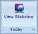

::: {style="DISPLAY: none"}
{#d2h_url_template}{#d2h_package_url style="WIDTH: 0px; DISPLAY: none; HEIGHT: 0px"}
:::

::: {.d2h_secondary_topic style="PADDING-BOTTOM: 10pt; MARGIN: 0pt; PADDING-LEFT: 0pt; PADDING-RIGHT: 0pt; PADDING-TOP: 0pt"}
#### Display Ribbon Button Label in Multiple Lines

Ribbon Button label can be shown in multiple lines using the property **IsMultiLine**.

+------------------------------------------------------------------------------------------------------------------------------------------------------------------------------------------------------------------------------------------------------------------------------------------------------------------------------------------------------------------------------------------------------------------------------------------------------------------------------------------------------------------------------------------------------------------------------------------------------------------------------------------------------------------------------------------------------------------------------------------------------------------------------------------------+
| [XAML]{style="FONT-FAMILY: 'Courier New'"}                                                                                                                                                                                                                                                                                                                                                                                                                                                                                                                                                                                                                                                                                                                                                     |
|                                                                                                                                                                                                                                                                                                                                                                                                                                                                                                                                                                                                                                                                                                                                                                                                |
| []{style="FONT-FAMILY: 'Courier New'"}                                                                                                                                                                                                                                                                                                                                                                                                                                                                                                                                                                                                                                                                                                                                                         |
|                                                                                                                                                                                                                                                                                                                                                                                                                                                                                                                                                                                                                                                                                                                                                                                                |
| [\<]{style="FONT-FAMILY: 'Courier New'; COLOR: blue"}[sync]{style="FONT-FAMILY: 'Courier New'; COLOR: #a31515"}[:]{style="FONT-FAMILY: 'Courier New'; COLOR: blue"}[RibbonButton]{style="FONT-FAMILY: 'Courier New'; COLOR: #a31515"}[ LargeIcon]{style="FONT-FAMILY: 'Courier New'; COLOR: red"}[=\"network.png\"]{style="FONT-FAMILY: 'Courier New'; COLOR: blue"}[ SizeMode]{style="FONT-FAMILY: 'Courier New'; COLOR: red"}[=\"Large\"]{style="FONT-FAMILY: 'Courier New'; COLOR: blue"}[ Label]{style="FONT-FAMILY: 'Courier New'; COLOR: red"}[=\"View Statistics\"]{style="FONT-FAMILY: 'Courier New'; COLOR: blue"}[ IsMultiLine]{style="FONT-FAMILY: 'Courier New'; COLOR: red"}[=\"True\"/\>]{style="FONT-FAMILY: 'Courier New'; COLOR: blue"}[]{style="FONT-FAMILY: 'Courier New'"} |
+------------------------------------------------------------------------------------------------------------------------------------------------------------------------------------------------------------------------------------------------------------------------------------------------------------------------------------------------------------------------------------------------------------------------------------------------------------------------------------------------------------------------------------------------------------------------------------------------------------------------------------------------------------------------------------------------------------------------------------------------------------------------------------------------+

[]{style="FONT-FAMILY: 'Calibri','sans-serif'"} 

[]{style="FONT-FAMILY: 'Calibri','sans-serif'"} 

{border="0"}

Figure 686: A typical Ribbon button with Multi Line

+-------------------------------------------------------------------------------------------------------------------------------------------------------------------------------------------------------------------------------------------------------------------------------------------------------------------------------------------------------------------------------------------------------------------------------------------------------------------------------------------------------------------------------------------------------------------------------------------------------------------------------------------------------------------------------------------------------------------------------------------------------------------------------------------------+
| [XAML]{style="FONT-FAMILY: 'Courier New'"}                                                                                                                                                                                                                                                                                                                                                                                                                                                                                                                                                                                                                                                                                                                                                      |
|                                                                                                                                                                                                                                                                                                                                                                                                                                                                                                                                                                                                                                                                                                                                                                                                 |
| []{style="FONT-FAMILY: 'Courier New'"}                                                                                                                                                                                                                                                                                                                                                                                                                                                                                                                                                                                                                                                                                                                                                          |
|                                                                                                                                                                                                                                                                                                                                                                                                                                                                                                                                                                                                                                                                                                                                                                                                 |
| [\<]{style="FONT-FAMILY: 'Courier New'; COLOR: blue"}[sync]{style="FONT-FAMILY: 'Courier New'; COLOR: #a31515"}[:]{style="FONT-FAMILY: 'Courier New'; COLOR: blue"}[RibbonButton]{style="FONT-FAMILY: 'Courier New'; COLOR: #a31515"}[ LargeIcon]{style="FONT-FAMILY: 'Courier New'; COLOR: red"}[=\"network.png\"]{style="FONT-FAMILY: 'Courier New'; COLOR: blue"}[ SizeMode]{style="FONT-FAMILY: 'Courier New'; COLOR: red"}[=\"Large\"]{style="FONT-FAMILY: 'Courier New'; COLOR: blue"}[ Label]{style="FONT-FAMILY: 'Courier New'; COLOR: red"}[=\"View Statistics\"]{style="FONT-FAMILY: 'Courier New'; COLOR: blue"}[ IsMultiLine]{style="FONT-FAMILY: 'Courier New'; COLOR: red"}[=\"False\"/\>]{style="FONT-FAMILY: 'Courier New'; COLOR: blue"}[]{style="FONT-FAMILY: 'Courier New'"} |
+-------------------------------------------------------------------------------------------------------------------------------------------------------------------------------------------------------------------------------------------------------------------------------------------------------------------------------------------------------------------------------------------------------------------------------------------------------------------------------------------------------------------------------------------------------------------------------------------------------------------------------------------------------------------------------------------------------------------------------------------------------------------------------------------------+

**[]{style="FONT-FAMILY: 'Calibri','sans-serif'; COLOR: #4f81bd"}** 

**[]{style="FONT-FAMILY: 'Calibri','sans-serif'; COLOR: #4f81bd"}** 

[]{style="FONT-FAMILY: 'Calibri','sans-serif'"} 

{border="0"}

Figure 687: A typical Ribbon button without Multi Line

[]{#related-topics}
:::
