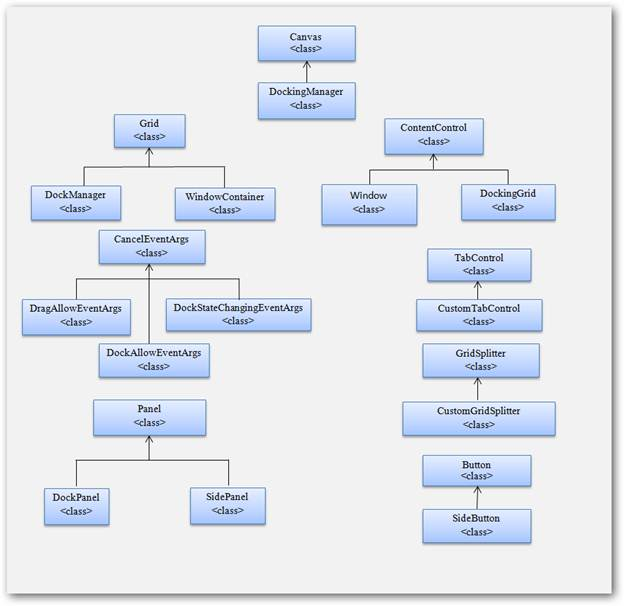

::: {style="DISPLAY: none"}
{#d2h_url_template}{#d2h_package_url style="WIDTH: 0px; DISPLAY: none; HEIGHT: 0px"}
:::

::: {.d2h_secondary_topic style="PADDING-BOTTOM: 10pt; MARGIN: 0pt; PADDING-LEFT: 0pt; PADDING-RIGHT: 0pt; PADDING-TOP: 0pt"}
#### DockingManager Class Diagram

The class diagram of a DockingManager is illustrated in the screenshot below.

{border="0"}

Figure 79: Class Diagram

[]{style="FONT-FAMILY: 'Calibri','sans-serif'"} 

More:

[ ]{#related-topics}

[{border="0" align="absMiddle"}Properties](ms-xhelp:///?Id=91cc8214-cb28-42fb-b7f4-dc1a3a5302ea){style="TEXT-DECORATION: none"}

[{border="0" align="absMiddle"}Events](ms-xhelp:///?Id=4b9ac836-62cd-403f-9b9b-b47836a463c0){style="TEXT-DECORATION: none"}

[{border="0" align="absMiddle"}Methods](ms-xhelp:///?Id=e96e6805-8d62-4d80-b261-b967dddbc664){style="TEXT-DECORATION: none"}
:::
