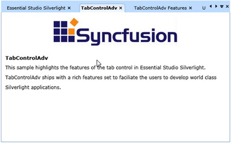
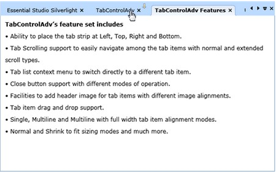
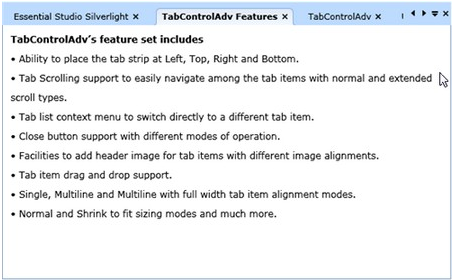

::: {style="DISPLAY: none"}
{#d2h_url_template}{#d2h_package_url style="WIDTH: 0px; DISPLAY: none; HEIGHT: 0px"}
:::

::: {.d2h_secondary_topic style="PADDING-BOTTOM: 10pt; MARGIN: 0pt; PADDING-LEFT: 0pt; PADDING-RIGHT: 0pt; PADDING-TOP: 0pt"}
##### []{#_Drag_and_Drop}Drag and Drop Support

[]{style="FONT-FAMILY: 'Calibri','sans-serif'"} 

The end-user can relocate the Tab items at runtimewhen required. TabControl supports Drag and Drop feature to achieve that. The following is the way the user can achieve.

            Before Dragging and Dropping the operation in *TabControlAdv*, set AllowDragDrop property value to True.

+-------------------------------------------------------------------------------------------------------------------------------------------------------------------------------------------------------------------------------------------------------------------------------------------------------------------------------------------------------------------------------------------------------------------------------------------------------------------------------------------------------------------------------------------------------------------------------------------------------------------------------------------------------------------------------------------------------------------------------------------+
| **[\[Xaml\]]{style="FONT-FAMILY: 'Courier New'"}**                                                                                                                                                                                                                                                                                                                                                                                                                                                                                                                                                                                                                                                                                        |
|                                                                                                                                                                                                                                                                                                                                                                                                                                                                                                                                                                                                                                                                                                                                           |
| [\<]{style="FONT-FAMILY: 'Courier New'; COLOR: blue"}[syncfusion]{style="FONT-FAMILY: 'Courier New'; COLOR: #a31515"}[:]{style="FONT-FAMILY: 'Courier New'; COLOR: blue"}[TabControlAdv]{style="FONT-FAMILY: 'Courier New'; COLOR: #a31515"}[ Name]{style="FONT-FAMILY: 'Courier New'; COLOR: red"}[=\"MyTabCtrl\"]{style="FONT-FAMILY: 'Courier New'; COLOR: blue"}[ Height]{style="FONT-FAMILY: 'Courier New'; COLOR: red"}[=\"250\"]{style="FONT-FAMILY: 'Courier New'; COLOR: blue"}[ Width]{style="FONT-FAMILY: 'Courier New'; COLOR: red"}[=\"300\"]{style="FONT-FAMILY: 'Courier New'; COLOR: blue"}[ AllowDragDrop]{style="FONT-FAMILY: 'Courier New'; COLOR: red"}[=\"True\"\>]{style="FONT-FAMILY: 'Courier New'; COLOR: blue"} |
|                                                                                                                                                                                                                                                                                                                                                                                                                                                                                                                                                                                                                                                                                                                                           |
| []{style="FONT-FAMILY: 'Courier New'"}                                                                                                                                                                                                                                                                                                                                                                                                                                                                                                                                                                                                                                                                                                    |
+-------------------------------------------------------------------------------------------------------------------------------------------------------------------------------------------------------------------------------------------------------------------------------------------------------------------------------------------------------------------------------------------------------------------------------------------------------------------------------------------------------------------------------------------------------------------------------------------------------------------------------------------------------------------------------------------------------------------------------------------+

[]{style="FONT-FAMILY: 'Calibri','sans-serif'; FONT-SIZE: 12pt"} 

+------------------------------------------------------------------------------------------------------------------------------------------------------+
| **[\[C#\]]{style="FONT-FAMILY: 'Courier New'"}**                                                                                                     |
|                                                                                                                                                      |
| [this]{style="FONT-FAMILY: 'Courier New'; COLOR: blue"}[.MyTabCtrl.AllowDragDrop = [true]{style="COLOR: blue"};]{style="FONT-FAMILY: 'Courier New'"} |
+------------------------------------------------------------------------------------------------------------------------------------------------------+

[]{style="FONT-FAMILY: 'Calibri','sans-serif'; FONT-SIZE: 12pt"} 

Drag and Drop Tab items by the following steps:

1.   Select a Tab Item to handle Drag and Drop operation.

2.   Click the TabItem, hold the same and then move the item wherever it should be dropped.

3.   While dragging, the drag marker symbol will be displayed above the mouse-over tab items.

4.   After dropping the item, the item positions get moved.

[]{style="FONT-FAMILY: 'Calibri','sans-serif'; FONT-SIZE: 12pt"} 

**DragStart**, **DragEnd** events are attched with this opeartion. DragStart event will trigger before starting to drag the item. The DragEnd event will get fired after dropping the dragged item.

{border="0"}

Figure 786: Before Drag

[                              ** **]{style="FONT-FAMILY: 'Calibri','sans-serif'; FONT-SIZE: 12pt"}

[]{style="FONT-FAMILY: 'Calibri','sans-serif'; FONT-SIZE: 12pt"} 

{border="0"}

Figure 787: Dragging

**[                               ]{style="FONT-FAMILY: 'Calibri','sans-serif'; FONT-SIZE: 12pt"}**

[]{style="FONT-FAMILY: 'Calibri','sans-serif'; FONT-SIZE: 12pt"} 

[]{style="FONT-FAMILY: 'Calibri','sans-serif'; FONT-SIZE: 12pt"} 

{border="0"}

Figure 788: After Drag and Dropped

[\
                  ** **]{style="FONT-FAMILY: 'Calibri','sans-serif'; FONT-SIZE: 12pt"}

[]{style="FONT-FAMILY: 'Calibri','sans-serif'; FONT-SIZE: 12pt"} 

[]{#related-topics}
:::
