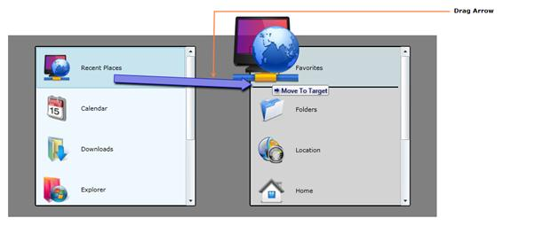

::: {style="DISPLAY: none"}
{#d2h_url_template}{#d2h_package_url style="WIDTH: 0px; DISPLAY: none; HEIGHT: 0px"}
:::

::: {.d2h_secondary_topic style="PADDING-BOTTOM: 10pt; MARGIN: 0pt; PADDING-LEFT: 0pt; PADDING-RIGHT: 0pt; PADDING-TOP: 0pt"}
#### DragArrow

The DragArrow is a visual addition to the drag and drop operation. The left end of the DragArrow is placed at the position of drag source and its right end follows the mouse pointer.

Use Case Scenarios

The DragArrow provides more visual help for the drag and drop operation. The user can easily understand which object is being dragged and source of that object.

Adding DragArrow to an Application

To add DragArrow to an application:

[]{#IsDragArrowEnabled}12.  Enable the **DragArrow**, to make the **DragArrow** visible.

13.  Set the **IsDragArrowEnabled** property that  is part of the **DragDropEventArgs,** to true.

The most suitable moment to set a IsDragArrowEnabled is in the DragAndDropManager_DragStarted() event handler. The following lines of code explain this.

 

 

+----------------------------------------------------------------------------------------------------------------------------------------------------------------------------------------------------------------------+
| **[\[C#\]]{style="FONT-FAMILY: 'Courier New'"}**[]{style="FONT-FAMILY: 'Courier New'"}                                                                                                                               |
|                                                                                                                                                                                                                      |
| [void]{style="FONT-FAMILY: 'Courier New'; COLOR: blue"}[ DragAndDropManager_DragStarted([object]{style="COLOR: blue"} sender, [DragDropEventArgs]{style="COLOR: #2b91af"} args)]{style="FONT-FAMILY: 'Courier New'"} |
|                                                                                                                                                                                                                      |
| [ {]{style="FONT-FAMILY: 'Courier New'"}                                                                                                                                                                             |
|                                                                                                                                                                                                                      |
| [  args.IsDragArrowEnabled = [true]{style="COLOR: blue"};]{style="FONT-FAMILY: 'Courier New'"}                                                                                                                       |
|                                                                                                                                                                                                                      |
| [ }]{style="FONT-FAMILY: 'Courier New'"}[]{style="FONT-FAMILY: 'Courier New'"}                                                                                                                                       |
+----------------------------------------------------------------------------------------------------------------------------------------------------------------------------------------------------------------------+

 

 

Example

{border="0"}

Figure 1141 : Drag Arrow

 

The DragArrow can be customized with the help of DragArrowTemplate property in DragAndDropManager. The ControlTemplate for the customized arrow is assigned to the DragArrowTemplate property to change the default DragArrow.

 

[]{#related-topics}
:::
