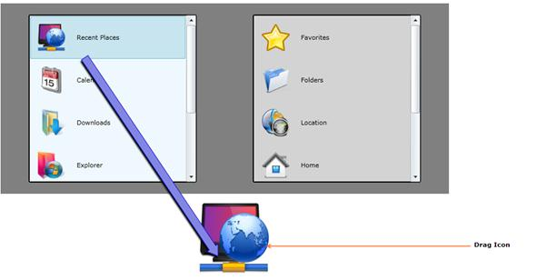

::: {style="DISPLAY: none"}
{#d2h_url_template}{#d2h_package_url style="WIDTH: 0px; DISPLAY: none; HEIGHT: 0px"}
:::

::: {.d2h_secondary_topic style="PADDING-BOTTOM: 10pt; MARGIN: 0pt; PADDING-LEFT: 0pt; PADDING-RIGHT: 0pt; PADDING-TOP: 0pt"}
#### [DragIcon]{#DragIcon}

DragIcon is an image that describes the object that is being dragged. It will follow the mouse pointer and will always be on top of other objects.  This feature provides more visual guide for the drag and drop operations.

Use Case Scenarios

The DragIcon provides information to the user about the object that is being dragged. It prevents the mistake of dragging objects that the user does not want to drag.

 

Adding DragIcon to an Application

In order to set a DragIcon, use the DragIcon property, which is part of the DragDropEventArgs. The most suitable moment to set a DragIcon is in the DragAndDropManager_DragStarted() event handler. The following lines of code explain this.

[]{style="COLOR: black"} 

[]{style="COLOR: black"} 

+----------------------------------------------------------------------------------------------------------------------------------------------------------------------------------------------------------------------+
| **[\[C#\]]{style="FONT-FAMILY: 'Courier New'"}**[]{style="FONT-FAMILY: 'Courier New'"}                                                                                                                               |
|                                                                                                                                                                                                                      |
| [void]{style="FONT-FAMILY: 'Courier New'; COLOR: blue"}[ DragAndDropManager_DragStarted([object]{style="COLOR: blue"} sender, [DragDropEventArgs]{style="COLOR: #2b91af"} args)]{style="FONT-FAMILY: 'Courier New'"} |
|                                                                                                                                                                                                                      |
| [ {]{style="FONT-FAMILY: 'Courier New'"}                                                                                                                                                                             |
|                                                                                                                                                                                                                      |
| [  args.DragIcon = [new]{style="COLOR: blue"} [Image]{style="COLOR: #2b91af"}() { Source = obj.Icon };]{style="FONT-FAMILY: 'Courier New'"}                                                                          |
|                                                                                                                                                                                                                      |
| [ }]{style="FONT-FAMILY: 'Courier New'"}[]{style="FONT-FAMILY: 'Courier New'"}                                                                                                                                       |
+----------------------------------------------------------------------------------------------------------------------------------------------------------------------------------------------------------------------+

[]{style="COLOR: black"} 

Example:

{border="0"}[]{#DragArrow}

Figure 1140 : DragIcon[]{style="COLOR: black"}

[]{#related-topics}
:::
